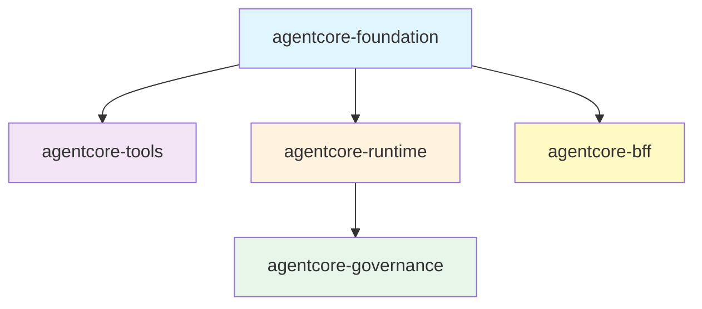
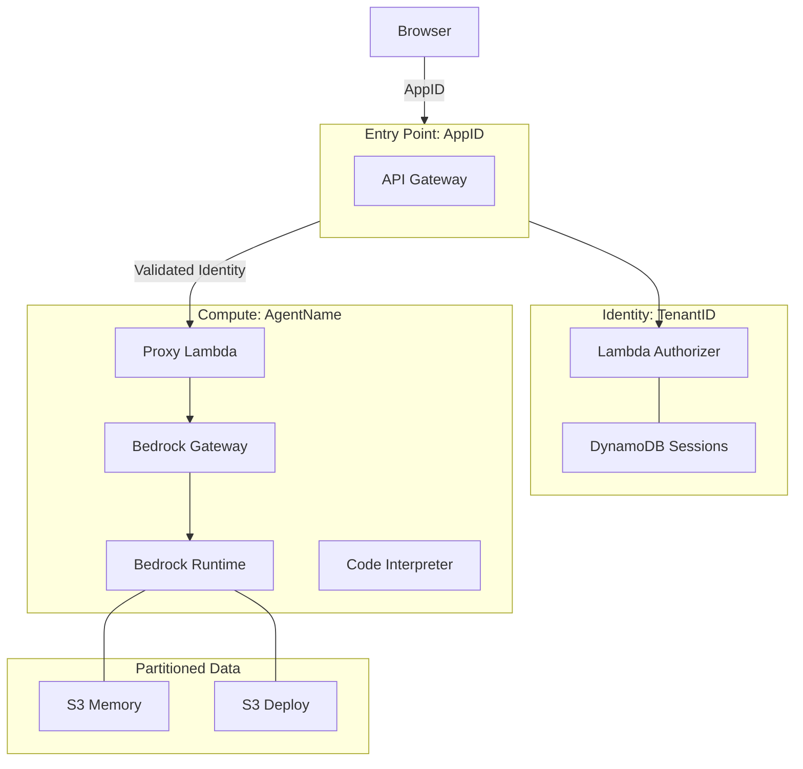

# Bedrock AgentCore Terraform // Production-Ready AI Infrastructure

Deploy, secure, and scale production AI agents on AWS Bedrock with a **local-first DX**, **Zero-Trust security**, and **Instant Hot-Reload**.

---

## 🛠️ Framework Features

*   ⚡ **Instant Hot-Reload**: Update agent logic without full dependency reinstalls using our **OCDS Layered Builds**.
*   🛡️ **Zero-Trust BFF**: A secure Backend-for-Frontend using the **Token Handler Pattern**—OIDC tokens never reach the browser.
*   🔐 **Hardened Multi-Tenancy**: Built-in **North-South Join Isolation** using dynamic ABAC policies to protect tenant data at the credential layer.
*   🔍 **OIDC Auto-Discovery**: Seamless integration with Entra ID, Okta, and Auth0 via automated build-time endpoint discovery.
*   🔄 **Seamless Session Rotation**: Integrated OIDC Refresh Token handler ensures long-running agents never lose connectivity.
*   🖥️ **Interactive Terminal**: Real-time observability and remote management with the `acore_debug` CLI.

---

## 🚀 The 3-Step Success Path

### 1. Bootstrap (Platform Readiness)
Prepare your AWS account for enterprise-grade automation. This one-time setup handles the "difficult" plumbing of OIDC trust and state management.
```bash
# One-time setup for GitLab CI (WIF) and Secure S3 State
bash terraform/scripts/bootstrap_wif.sh
```
*   **Action**: Creates OIDC Provider for GitLab, a Scoped Deployment IAM Role, and an Encrypted S3 State Bucket.
*   **Security**: Eliminates the need for long-lived AWS Access Keys in CI/CD variables.

### 2. Scaffold (Development Velocity)
Developers start locally with a 100% compliant project structure.
```bash
# 1. Scaffold a fresh project using the enterprise template
pip install copier
copier copy --trust templates/agent-project my-agent

# 2. Develop logic in pure Python (No AWS needed)
cd my-agent/agent-code
python runtime.py
```
*   **Local-First**: Test your agent logic and MCP tools locally before ever touching the cloud.

### 3. Orchestrate (Global Scale)
Deploy your agent using the modular AgentCore topology.
```bash
# Initialize and deploy to the dev environment
cd terraform
terraform init -backend-config=backend-dev.tf
terraform apply
```
*   **Result**: Your agent is live with a secure Gateway, MCP tools, and a high-performance Web UI (BFF).

---

## 👤 Who is this for?

| Role | Focus | Outcome |
| :--- | :--- | :--- |
| **AI/ML Engineer** | Python logic & MCP tools | Builds intelligent, tool-using agents without managing AWS plumbing. |
| **DevOps / SRE** | Bootstrapping & CI/CD | Manages account readiness, regional splitting, and automated deployments. |
| **Security Architect** | Zero-Trust & Compliance | Enforces tenant isolation, OIDC discovery, and audit logging. |

---

## 🎯 Engineering Principles

*   **The CLI Bridge Pattern**: Day 0 access to the latest Bedrock features (Guardrails, Inference Profiles) via stateful CLI integration and SSM persistence.
*   **OCDS (Optimized Code/Dependency Separation)**: Layered Lambda packaging that caches heavy dependencies while keeping agent logic fresh and hot-reloadable.
*   **North-South Join Isolation**: A hierarchical multi-tenancy model that anchors identity context (User/Tenant) to physical compute resources (Agents).
*   **ABAC Enforcement**: Attribute-Based Access Control ensures that even a compromised agent cannot access data belonging to another tenant.

---

## 🏗️ Architecture

### Logic & Modules


### Physical Infrastructure (North-South Join)


---

## 📖 Documentation

- **[DEVELOPER_GUIDE.md](./DEVELOPER_GUIDE.md)** - Team onboarding and common development tasks.
- **[SETUP.md](./SETUP.md)** - Detailed, step-by-step account configuration.
- **[AGENTS.md](./AGENTS.md)** - The Universal Codex for AI Agents (Rules, Security, Patterns).
- **[docs/architecture.md](./docs/architecture.md)** - Deep dive into system design and data flows.
- **[docs/WIF_SETUP.md](./docs/WIF_SETUP.md)** - Advanced GitLab OIDC configuration.

---

## ⚖️ License

MIT - See LICENSE file for details.
