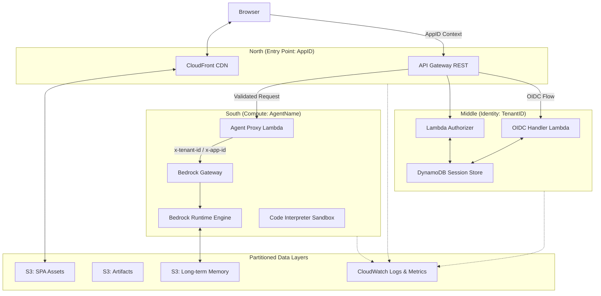
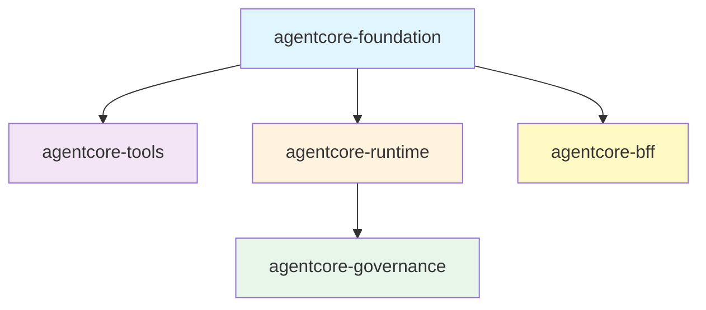

# Bedrock AgentCore Terraform

A hardened Terraform framework for deploying enterprise AI agents on AWS Bedrock AgentCore. The gap between a raw foundation model and a production-grade agent is filled with identity propagation, tenant isolation, encrypted state management, and a deployment pipeline that refuses to cut corners. The `hashicorp/aws` provider does not yet support AgentCore resources -- verified through v5.100.0. 

This framework bridges that gap with a stateful CLI bridge pattern that wraps every AgentCore control-plane operation in a lifecycle manager backed by SSM Parameter Store, giving you full infrastructure-as-code semantics today and a clean `terraform import` migration path when native resources arrive.

---

## Three Core Systems

### Identity Translation Engine

Every agent interaction begins with a human. That human arrives carrying a JWT from their corporate identity provider -- Entra ID, Okta, Auth0 -- and the framework must translate that ephemeral, provider-specific token into a scoped AWS Workload Token before any compute touches it. Agents never see master session tokens. They receive a least-privilege identity anchored to the North-South Join hierarchy: 
- **AppID** defines the application boundary
- **TenantID** defines the ownership unit
- **AgentName** identifies the compute resource. Together, these three dimensions form a composite key that threads through every layer of the stack.

ABAC enforcement happens at runtime through dynamic IAM session policies. When a request arrives, the proxy Lambda assumes the agent's execution role with a session policy that physically restricts S3 access to the tenant-specific prefix `{app_id}/{tenant_id}/{agent_name}/`. The credentials themselves are scoped -- not just the application logic. A compromised agent cannot read another tenant's memory because the temporary credentials it holds lack the permission to do so.

### OCDS Build Protocol

The Optimized Code/Dependency Separation protocol splits Lambda packaging into two deterministic stages. 
Stage 1 reads `pyproject.toml`, resolves dependencies against the target platform (`manylinux2014_x86_64` or `manylinux2014_aarch64` for Graviton), and caches them in an isolated layer.
Stage 2 packages only your agent logic. The result is that a one-line change to your agent's reasoning loop produces a rebuild measured in seconds, not minutes, because the 200MB dependency layer is untouched.

Architecture-aware binary fetching means you can target ARM64/Graviton by flipping `lambda_architecture = "arm64"` and the build engine handles the rest. SHA256 content hashing on both stages ensures that identical inputs produce identical outputs, and that Terraform only triggers a rebuild when something actually changed. The deployment artifact lands in S3 encrypted with SSE-S3, versioned, and referenced by the runtime via a content-addressed key.

### Stateful CLI Bridge

> Ten distinct AgentCore resource types -- Gateway, Workload Identity, Browser, Code Interpreter, Runtime, Memory, Policy Engine, Cedar Policies, Evaluators, and OAuth2 Credential Providers -- have no Terraform provider representation. 

The framework wraps each in a `null_resource` with a `local-exec` provisioner that calls the `bedrock-agentcore-control` CLI, captures JSON output, and surfaces resource IDs through `data.external` sources. SHA256-based triggers on the resource configuration ensure idempotency: if the configuration has not changed, Terraform does not re-create the resource.

Resource IDs persist in SSM Parameter Store, which means they survive CI/CD runner destruction, local state corruption, and team member rotation. When HashiCorp ships `aws_bedrockagentcore_*` resources, migration is a single `terraform import` per resource followed by a swap from `null_resource` to the native type. The framework was designed for this transition from day one.

---

## Architecture

### The North-South Join

The North-South Join is a hierarchical identity model that anchors every request to three coordinates. 

-**North** is the entry point: the AppID, materialized as an API Gateway.
-**Middle** is the identity layer: the TenantID, extracted from the OIDC token and validated by a Lambda Authorizer against DynamoDB.
-**South** is the compute layer: the AgentName, where the Bedrock Runtime Engine executes agent logic. 

Data partitioning follows the same hierarchy -- DynamoDB composite keys use `APP#{app_id}#TENANT#{tenant_id}`, S3 paths use `{app_id}/{tenant_id}/{agent_name}/memory/`, and CloudWatch log groups nest under `/aws/bedrock/agentcore/{resource-type}/{agent-name}`.



### Logical Topology

The module dependency graph is fixed and intentional. Foundation has no dependencies. Tools and Runtime depend on Foundation. Governance depends on Foundation and Runtime. BFF depends on Foundation. This ordering prevents circular references and ensures that shared infrastructure (IAM roles, log groups, WAF ACLs) exists before any module that consumes it.



---

## Module Reference

| Module | Domain | Key Resources | Feature Toggles |
|--------|--------|---------------|-----------------|
| `agentcore-foundation` | Gateway, Identity, Observability, WAF | MCP Gateway, Gateway Targets, Workload Identity, CloudWatch Log Groups, X-Ray Sampling Rules, WAF Web ACL, IAM Roles | `enable_gateway`, `enable_identity`, `enable_observability`, `enable_xray`, `enable_waf` |
| `agentcore-tools` | Code Interpreter, Browser | Python sandbox (PUBLIC/SANDBOX/VPC modes), Web browser with optional session recording to S3 | `enable_code_interpreter`, `enable_browser`, `enable_browser_recording` |
| `agentcore-runtime` | Runtime, Memory, Packaging | Agent execution runtime, S3 deployment artifacts bucket, OCDS two-stage build, short-term and long-term memory, application inference profiles | `enable_runtime`, `enable_memory`, `enable_packaging`, `enable_inference_profile` |
| `agentcore-governance` | Policy Engine, Guardrails, Evaluations | Cedar policy enforcement, Bedrock Guardrails (content/PII filters), model-based evaluation (TOOL_CALL/REASONING/RESPONSE) | `enable_policy_engine`, `enable_guardrails`, `enable_evaluations` |
| `agentcore-bff` | Token Handler, SPA Hosting, Streaming Proxy | API Gateway REST, Lambda Authorizer, OIDC Handler Lambda, DynamoDB session store, CloudFront distribution, SigV4 streaming proxy (15-min timeout) | `enable_bff` |

---

## Security Model

### The Authentication Chain

Credentials never persist. The deployment pipeline authenticates via GitLab Web Identity Federation: the CI runner presents a JWT to AWS STS, receives temporary credentials scoped to a deployment role, and uses those credentials for exactly one pipeline execution. Terraform provisions resources under those temporary credentials. The agent runtime itself operates under a dedicated IAM role with least-privilege permissions -- it can invoke Bedrock, read its own S3 prefix, and write to its own log group. Nothing more.

The MCP Gateway adds a second authentication layer. Inbound requests authenticate via Workload Identity, which validates the caller's OAuth2 token and issues a scoped session. Lambda MCP tools execute under their own IAM execution roles, isolated from the gateway's permissions. The full chain reads: 

>**GitLab WIF -> AWS STS -> temporary credentials -> Terraform provisions -> Agent Runtime (scoped IAM) -> Gateway (Workload Identity OAuth2) -> MCP Tools (Lambda execution roles)**.

### Token Handler Pattern

No token ever reaches the browser. The BFF module implements the AWS Serverless Token Handler Pattern: the OIDC Handler Lambda exchanges authorization codes for access and refresh tokens, stores them server-side in DynamoDB with a TTL matching the token expiry, and returns a single `Set-Cookie` header with `Secure; HttpOnly; SameSite=Strict` flags. The session ID is the only value that crosses the wire to the client. XSS attacks that compromise the SPA cannot exfiltrate credentials because there are no credentials in the browser to steal. PKCE is enforced on all OIDC flows, even for confidential clients, to prevent authorization code injection.

### Multi-Tenant Isolation

Tenant boundaries are enforced at three layers simultaneously. DynamoDB uses composite keys (`APP#{app_id}#TENANT#{tenant_id}`) so that a query for one tenant's sessions physically cannot return another tenant's data. S3 partitions agent memory under `{app_id}/{tenant_id}/{agent_name}/memory/`, and the dynamic session policies described above restrict the runtime's temporary credentials to that exact prefix. IAM condition keys (`aws:SourceAccount`) prevent cross-account confusion deputy attacks.

### Agent-to-Agent Authentication

In multi-agent systems, a source agent that needs to delegate work to a peer follows a strict protocol. The source agent calls `GetWorkloadAccessTokenForJWT`, exchanging the original user's JWT for a scoped workload token. It then invokes the target agent with an `Authorization: Bearer <token>` header. The target agent validates the token through its inbound authorizer, and the original user's identity context -- including Entra ID group claims -- propagates through the entire call chain. Anonymous agent-to-agent communication is forbidden.

### Encryption

AWS-managed SSE-S3 (AES-256) encrypts all data at rest: S3 buckets, deployment artifacts, agent memory. CloudWatch uses its default AWS-managed encryption. All APIs communicate over HTTPS/TLS. Customer-managed KMS keys are supported via the `enable_kms` and `kms_key_arn` variables but are not required -- ADR 0008 documents the reasoning: AWS-managed encryption provides equivalent cryptographic security with significantly less operational overhead. Toggle KMS on only when regulatory requirements demand customer-controlled key material.

---

## Getting Started

### 1. Bootstrap WIF

Establish the OIDC trust relationship between your CI/CD provider and AWS. This one-time setup creates the OIDC provider, a scoped deployment IAM role, and an encrypted S3 state bucket.

```bash
bash terraform/scripts/bootstrap_wif.sh
```

### 2. Configure

Create a `terraform.tfvars` file or use one of the provided examples.

```hcl
agent_name  = "my-agent"
region      = "eu-west-2"
environment = "dev"

enable_gateway      = true
enable_runtime      = true
runtime_source_path = "./agent-code"

enable_code_interpreter       = true
code_interpreter_network_mode = "SANDBOX"

enable_observability = true
enable_memory        = true
memory_type          = "BOTH"
```

### 3. Deploy

```bash
cd terraform
terraform init -backend-config=backend-dev.tf
terraform apply -var-file=../examples/1-hello-world/terraform.tfvars
```

---

## Configuration Reference

### Core

| Variable | Type | Default | Description |
|----------|------|---------|-------------|
| `agent_name` | `string` | -- (required) | Physical name of the agent resource. Alphanumeric and hyphens, 1-64 characters. |
| `app_id` | `string` | `agent_name` | Application ID for multi-tenant isolation (North anchor). |
| `region` | `string` | `us-east-1` | Default AWS region for all resources. |
| `agentcore_region` | `string` | `region` | AgentCore control-plane region override. |
| `bedrock_region` | `string` | `agentcore_region` | Bedrock model region override. |
| `bff_region` | `string` | `agentcore_region` | BFF/API Gateway region override. |
| `environment` | `string` | `dev` | Deployment stage: `dev`, `staging`, or `prod`. |
| `tags` | `map(string)` | `{}` | Additional tags applied to all resources. |

### Foundation

| Variable | Type | Default | Description |
|----------|------|---------|-------------|
| `enable_gateway` | `bool` | `true` | Enable the MCP protocol gateway. |
| `gateway_name` | `string` | `""` | Custom gateway name (auto-generated if empty). |
| `gateway_search_type` | `string` | `HYBRID` | Gateway search mode: `SEMANTIC` or `HYBRID`. |
| `gateway_role_arn` | `string` | `""` | Bring-your-own IAM role for the gateway. |
| `mcp_targets` | `map(object)` | `{}` | MCP Lambda targets. Each entry requires `name` and `lambda_arn`. |
| `enable_identity` | `bool` | `false` | Enable Workload Identity (OAuth2). |
| `oauth_return_urls` | `list(string)` | `[]` | OAuth2 return URLs for workload identity. |
| `enable_observability` | `bool` | `true` | Enable CloudWatch log groups and metrics. |
| `log_retention_days` | `number` | `30` | CloudWatch log retention period. |
| `enable_xray` | `bool` | `true` | Enable X-Ray distributed tracing. |
| `alarm_sns_topic_arn` | `string` | `""` | SNS topic for CloudWatch alarm notifications. |
| `enable_waf` | `bool` | `false` | Enable WAF protection for API Gateway. |
| `enable_kms` | `bool` | `false` | Enable customer-managed KMS encryption. |
| `kms_key_arn` | `string` | `""` | KMS key ARN (required when `enable_kms` is true). |

### Tools

| Variable | Type | Default | Description |
|----------|------|---------|-------------|
| `enable_code_interpreter` | `bool` | `true` | Enable the Python code interpreter sandbox. |
| `code_interpreter_network_mode` | `string` | `SANDBOX` | Network mode: `PUBLIC`, `SANDBOX`, or `VPC`. |
| `code_interpreter_vpc_config` | `object` | `null` | VPC subnet and security group configuration (required for VPC mode). |
| `enable_browser` | `bool` | `false` | Enable the web browser tool. |
| `browser_network_mode` | `string` | `SANDBOX` | Browser network mode: `PUBLIC`, `SANDBOX`, or `VPC`. |
| `browser_vpc_config` | `object` | `null` | VPC configuration for browser (required for VPC mode). |
| `enable_browser_recording` | `bool` | `false` | Enable session recording for browser interactions. |
| `browser_recording_s3_bucket` | `string` | `""` | S3 bucket for browser session recordings. |

### Runtime

| Variable | Type | Default | Description |
|----------|------|---------|-------------|
| `enable_runtime` | `bool` | `true` | Enable the agent execution runtime. |
| `runtime_source_path` | `string` | `./agent-code` | Path to agent source code directory. |
| `runtime_entry_file` | `string` | `runtime.py` | Python entry point file. |
| `runtime_config` | `map(any)` | `{}` | Runtime configuration passed as JSON. |
| `runtime_role_arn` | `string` | `""` | Bring-your-own IAM role for the runtime. |
| `runtime_policy_arns` | `list(string)` | `[]` | Additional IAM policy ARNs to attach. |
| `runtime_inline_policies` | `map(string)` | `{}` | Inline IAM policies for the runtime role. |
| `runtime_reserved_concurrency` | `number` | `10` | Reserved concurrent executions for the runtime Lambda. |
| `enable_memory` | `bool` | `false` | Enable agent memory. |
| `memory_type` | `string` | `BOTH` | Memory type: `SHORT_TERM`, `LONG_TERM`, or `BOTH`. |
| `enable_packaging` | `bool` | `true` | Enable OCDS two-stage build. |
| `python_version` | `string` | `3.12` | Python version for packaging. |
| `lambda_architecture` | `string` | `x86_64` | Compute architecture: `x86_64` or `arm64` (Graviton). |
| `deployment_bucket_name` | `string` | `""` | Custom S3 bucket for deployment artifacts (auto-created if empty). |
| `enable_inference_profile` | `bool` | `false` | Enable Bedrock application inference profile. |
| `inference_profile_name` | `string` | `""` | Name for the inference profile. |
| `inference_profile_model_source_arn` | `string` | `""` | Foundation model or system-defined inference profile ARN. |

### Governance

| Variable | Type | Default | Description |
|----------|------|---------|-------------|
| `enable_policy_engine` | `bool` | `false` | Enable Cedar policy enforcement. |
| `cedar_policy_files` | `map(string)` | `{}` | Map of policy names to Cedar policy file paths. |
| `policy_engine_schema` | `string` | `""` | Cedar schema definition. |
| `enable_guardrails` | `bool` | `false` | Enable Bedrock Guardrails. |
| `guardrail_name` | `string` | `""` | Name for the guardrail. |
| `guardrail_filters` | `list(object)` | (6 default filters) | Content filters: HATE, INSULT, SEXUAL, VIOLENCE, MISCONDUCT, PROMPT_ATTACK. |
| `guardrail_sensitive_info_filters` | `list(object)` | `[]` | PII filters with BLOCK or ANONYMIZE actions. |
| `enable_evaluations` | `bool` | `false` | Enable model-based evaluation. |
| `evaluation_type` | `string` | `TOOL_CALL` | Evaluation type: `TOOL_CALL`, `REASONING`, `RESPONSE`, or `ALL`. |
| `evaluator_model_id` | `string` | `anthropic.claude-sonnet-4-5` | Model ID for the evaluator. |
| `evaluation_prompt` | `string` | (default prompt) | Custom evaluation prompt. |
| `evaluation_criteria` | `map(string)` | `{}` | Named evaluation criteria. |

### BFF (Token Handler)

| Variable | Type | Default | Description |
|----------|------|---------|-------------|
| `enable_bff` | `bool` | `false` | Enable the Serverless SPA/BFF module. |
| `oidc_issuer` | `string` | `""` | OIDC Issuer URL (e.g., Entra ID tenant URL). |
| `oidc_client_id` | `string` | `""` | OIDC Client ID. |
| `oidc_client_secret_arn` | `string` | `""` | Secrets Manager ARN for the OIDC client secret. |
| `oidc_authorization_endpoint` | `string` | `""` | Override authorization endpoint (auto-discovered if empty). |
| `oidc_token_endpoint` | `string` | `""` | Override token endpoint (auto-discovered if empty). |
| `bff_agentcore_runtime_arn` | `string` | `""` | AgentCore runtime ARN for the proxy (required if `enable_bff=true` and `enable_runtime=false`). |
| `proxy_reserved_concurrency` | `number` | `10` | Reserved concurrent executions for the BFF proxy Lambda. |

---

## Examples

| Example | Purpose | Features Enabled |
|---------|---------|-----------------|
| `1-hello-world` | Minimal standalone agent demonstrating basic AgentCore capabilities | Runtime, Observability, Packaging |
| `2-gateway-tool` | MCP gateway integration with a Titanic dataset analysis Lambda | Gateway, Code Interpreter (SANDBOX), Runtime, Packaging |
| `3-deepresearch` | Full-featured research agent with Strands DeepAgents | Gateway, Code Interpreter, Browser, Memory (BOTH), Observability |
| `4-research` | Research agent with governance and quality evaluation | Gateway, Code Interpreter, Browser, Memory, Evaluations (REASONING) |

Deploy any example with a single command:

```bash
cd terraform
terraform init -backend=false
terraform plan -var-file=../examples/3-deepresearch/terraform.tfvars
```

---

## CI/CD Pipeline

The framework ships with both a GitLab CI pipeline for full deployment and a GitHub Actions workflow for validation-only CI.

### GitLab CI (Full Pipeline)

The GitLab pipeline spans 12 stages across three environments, with every stage authenticated via Web Identity Federation -- no long-lived AWS access keys exist anywhere in the system.

| Stage | Environment | Trigger | Purpose |
|-------|-------------|---------|---------|
| `validate:fmt` | -- | Every push | Terraform formatting check |
| `validate:syntax` | -- | Every push | `terraform init` + `terraform validate` |
| `validate:docs-and-tests` | -- | MR / main | Enforce that Terraform changes include doc and test updates |
| `lint:tflint` | -- | MR / main | TFLint recursive scan |
| `lint:checkov` | -- | MR / main | Checkov security scan with JUnit reporting |
| `test:examples` | -- | MR / main | Validate all example configurations |
| `test:cedar-policies` | -- | MR / main | Cedar policy syntax validation |
| `test:python-*` | -- | MR / main | pytest suites for each example agent |
| `plan:dev` + `deploy:dev` + `smoke-test:dev` | Dev | Merge to `main` | Automatic deploy to dev account |
| `plan:test` + `deploy:test` + `smoke-test:test` | Test | `release/*` branch | Manual deploy to test account |
| `plan:prod` + `deploy:prod` + `smoke-test:prod` | Prod | Git tag | Manual deploy to prod account (with approval) |

Scheduled pipelines run drift detection across all environments using `terraform plan -detailed-exitcode`. If infrastructure has diverged from state, the pipeline flags the drift and optionally sends a Slack notification.

### GitHub Actions (Validation Only)

The GitHub Actions workflow runs on every pull request and push to `main`. It executes formatting checks, `terraform validate`, TFLint, Checkov, example validation, and Copier template tests. It does not deploy to AWS and requires no cloud credentials.

---

## State Management

Terraform state lives in S3 with native S3 locking enabled via `use_lockfile = true`, which requires Terraform 1.10.0 or later. The framework uses separate S3 buckets per environment rather than Terraform workspaces. This is a deliberate blast-radius decision: if the dev state bucket is compromised or corrupted, test and prod are physically unaffected. Switching environments requires a `terraform init -backend-config=backend-{env}.tf` rather than a `terraform workspace select`, which makes the active environment explicit and impossible to confuse. No DynamoDB lock table is required -- native S3 locking handles concurrency.

```
S3 Bucket (per environment)
  agentcore/
    terraform.tfstate
    terraform.tfstate.tflock    # lock file during operations
    [versioned snapshots]       # via S3 versioning
```

---

## Key Decisions

| Decision | Rationale | ADR |
|----------|-----------|-----|
| Four-module architecture (Foundation, Tools, Runtime, Governance) + BFF | Semantic separation of concerns without over-fragmentation. Each module maps to a distinct operational domain. | 0001 |
| CLI-based resources via `null_resource` | The `hashicorp/aws` provider does not support AgentCore resources (validated through v5.100.0). CLI bridge with SSM persistence provides IaC semantics today. | 0002 |
| GitLab CI with Web Identity Federation | Eliminates long-lived AWS access keys. JWT-to-STS exchange scoped per environment. | 0003 |
| S3 backend with native locking | `use_lockfile = true` (Terraform >= 1.10.0) replaces DynamoDB lock tables. Simpler, fewer resources. | 0004 |
| Separate backends per environment | Blast radius containment. Wrong-workspace accidents physically cannot affect production. | 0006 |
| AWS-managed encryption (SSE-S3) | Equivalent cryptographic security to customer KMS with less operational overhead. Customer KMS opt-in available. | 0008 |
| Enterprise REST Proxy with STS exchange | Propagates Entra ID user context into Bedrock via `AssumeRoleWithWebIdentity`. Enables user-level authorization. | 0009 |
| Dual-tier service discovery | Cloud Map for east-west agent-to-agent resolution. API Gateway catalog for northbound user-to-agent discovery. | 0010 |
| Serverless Token Handler (BFF) | Zero browser-stored credentials. Server-side DynamoDB sessions with HttpOnly/SameSite=Strict cookies. PKCE enforced. | 0011 |

---

## Documentation

| Document | Purpose |
|----------|---------|
| [DEVELOPER_GUIDE.md](./DEVELOPER_GUIDE.md) | Team onboarding, development workflow, and common tasks |
| [AGENTS.md](./AGENTS.md) | Development rules and principles for AI coding agents |
| [docs/architecture.md](./docs/architecture.md) | System design, data flows, and resource model |
| [docs/adr/](./docs/adr/) | Architecture Decision Records (0001 through 0012) |

---

## License

MIT -- See the [LICENSE](./LICENSE) file for details.
