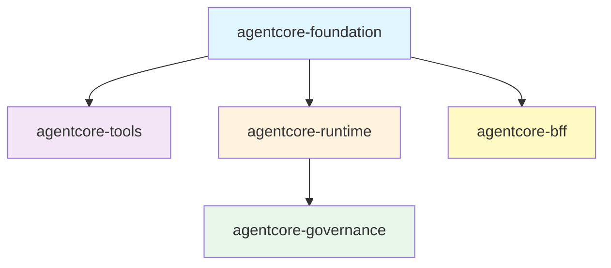
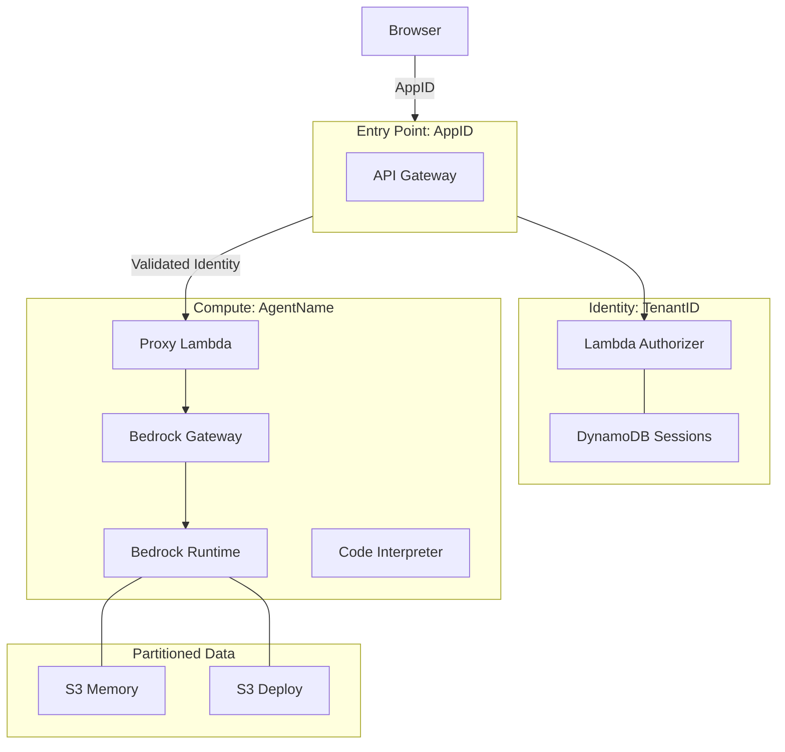

# Bedrock AgentCore Terraform // Production-Ready AI Infrastructure

Deploy, secure, and scale production AI agents on AWS Bedrock with a **local-first DX**, **Zero-Trust security**, and **Instant Hot-Reload**.

---

## 🛠️ Framework Features

*   ⚡ **Fast OCDS Builds**: Layered hashing ensures dependencies only rebuild when `pyproject.toml` changes.
*   🖥️ **Interactive CLI Terminal**: Monitor your agents in real-time with `python terraform/scripts/acore_debug.py`.
*   🔍 **OIDC Auto-Discovery**: Automated build-time endpoint discovery for Entra ID, Okta, and Auth0.
*   🔄 **Seamless Session Rotation**: Built-in refresh token handler ensures long-running agents never lose connectivity.
*   🛡️ **ABAC & Cedar Support**: Enterprise-grade authorization using attribute-based access and Cedar policies.

---

## 🏗️ Architecture

### Logic & Modules


### Physical Infrastructure (North-South Join)


---

## 🎯 The Framework at a Glance

Bedrock AgentCore is an enterprise-grade orchestration framework for AI Agents. It bridges the gap between raw AI capabilities and production-hardened infrastructure, providing a complete lifecycle from local prototyping to multi-tenant global scale.

### Core Engineering Principles

*   **The CLI Bridge Pattern**: Day 0 access to the latest Bedrock features (Guardrails, Inference Profiles) via stateful CLI integration and SSM persistence.
*   **OCDS (Optimized Code/Dependency Separation)**: Layered Lambda packaging that caches heavy dependencies while keeping agent logic fresh and hot-reloadable.
*   **North-South Join Isolation**: A hierarchical multi-tenancy model that anchors identity context (User/Tenant) to physical compute resources (Agents) via dynamic ABAC policies.
*   **Zero-Trust BFF**: A Serverless Backend-for-Frontend that implements the **Token Handler Pattern**—tokens never reach the browser, preventing XSS-based theft.

---

## 👤 Who is this for?

| Role | Focus | Outcome |
| :--- | :--- | :--- |
| **AI/ML Engineer** | Python logic & MCP tools | Builds intelligent, tool-using agents without managing AWS plumbing. |
| **DevOps / SRE** | Bootstrapping & CI/CD | Manages account readiness, regional splitting, and automated deployments. |
| **Security Architect** | Zero-Trust & Compliance | Enforces tenant isolation, OIDC discovery, and audit logging. |

---

## 🚀 The 3-Step Journey

### 1. Bootstrap (Account Readiness)
Before deploying agents, the AWS account must be prepared for modern CI/CD and secure state management. This is a one-time setup typically performed by a **Platform Engineer**.

```bash
# Prepare account for GitLab CI (WIF) and S3 State
bash terraform/scripts/bootstrap_wif.sh
```
*   **Creates**: OIDC Provider for GitLab, Scoped Deployment IAM Role, and Encrypted S3 State Bucket.
*   **Ensures**: No long-lived AWS keys in CI/CD variables.

### 2. Scaffold (Local Developer Experience)
**AI Developers** start locally. Use our enterprise template to generate a compliant agent project.

```bash
# 1. Scaffold a fresh project
pip install copier
copier copy --trust templates/agent-project my-new-agent

# 2. Develop logic in pure Python (No AWS needed)
cd my-new-agent/agent-code
python runtime.py
```

### 3. Orchestrate (Infrastructure as Code)
Deploy the agent to AWS using the modular AgentCore topology.

```bash
# Deploy to Dev
cd terraform
terraform init -backend-config=backend-dev.tf
terraform apply
```
*   **Result**: Your agent is live with a secure Gateway, MCP tools, and a Backend-for-Frontend (BFF).

---

## 📖 Documentation

- **[DEVELOPER_GUIDE.md](./DEVELOPER_GUIDE.md)** - Team onboarding and common development tasks.
- **[SETUP.md](./SETUP.md)** - Detailed, step-by-step account configuration.
- **[AGENTS.md](./AGENTS.md)** - The Universal Codex for AI Agents (Rules, Security, Patterns).
- **[docs/architecture.md](./docs/architecture.md)** - Deep dive into system design and data flows.
- **[docs/WIF_SETUP.md](./docs/WIF_SETUP.md)** - Advanced GitLab OIDC configuration.

---

## ⚖️ License

MIT - See LICENSE file for details.
