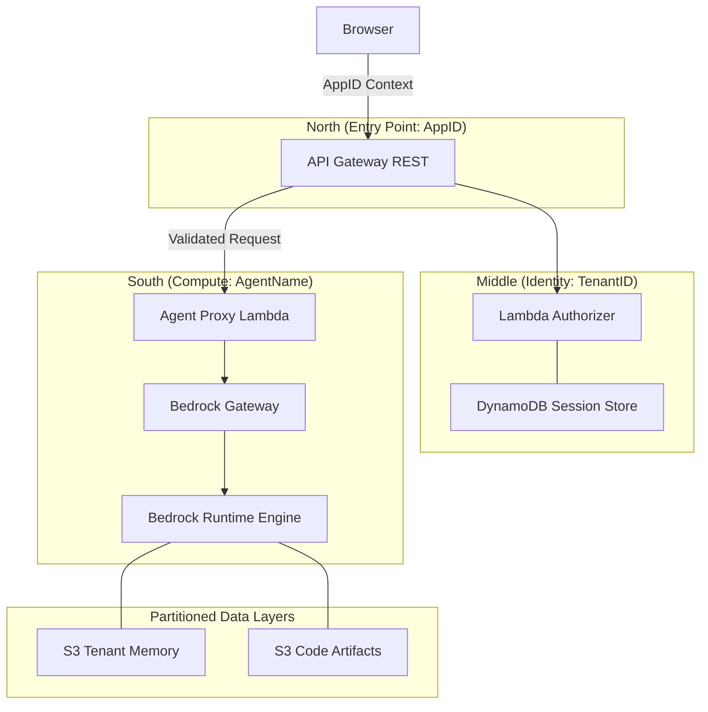
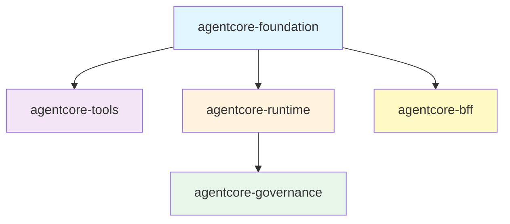

# Bedrock AgentCore Terraform // AI Infrastructure at Kernel Precision

Deploy, secure, and scale production AI agents on AWS Bedrock. Bedrock AgentCore is a hardened orchestration engine that bridges the gap between raw AI models and enterprise-ready security. 

---

## Technical Impact

In modern AI deployments, the frontend is a liability. Stolen tokens and prompt-injection attacks are not edge cases—they are the default threat model. AgentCore treats AI infrastructure as a systems internals problem, providing defense-in-depth at the identity and compute layers.

*   **Identity Translation Engine**: This engine automatically exchanges fragile User JWTs for scoped **Workload Tokens**. Your agents never handle master session tokens; instead, they receive a least-privilege identity anchored to a specific tenant.
*   **OCDS Build Protocol**: The Optimized Code/Dependency Separation protocol implements a two-stage Lambda packaging system. It caches heavy system dependencies independently of agent logic, which enables **Instant Hot-Reloads** and deterministic deployments.
*   **Stateful CLI Bridge**: This bridge solves the Terraform "Provider Gap" for Bedrock resources. It wraps AWS CLI control-plane operations in a stateful lifecycle manager and uses **SSM Parameter Store** as a persistent registry to ensure resource IDs survive CI/CD runner destruction.

---

## Architecture

### The North-South Join (Physical)
Every request is anchored by a hierarchical identity model. **North** defines the logical application boundary, **Middle** provides organizational isolation, and **South** manages the shared compute resources.



### Logical Topology


---

## Stakeholder Mapping

| Role | Focus | Technical Outcome |
| :--- | :--- | :--- |
| **AI Engineer** | Logic and MCP tools | You build intelligent agents without managing AWS plumbing. |
| **Platform Engineer** | Bootstrapping and CI/CD | You manage account readiness, regional splits, and deployment stability. |
| **Security Lead** | Zero-Trust and Isolation | You enforce tenant boundaries, OIDC discovery, and audit trails. |

---

## The 3-Step Success Path

### 1. Bootstrap (Prepare the Environment)
Prepare your AWS account for modern automation. This one-time setup establishes the OIDC trust relationship between your CI/CD provider and AWS.
```bash
# Prepare the account for GitLab CI (WIF) and Encrypted S3 State
bash terraform/scripts/bootstrap_wif.sh
```
*   **Action**: Creates the OIDC Provider, a scoped Deployment IAM Role, and an Encrypted S3 State Bucket.
*   **Security**: Eliminates long-lived access keys from your CI/CD environment.

### 2. Scaffold (Accelerate Development)
Start locally with a 100% compliant project structure.
```bash
# Scaffold a fresh agent project
pip install copier
copier copy --trust templates/agent-project my-agent

# Develop logic in pure Python
cd my-agent/agent-code
python runtime.py
```

### 3. Orchestrate (Scale to Production)
Deploy your agent using the modular topology and environment-specific backends.
```bash
# Initialize and deploy to the dev environment
cd terraform
terraform init -backend-config=backend-dev.tf
terraform apply
```

---

## Framework Features

*   ⚡ **Instant Hot-Reload**: Update agent logic without reinstalling heavy dependencies.
*   🔍 **OIDC Auto-Discovery**: Automatically discover endpoints for Entra ID, Okta, and Auth0.
*   🛡️ **ABAC Physical Isolation**: Restrict agent credentials to tenant-specific S3 prefixes using dynamic session policies.
*   🖥️ **Interactive Terminal**: Manage and observe your agents in real-time with the `acore_debug` CLI.

---

## Documentation

- **[DEVELOPER_GUIDE.md](./DEVELOPER_GUIDE.md)**: Team onboarding and common development tasks.
- **[SETUP.md](./SETUP.md)**: Detailed, step-by-step account configuration.
- **[AGENTS.md](./AGENTS.md)**: The Universal Codex for AI Agents (Rules and Patterns).
- **[docs/architecture.md](./docs/architecture.md)**: Deep dive into system design and data flows.

---

## License

MIT - See the LICENSE file for details.
