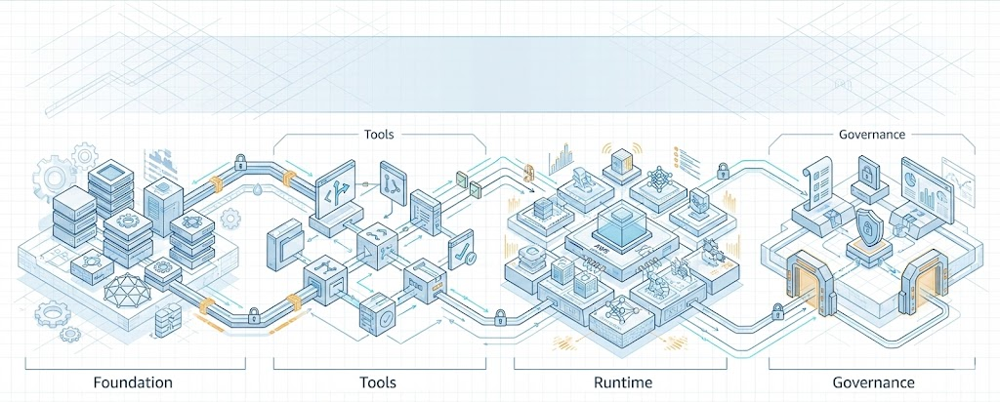
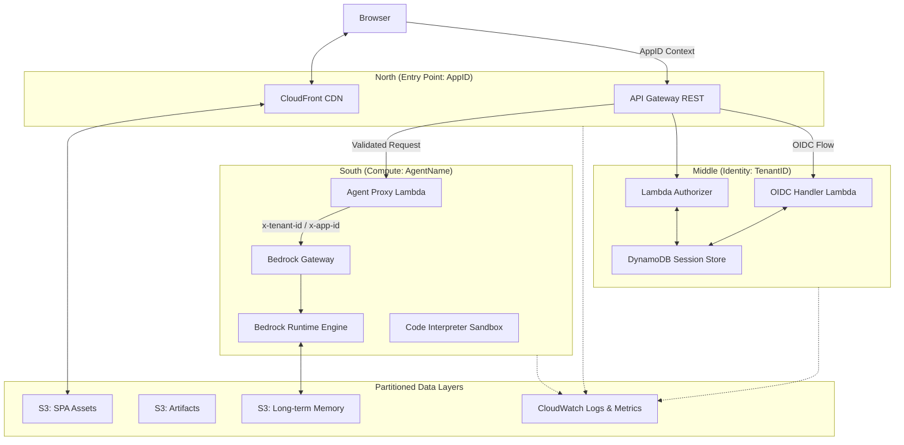
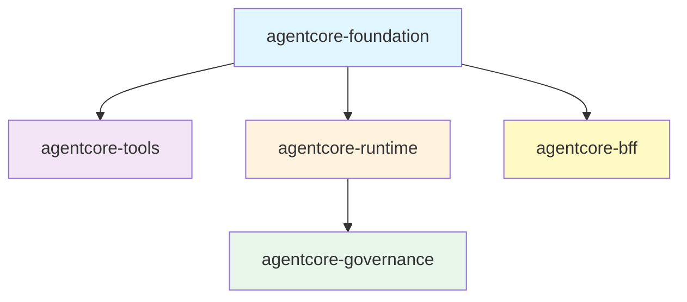

# Bedrock AgentCore Terraform



A hardened Terraform framework for deploying enterprise AI agents on AWS Bedrock AgentCore. The gap between a raw foundation model and a production-grade agent is filled with identity propagation, tenant isolation, encrypted state management, and a deployment pipeline that refuses to cut corners.


## Architecture

### The North-South Join

The North-South Join is a hierarchical identity model that anchors every request to three coordinates.

-**North** is the entry point: the AppID, materialized as an API Gateway.
-**Middle** is the identity layer: the TenantID, extracted from the OIDC token and validated by a Lambda Authorizer against DynamoDB.
-**South** is the compute layer: the AgentName, where the Bedrock Runtime Engine executes agent logic.

Data partitioning follows the same hierarchy -- DynamoDB composite keys use `APP#{app_id}#TENANT#{tenant_id}`, S3 paths use `{app_id}/{tenant_id}/{agent_name}/memory/`, and CloudWatch log groups nest under `/aws/bedrock/agentcore/{resource-type}/{agent-name}`.



> The `hashicorp/aws` provider does not yet support AgentCore resources -- verified through v5.100.0.

This framework bridges that gap with a stateful CLI bridge pattern that wraps every AgentCore control-plane operation in a lifecycle manager backed by SSM Parameter Store, giving you full infrastructure-as-code semantics today and a clean `terraform import` migration path when native resources arrive.

---

## Three Core Systems

### Identity Translation Engine

Every agent interaction begins with a human. That human arrives carrying a JWT from their corporate identity provider -- Entra ID, Okta, Auth0 -- and the framework must translate that ephemeral, provider-specific token into a scoped AWS Workload Token before any compute touches it. Agents never see master session tokens. They receive a least-privilege identity anchored to the North-South Join hierarchy:
- **AppID** defines the application boundary
- **TenantID** defines the ownership unit
- **AgentName** identifies the compute resource. Together, these three dimensions form a composite key that threads through every layer of the stack.

ABAC enforcement happens at runtime through dynamic IAM session policies. When a request arrives, the proxy Lambda assumes the agent's execution role with a session policy that physically restricts S3 access to the tenant-specific prefix `{app_id}/{tenant_id}/{agent_name}/`. The credentials themselves are scoped -- not just the application logic. A compromised agent cannot read another tenant's memory because the temporary credentials it holds lack the permission to do so.

### OCDS Build Protocol

The Optimized Code/Dependency Separation protocol splits Lambda packaging into two deterministic stages.
Stage 1 reads `pyproject.toml`, resolves dependencies against the target platform (`manylinux2014_x86_64` or `manylinux2014_aarch64` for Graviton), and caches them in an isolated layer.
Stage 2 packages only your agent logic. The result is that a one-line change to your agent's reasoning loop produces a rebuild measured in seconds, not minutes, because the 200MB dependency layer is untouched.

Architecture-aware binary fetching means you can target ARM64/Graviton by flipping `lambda_architecture = "arm64"` and the build engine handles the rest. SHA256 content hashing on both stages ensures that identical inputs produce identical outputs, and that Terraform only triggers a rebuild when something actually changed. The deployment artifact lands in S3 encrypted with SSE-S3, versioned, and referenced by the runtime via a content-addressed key.

### Stateful CLI Bridge

> The remaining CLI-managed AgentCore resource families are those without stable native coverage in this repo's migration matrix (for example Workload Identity, Browser, Code Interpreter, Policy Engine, Cedar Policies, Evaluators, and OAuth2 Credential Providers).

Where native resources are not yet adopted, the framework uses a `null_resource` + `local-exec` CLI bridge (`bedrock-agentcore-control`) with SHA256-based triggers for idempotent behavior.

CLI-managed resource IDs persist in SSM Parameter Store, which means they survive CI/CD runner destruction, local state corruption, and team member rotation. When native resources are adopted, migration is a `terraform import` transition from `null_resource` to the native type. The framework was designed for this transition from day one.

---

### Logical Topology

The module dependency graph is fixed and intentional. Foundation has no dependencies. Tools and Runtime depend on Foundation. Governance depends on Foundation and Runtime. BFF depends on Foundation. This ordering prevents circular references and ensures that shared infrastructure (IAM roles, log groups, WAF ACLs) exists before any module that consumes it.



---

## Module Reference

| Module | Domain | Key Resources | Feature Toggles |
|--------|--------|---------------|-----------------|
| `agentcore-foundation` | Gateway, Identity, Observability, WAF | MCP Gateway, Gateway Targets, Workload Identity, CloudWatch Log Groups, X-Ray Sampling Rules, WAF Web ACL, IAM Roles | `enable_gateway`, `enable_identity`, `enable_observability`, `enable_xray`, `enable_waf` |
| `agentcore-tools` | Code Interpreter, Browser | Python sandbox (PUBLIC/SANDBOX/VPC modes), Web browser with optional session recording to S3 | `enable_code_interpreter`, `enable_browser`, `enable_browser_recording` |
| `agentcore-runtime` | Runtime, Memory, Packaging | Agent execution runtime, S3 deployment artifacts bucket, OCDS two-stage build, short-term and long-term memory, application inference profiles | `enable_runtime`, `enable_memory`, `enable_packaging`, `enable_inference_profile` |
| `agentcore-governance` | Policy Engine, Guardrails, Evaluations | Cedar policy enforcement, Bedrock Guardrails (content/PII filters), model-based evaluation (TOOL_CALL/REASONING/RESPONSE) | `enable_policy_engine`, `enable_guardrails`, `enable_evaluations` |
| `agentcore-bff` | Token Handler, SPA Hosting, Streaming Proxy | API Gateway REST, Lambda Authorizer, OIDC Handler Lambda, DynamoDB session store, CloudFront distribution, SigV4 streaming proxy (15-min timeout), optional S3 shadow audit logs with Athena/Glue query metadata | `enable_bff`, `enable_bff_audit_log_persistence` |

---

## Security Model

### The Authentication Chain

Credentials never persist. The deployment pipeline authenticates via GitLab Web Identity Federation: the CI runner presents a JWT to AWS STS, receives temporary credentials scoped to a deployment role, and uses those credentials for exactly one pipeline execution. Terraform provisions resources under those temporary credentials. The agent runtime itself operates under a dedicated IAM role with least-privilege permissions -- it can invoke Bedrock, read its own S3 prefix, and write to its own log group. Nothing more.

The MCP Gateway adds a second authentication layer. Inbound requests authenticate via Workload Identity, which validates the caller's OAuth2 token and issues a scoped session. Lambda MCP tools execute under their own IAM execution roles, isolated from the gateway's permissions. The full chain reads:

>**GitLab WIF -> AWS STS -> temporary credentials -> Terraform provisions -> Agent Runtime (scoped IAM) -> Gateway (Workload Identity OAuth2) -> MCP Tools (Lambda execution roles)**.

### Token Handler Pattern

No token ever reaches the browser. The BFF module implements the AWS Serverless Token Handler Pattern: the OIDC Handler Lambda exchanges authorization codes for access and refresh tokens, stores them server-side in DynamoDB with a TTL matching the token expiry, and returns a single `Set-Cookie` header with `Secure; HttpOnly; SameSite=Strict` flags. The session ID is the only value that crosses the wire to the client. XSS attacks that compromise the SPA cannot exfiltrate credentials because there are no credentials in the browser to steal. PKCE is enforced on all OIDC flows, even for confidential clients, to prevent authorization code injection.

### Multi-Tenant Isolation

Tenant boundaries are enforced at three layers simultaneously. DynamoDB uses composite keys (`APP#{app_id}#TENANT#{tenant_id}`) so that a query for one tenant's sessions physically cannot return another tenant's data. S3 partitions agent memory under `{app_id}/{tenant_id}/{agent_name}/memory/`, and the dynamic session policies described above restrict the runtime's temporary credentials to that exact prefix. IAM condition keys (`aws:SourceAccount`) prevent cross-account confusion deputy attacks.

### Agent-to-Agent Authentication

In multi-agent systems, a source agent that needs to delegate work to a peer follows a strict protocol. The source agent calls `GetWorkloadAccessTokenForJWT`, exchanging the original user's JWT for a scoped workload token. It then invokes the target agent with an `Authorization: Bearer <token>` header. The target agent validates the token through its inbound authorizer, and the original user's identity context -- including Entra ID group claims -- propagates through the entire call chain. Anonymous agent-to-agent communication is forbidden.

### Encryption

AWS-managed SSE-S3 (AES-256) encrypts all data at rest: S3 buckets, deployment artifacts, agent memory. CloudWatch uses its default AWS-managed encryption. All APIs communicate over HTTPS/TLS. Customer-managed KMS keys are supported via the `enable_kms` and `kms_key_arn` variables but are not required -- ADR 0008 documents the reasoning: AWS-managed encryption provides equivalent cryptographic security with significantly less operational overhead. Toggle KMS on only when regulatory requirements demand customer-controlled key material.

---

## Getting Started

### 1. Bootstrap WIF

Establish the OIDC trust relationship between your CI/CD provider and AWS. This one-time setup creates the OIDC provider, a scoped deployment IAM role, and an encrypted S3 state bucket.

```bash
bash terraform/scripts/bootstrap_wif.sh
```

### 2. Configure

Create a `terraform.tfvars` file or use one of the provided examples.

```hcl
agent_name  = "my-agent-core-a1b2"
app_id      = "my-agent"
region      = "eu-west-2"
environment = "dev"

enable_gateway      = true
enable_runtime      = true
runtime_source_path = "./agent-code"

enable_code_interpreter       = true
code_interpreter_network_mode = "SANDBOX"

enable_observability = true
enable_memory        = true
memory_type          = "BOTH"
```

### 3. Deploy

```bash
cd terraform
terraform init -backend-config=backend-dev.tf
terraform apply -var-file=../examples/1-hello-world/terraform.tfvars
```

---

## Developer Experience

### The Inner Loop

The distance between saving a file and seeing it execute in AWS is measured in seconds, not minutes. The OCDS build protocol described above is what makes this possible, but `hot_reload.py` is what makes it automatic. Run the watcher against your agent source directory and it monitors every `.py` file via `watchdog`. When you save, it fires a targeted `terraform apply -target=module.agentcore_runtime` that triggers only OCDS Stage 2 -- your code is repackaged, the dependency layer is untouched, and the new artifact lands in S3 within a few seconds. The Lambda picks up the new code on its next invocation. No container builds, no CI round-trips, no manual zipping.

```bash
# Terminal 1: start the hot-reload watcher
python terraform/scripts/hot_reload.py examples/3-deepresearch/agent-code

# Terminal 2: observe what happens
python terraform/scripts/acore_debug.py
```

The debug TUI (`acore_debug.py`) auto-discovers your deployed infrastructure from `terraform output -json`, then streams CloudWatch logs into a live terminal panel alongside a latency trace that breaks down each request into Gateway, Authorizer, Router, Lambda, and Bedrock segments. Press `r` to trigger a manual reload without leaving the debugger. The tool speaks the OCDS protocol -- when it reloads, it runs an identical targeted apply that respects the two-stage hash boundaries.

### Frontend Component Library (React + Tailwind)

The SPA frontend template now includes a reusable, static-hosting-compatible component library for building specialized agent dashboards without introducing a frontend build pipeline. The library lives in `templates/agent-project/frontend/components.js` and is mirrored in `examples/5-integrated/frontend/components.js`.

- **Runtime model:** Browser-loaded React + Tailwind (ES modules, no bundler required)
- **Reusable blocks:** App shell, panels, metric cards, transcript, timeline, tool catalog, JSON preview, prompt composer
- **DX integration:** The example app attempts to load `docs/api/mcp-tools-v1.openapi.json` to populate dashboard tool panels automatically, and the repo now also ships a generated typed client at `docs/api/mcp-tools-v1.client.ts` for frontend/integrator SDK usage

This keeps the BFF/Token Handler deployment model serverless and static while giving teams a composable UI base for role-specific consoles.

### Local MCP Development

The `examples/mcp-servers/local-dev/` directory provides a Flask-based MCP server that implements the same protocol your Lambda handlers speak, without requiring an AWS account. Start it with `make dev` from the `examples/mcp-servers/` directory and it binds to `localhost:8080`, serving tool definitions and handling invocations against local data. The development cycle is bidirectional: build and test locally, promote to Lambda when the logic is stable, diagnose production issues locally by pulling real payloads down and replaying them against the Flask server.

```bash
cd examples/mcp-servers
make setup   # one-time dependency install
make dev     # Flask MCP server on localhost:8080
make test    # run handler tests locally
make watch   # auto-restart on file changes (inotifywait)
```

### The Makefile

The root Makefile exposes the full development surface through forty-odd targets. `make quickstart` gets a new team member from clone to validated in under a minute. `make plan-dev` through `make plan-research` let you plan against any example configuration without remembering tfvars paths. `make test-all` runs every Terraform and Python validation in sequence. `make security-scan` runs Checkov. `make policy-report` generates the policy and tag conformance report. `make logs-gateway` through `make logs-evaluator` tail CloudWatch logs per component.
 `make docs` regenerates terraform-docs plus MCP OpenAPI/typed-client artifacts, `make generate-openapi-client` regenerates the TypeScript SDK from the MCP OpenAPI spec, and `make check-openapi-client` validates generated-client drift. `make streaming-load-test` runs the automated NDJSON streaming connectivity/load tester for validating the 15-minute (900s) streaming wall through the BFF proxy. `make debug` runs a plan with `TF_LOG=DEBUG` for when things go sideways.
The root Makefile exposes the full development surface through forty-odd targets. `make quickstart` gets a new team member from clone to validated in under a minute. `make plan-dev` through `make plan-research` let you plan against any example configuration without remembering tfvars paths. `make test-all` runs every Terraform and Python validation in sequence. `make security-scan` runs Checkov. `make logs-gateway` through `make logs-evaluator` tail CloudWatch logs per component. `make docs` regenerates terraform-docs plus MCP OpenAPI/typed-client artifacts, `make generate-openapi-client` regenerates the TypeScript SDK from the MCP OpenAPI spec, `make check-openapi-client` validates generated-client drift, and `make openapi-contract-diff OLD=<baseline.json>` produces a classified contract diff/changelog summary (potentially breaking vs additive vs documentation-only) for PR/release review. `make streaming-load-test` runs the automated NDJSON streaming connectivity/load tester for validating the 15-minute (900s) streaming wall through the BFF proxy. `make debug` runs a plan with `TF_LOG=DEBUG` for when things go sideways.

No target requires AWS credentials except those that explicitly deploy or read live infrastructure. Formatting, validation, security scanning, linting, and Python unit tests all run locally and offline.

### Streaming Wall Verification (Issue #32)

To validate long-lived response streaming through the BFF proxy, use the automated CLI tester:

```bash
# Uses terraform output agentcore_bff_api_url and appends /chat
make streaming-load-test ARGS='--session-cookie tenant-a:session-123 --duration-seconds 900 --verbose'
```

The tester validates:
- HTTP `200` response status
- NDJSON streaming content type (`application/x-ndjson`)
- minimum stream duration (defaults to `--duration-seconds`)
- minimum delta event count (defaults to `1`)

Use `--use-spa-url` when targeting CloudFront (`/api/chat`) instead of the direct API Gateway invoke URL, and `--json-summary` for evidence artifacts in issue/PR closeout comments.

### Pre-commit Enforcement

Every commit passes through a hook chain that catches problems before they reach CI. Terraform formatting, validation, and docs generation run automatically. TFLint applies the AWS ruleset. Checkov scans for security misconfigurations. Black and Flake8 enforce Python style at line-length 120. Custom local hooks round out the chain: `docs-sync-check` blocks Terraform changes that lack documentation updates, `tests-sync-check` blocks Terraform changes that lack test updates, `agent-docs-sync-check` enforces parity across `AGENTS.md`/`CLAUDE.md`/`GEMINI.md`, `scratch-ephemeral-check` blocks committing `.scratch/` artifacts, `file-proliferation-check` blocks ad-hoc variant filenames/scripts outside approved paths, and `no-placeholder-arns` catches hardcoded dummy account IDs before they can ship.

### Session Preflight (Worktree Safety)

Run session preflight checks before editing and before commit/push:

```bash
make preflight-session
```

The preflight source-of-truth is `terraform/scripts/session/preflight.policy`. It enforces branch/worktree guardrails and issue-linked worktree naming conventions.

For an interactive linked-worktree helper (list/create/resume), use:

```bash
make worktree
```

The menu validates branch naming against the same policy regex, runs `make preflight-session` in the selected worktree, and can hand off into your selected agent/CLI in the correct worktree. For new worktrees, it can pull from the GitHub `ready` issue queue, order it by plan docs (default `ROADMAP.md` issue order), then by priority labels, then by creation time, auto-derive the branch slug from the selected issue title, suggest a branch `scope` namespace from issue labels/title (editable), and optionally auto-claim the selected issue (`ready` -> `in-progress`) after worktree creation and preflight pass. You can override queue plan sources with `WORKTREE_QUEUE_PLAN_FILES` (space-separated repo-relative files). On shell handoff, it lets you choose `gemini`, `claude`, or `codex`, choose `yolo`/equivalent mode or normal mode, choose `issue type` (execution or tracker), choose the expected `closure condition`, and choose `execute-now` or `print-only`. It then prints a boilerplate agent prompt plus the launch command (with selected worktree path and parsed issue number injected) and either executes it immediately or opens a shell without executing it.

### Issue Queue Conventions (for `make worktree`)

The `ready` queue is only useful when issue metadata is consistent. Recommended conventions:

- **Issue type labels**: `tracker`, `execution`
- **Status labels**: `ready`, `in-progress`, `blocked`, `review`, `done`
- **Stream labels (workstream lanes)**: `a`, `b`, `c`, `d`, `e`
- **Roadmap item labels (optional)**: `a0`, `a1`, `b0`, etc.
- **Domain labels (optional)**: `provider`, `docs`, `runtime`, `ci`, `release`
- **Branch scope** (`wt/<scope>/<issue>-<slug>`): a branch namespace only; use the primary touched area (`provider`, `docs`, `runtime`, etc.). `make worktree` now suggests this from labels/title, and you can override it.
- **Priority labels (optional)**: `p0`, `p1`, `p2`, `p3`

Queue ordering for `make worktree` create flow:

1. Plan-doc order (`ROADMAP.md` by default, or `WORKTREE_QUEUE_PLAN_FILES`)
2. Priority labels (`p0` before `p1`, etc.)
3. `createdAt` (fallback only)

GitHub issue templates are provided for both tracker and execution issues under `.github/ISSUE_TEMPLATE/` and are aligned with Rule 12 requirements (Context, Technical Detail, Tasks, Acceptance Criteria, and closeout evidence).

### Windows Support

Terraform pre-commit hooks require bash, which makes them hostile to native Windows development. `validate_windows.bat` provides an alternative: it locates your Terraform binary (checking PATH, then falling back to common install locations), runs `terraform fmt -check -recursive`, and then invokes pre-commit with the bash-dependent hooks skipped. Pass `--fix` to auto-format instead of just checking. The script finds pre-commit through multiple strategies -- `uv tool run`, standalone binary, `py -3.12 -m pre_commit` -- so it works regardless of how Python is installed.

### Scaffolding New Agents

The `templates/agent-project/` directory contains a Copier template for bootstrapping a new agent project with Terraform wiring, optional BFF/front-end files, and a production-ready agent code pattern:
- `agent-code/runtime.py` (Bedrock entrypoint)
- `agent-code/agent.py` (Strands composition/orchestration)
- `agent-code/tools.py` (`@tool` functions)
- `agent-code/tests/test_runtime.py` (starter tests)
- `agent-code/pyproject.toml` (Python dependencies + pytest config)

Interactive flow:

```bash
python3 -m pip install --user copier
export PATH="$HOME/.local/bin:$PATH"
copier copy --trust templates/agent-project .scratch/my-agent
cd .scratch/my-agent/terraform
terraform init -backend=false
terraform validate
```

Non-interactive flow (repeatable in automation):

```bash
copier copy --force --trust \
  --data agent_name=my-agent-core-a1b2 \
  --data app_id=my-agent \
  --data region=us-east-1 \
  --data environment=dev \
  --data enable_bff=true \
  templates/agent-project .scratch/my-agent
```

Notes:
- `agent_name` is the internal immutable identity for physical AWS resource names. Use a low-collision suffix pattern such as `word-word-word-a1b2`.
- `app_id` is the logical app boundary for multi-tenant partitioning; keep it stable across related agents.
- `allow_legacy_agent_name = true` is a temporary migration escape hatch for existing deployed names that cannot be safely renamed yet.
- If `enable_bff=true`, replace OIDC placeholder values in generated `terraform/main.tf` before deploy.
- Copier templates project files only; repository permissions/branch protection are managed in GitLab project/group settings.
- CI validates template generation and generated `terraform validate` so scaffolding drift is caught early.

---

## Configuration Reference

### Core

| Variable | Type | Default | Description |
|----------|------|---------|-------------|
| `agent_name` | `string` | -- (required) | Internal physical agent identity (immutable). Lowercase pattern: `word-word-word-xxxx` or `word-word-word-env-xxxx` (4-6 char suffix). |
| `app_id` | `string` | `agent_name` | Human-facing application alias for routing and multi-tenant isolation (North anchor). |
| `allow_legacy_agent_name` | `bool` | `false` | Temporary migration escape hatch to keep an existing legacy `agent_name` without forced rename. |
| `region` | `string` | `us-east-1` | Default AWS region for all resources. |
| `agentcore_region` | `string` | `region` | AgentCore control-plane region override. |
| `bedrock_region` | `string` | `agentcore_region` | Bedrock model region override. |
| `bff_region` | `string` | `agentcore_region` | BFF/API Gateway region override. |
| `environment` | `string` | `dev` | Deployment stage: `dev`, `staging`, or `prod`. |
| `tags` | `map(string)` | `{}` | Additional tags applied to all resources (canonical tags `AppID`, `AgentAlias`, `Environment`, `AgentName`, `ManagedBy`, `Owner` are merged automatically). |

### Foundation

| Variable | Type | Default | Description |
|----------|------|---------|-------------|
| `enable_gateway` | `bool` | `true` | Enable the MCP protocol gateway. |
| `gateway_name` | `string` | `""` | Custom gateway name (auto-generated if empty). |
| `gateway_search_type` | `string` | `HYBRID` | Gateway search mode: `SEMANTIC` or `HYBRID`. |
| `gateway_role_arn` | `string` | `""` | Bring-your-own IAM role for the gateway. |
| `mcp_targets` | `map(object)` | `{}` | MCP Lambda targets. Each entry requires `name` and `lambda_arn`. |
| `enable_identity` | `bool` | `false` | Enable Workload Identity (OAuth2). |
| `oauth_return_urls` | `list(string)` | `[]` | OAuth2 return URLs for workload identity. |
| `enable_observability` | `bool` | `true` | Enable CloudWatch log groups and metrics. |
| `log_retention_days` | `number` | `30` | CloudWatch log retention period. |
| `enable_xray` | `bool` | `true` | Enable X-Ray distributed tracing. |
| `alarm_sns_topic_arn` | `string` | `""` | SNS topic for CloudWatch alarm notifications. |
| `enable_agent_dashboards` | `bool` | `false` | Create an optional per-agent CloudWatch dashboard (Terraform-managed). |
| `agent_dashboard_name` | `string` | `""` | Optional dashboard name override (defaults to `<agent_name>-dashboard` when empty). |
| `dashboard_region` | `string` | `""` | Optional widget/console region override (defaults to `region` when empty). |
| `dashboard_widgets_override` | `string` | `""` | Optional JSON array string of CloudWatch widget objects to replace the default dashboard layout. |
| `enable_waf` | `bool` | `false` | Enable WAF protection for API Gateway. |
| `enable_kms` | `bool` | `false` | Enable customer-managed KMS encryption. |
| `kms_key_arn` | `string` | `""` | KMS key ARN (required when `enable_kms` is true). |

### Tools

| Variable | Type | Default | Description |
|----------|------|---------|-------------|
| `enable_code_interpreter` | `bool` | `true` | Enable the Python code interpreter sandbox. |
| `code_interpreter_network_mode` | `string` | `SANDBOX` | Network mode: `PUBLIC`, `SANDBOX`, or `VPC`. |
| `code_interpreter_vpc_config` | `object` | `null` | VPC subnet and security group configuration (required for VPC mode). |
| `enable_browser` | `bool` | `false` | Enable the web browser tool. |
| `browser_network_mode` | `string` | `SANDBOX` | Browser network mode: `PUBLIC`, `SANDBOX`, or `VPC`. |
| `browser_vpc_config` | `object` | `null` | VPC configuration for browser (required for VPC mode). |
| `enable_browser_recording` | `bool` | `false` | Enable session recording for browser interactions. |
| `browser_recording_s3_bucket` | `string` | `""` | S3 bucket for browser session recordings. |

### Runtime

| Variable | Type | Default | Description |
|----------|------|---------|-------------|
| `enable_runtime` | `bool` | `true` | Enable the agent execution runtime. |
| `runtime_source_path` | `string` | `./agent-code` | Path to agent source code directory. |
| `runtime_entry_file` | `string` | `runtime.py` | Python entry point file. |
| `runtime_config` | `map(any)` | `{}` | Runtime configuration passed as JSON. |
| `runtime_role_arn` | `string` | `""` | Bring-your-own IAM role for the runtime. |
| `runtime_policy_arns` | `list(string)` | `[]` | Additional IAM policy ARNs to attach. |
| `runtime_inline_policies` | `map(string)` | `{}` | Inline IAM policies for the runtime role. |
| `runtime_reserved_concurrency` | `number` | `10` | Reserved concurrent executions for the runtime Lambda. |
| `enable_memory` | `bool` | `false` | Enable agent memory. |
| `memory_type` | `string` | `BOTH` | Memory type: `SHORT_TERM`, `LONG_TERM`, or `BOTH`. |
| `enable_packaging` | `bool` | `true` | Enable OCDS two-stage build. |
| `python_version` | `string` | `3.12` | Python version for packaging. |
| `lambda_architecture` | `string` | `x86_64` | Compute architecture: `x86_64` or `arm64` (Graviton). |
| `deployment_bucket_name` | `string` | `""` | Custom S3 bucket for deployment artifacts (auto-created if empty). |
| `enable_inference_profile` | `bool` | `false` | Enable Bedrock application inference profile. |
| `inference_profile_name` | `string` | `""` | Name for the inference profile. |
| `inference_profile_model_source_arn` | `string` | `""` | Foundation model or system-defined inference profile ARN. |

### Per-Agent Dashboards (Issue #10)

Set `enable_agent_dashboards = true` to create a Terraform-managed CloudWatch dashboard in the foundation module. The default dashboard includes:

- Gateway metrics (`Errors`, `TargetInvocationDuration`) when the gateway is enabled
- Log widgets for gateway/runtime and optional component logs (code interpreter, browser, evaluator) based on enabled features

If a service does not emit a stable CloudWatch metric for a desired panel (for example runtime/tool invocation counts in some deployments), the default dashboard omits that metric widget and relies on log widgets instead. Use `dashboard_widgets_override` for advanced custom layouts.

### Inference Profile Cost Isolation (Per Agent)

For Bedrock usage/cost attribution per agent, enable `enable_inference_profile` and use the created **application inference profile ARN as `modelId`** in runtime/evaluator calls.

Example runtime config:

```hcl
runtime_config = {
  modelId = module.agentcore_runtime.inference_profile_arn
}
```

Operational verification points:

- Terraform output `agentcore_inference_profile_arn` (or `module.agentcore_runtime.inference_profile_arn`) confirms the profile ARN to wire into `modelId`.
- Terraform output `agentcore_dashboard_console_url` opens the per-agent CloudWatch dashboard for operational correlation (errors/latency/logs).
- AWS billing/usage tooling (for example Cost Explorer and Bedrock usage reporting) should be inspected using the inference-profile-based calling pattern above to attribute usage to the agent-specific profile.

### Governance

| Variable | Type | Default | Description |
|----------|------|---------|-------------|
| `enable_policy_engine` | `bool` | `false` | Enable Cedar policy enforcement. |
| `cedar_policy_files` | `map(string)` | `{}` | Map of policy names to Cedar policy file paths. |
| `policy_engine_schema` | `string` | `""` | Cedar schema definition. |
| `enable_guardrails` | `bool` | `false` | Enable Bedrock Guardrails. |
| `guardrail_name` | `string` | `""` | Name for the guardrail. |
| `guardrail_filters` | `list(object)` | (6 default filters) | Content filters: HATE, INSULT, SEXUAL, VIOLENCE, MISCONDUCT, PROMPT_ATTACK. |
| `guardrail_sensitive_info_filters` | `list(object)` | `[]` | PII filters with BLOCK or ANONYMIZE actions. |
| `enable_evaluations` | `bool` | `false` | Enable model-based evaluation. |
| `evaluation_type` | `string` | `TOOL_CALL` | Evaluation type: `TOOL_CALL`, `REASONING`, `RESPONSE`, or `ALL`. |
| `evaluator_model_id` | `string` | `anthropic.claude-sonnet-4-5` | Model ID for the evaluator. |
| `evaluation_prompt` | `string` | (default prompt) | Custom evaluation prompt. |
| `evaluation_criteria` | `map(string)` | `{}` | Named evaluation criteria. |

### BFF (Token Handler)

| Variable | Type | Default | Description |
|----------|------|---------|-------------|
| `enable_bff` | `bool` | `false` | Enable the Serverless SPA/BFF module. |
| `oidc_issuer` | `string` | `""` | OIDC Issuer URL (e.g., Entra ID tenant URL). |
| `oidc_client_id` | `string` | `""` | OIDC Client ID. |
| `oidc_client_secret_arn` | `string` | `""` | Secrets Manager ARN for the OIDC client secret. |
| `oidc_authorization_endpoint` | `string` | `""` | Override authorization endpoint (auto-discovered if empty). |
| `oidc_token_endpoint` | `string` | `""` | Override token endpoint (auto-discovered if empty). |
| `bff_agentcore_runtime_arn` | `string` | `""` | AgentCore runtime ARN for the proxy (required if `enable_bff=true` and `enable_runtime=false`). |
| `bff_agentcore_runtime_role_arn` | `string` | `""` | Optional runtime IAM role ARN for BFF to assume (set for cross-account runtime identity propagation). |
| `proxy_reserved_concurrency` | `number` | `10` | Reserved concurrent executions for the BFF proxy Lambda. |

---

## Examples

| Example | Purpose | Features Enabled |
|---------|---------|-----------------|
| `1-hello-world` | Minimal standalone agent demonstrating basic AgentCore capabilities | Runtime, Observability, Packaging |
| `2-gateway-tool` | MCP gateway integration with a Titanic dataset analysis Lambda | Gateway, Code Interpreter (SANDBOX), Runtime, Packaging |
| `3-deepresearch` | Full-featured research agent with Strands DeepAgents | Gateway, Code Interpreter, Browser, Memory (BOTH), Observability |
| `4-research` | Research agent with governance and quality evaluation | Gateway, Code Interpreter, Browser, Memory, Evaluations (REASONING) |

Deploy any example with a single command:

```bash
cd terraform
terraform init -backend=false
terraform plan -var-file=../examples/3-deepresearch/terraform.tfvars
```

---

## Cross-Account Invocation (Gateway + BFF)

- **Gateway -> Lambda targets**: The foundation module gateway service role now gets least-privilege `lambda:InvokeFunction` permissions scoped to the exact `mcp_targets[*].lambda_arn` values (no wildcard invoke).
- **Cross-account Lambda targets**: If a target Lambda lives in another account, add a resource-based policy on that Lambda allowing the gateway service role ARN to invoke it. The root module now exposes `agentcore_gateway_role_arn` and `agentcore_gateway_arn` outputs to wire this cleanly.
- **BFF -> Runtime (cross-account)**: Set both `bff_agentcore_runtime_arn` and `bff_agentcore_runtime_role_arn` so the proxy can invoke the external runtime and (when configured) assume the runtime role for identity propagation.

Example (root module inputs):

```hcl
enable_bff = true

# External runtime (different account)
bff_agentcore_runtime_arn      = "arn:aws:bedrock-agentcore:us-east-1:222222222222:runtime/my-runtime"
bff_agentcore_runtime_role_arn = "arn:aws:iam::222222222222:role/my-runtime-role"
```

---

## Versioning And Release Contract

- Canonical repository version is stored in `VERSION` (current line: `0.1.x`).
- Official releases are immutable tags in the format `vMAJOR.MINOR.PATCH` (for example `v0.1.0`).
- `main` is the integration branch.
- `main` is the promotion branch for dev and test (manual/API pipeline gates for test).
- Forks are not part of release promotion.
- Release refs must be pushed to both remotes: `origin` (GitHub) and `gitlab` (GitLab).

For Terraform module consumers, pin to a release tag rather than a branch ref.

Dual-remote push flow:

```bash
# Integration commit
git push origin main
git push gitlab main

# Release tag
git tag v0.1.0
git push origin v0.1.0
git push gitlab v0.1.0
```

---

## CI/CD Pipeline

The framework ships with both a GitLab CI pipeline for full deployment and a GitHub Actions workflow for validation-only CI.

### GitLab CI (Full Pipeline)

The GitLab pipeline spans 13 stages across three environments, with every stage authenticated via Web Identity Federation -- no long-lived AWS access keys exist anywhere in the system.

| Stage | Environment | Trigger | Purpose |
|-------|-------------|---------|---------|
| `validate:fmt` | -- | Every push | Terraform formatting check |
| `validate:syntax` | -- | Every push | `terraform init` + `terraform validate` |
| `validate:docs-and-tests` | -- | Every push to tracked branches | Enforce that Terraform changes include doc and test updates |
| `lint:tflint` | -- | Every push to tracked branches | TFLint recursive scan |
| `lint:checkov` | -- | Every push to tracked branches | Checkov security scan with JUnit reporting |
| `test:examples` | -- | Every push to tracked branches | Validate all example configurations |
| `test:cedar-policies` | -- | Every push to tracked branches | Cedar policy syntax validation |
| `test:python-*` | -- | Every push to tracked branches | pytest suites for each example agent |
| `promote:dev` | Dev Gate | Push to `main` | Manual promotion gate required before any dev deploy |
| `plan:dev` -> `deploy:dev` -> `smoke-test:dev` | Dev | Push to `main` after `promote:dev` | Chained dev deployment flow; `deploy:dev` is blocked until promotion is approved |
| `promote:test` | Test Gate | Manual/API pipeline on `main` | Manual promotion gate; requires successful `deploy:dev` + `smoke-test:dev` in the same pipeline |
| `plan:test` -> `deploy:test` -> `smoke-test:test` | Test | Same manual/API `main` pipeline after `promote:test` | Explicit chained DAG; test-environment jobs are never created on push pipelines |
| `gate:prod-from-test` | -- | Git tag | Verifies same SHA has successful `deploy:test` + `smoke-test:test` in a successful `main` pipeline |
| `plan:prod` + `deploy:prod` + `smoke-test:prod` | Prod | Git tag | Manual deploy to prod account (with approval) |

Scheduled pipelines run drift detection across all environments using `terraform plan -detailed-exitcode`. If infrastructure has diverged from state, the pipeline flags the drift and optionally sends a Slack notification.

### GitLab Hardening Checklist (Settings + IaC Mapping)

Use this as the baseline hardening profile for production promotion.

1. Protect `main` and block direct pushes.
2. If you use merge request gates, require CODEOWNERS approval for protected branches.
3. Protect release tags (`v*`) so only release managers/maintainers can create them.
4. Protect `production` environment and restrict who can deploy `deploy:prod`.
5. If you use merge request gates, require explicit approval rules (platform/security groups).
6. Mark prod CI variables as protected (`CI_ENVIRONMENT_ROLE_ARN_PROD`, `TF_STATE_BUCKET_PROD`, secrets).

Terraform GitLab provider mapping:

| Control | Terraform Resource | Notes |
|---------|--------------------|-------|
| Protected branch policy | `gitlab_branch_protection` | Set no direct push to `main`, require CODEOWNERS approval where licensed. |
| Protected tag policy | `gitlab_tag_protection` | Protect `v*` tag creation to release managers/maintainers. |
| Protected production deploys | `gitlab_project_protected_environment` | Restrict deploy access for `production` environment. |
| MR approval requirements (optional) | `gitlab_project_level_mr_approvals`, `gitlab_project_approval_rule` | Enforce minimum approvers and approval groups if MR flow is enabled. |
| CODEOWNERS in repo | `gitlab_repository_file` | Manage `CODEOWNERS` as code. |
| Team access assignment | `gitlab_project_share_group`, `gitlab_group_membership` | Delegate project/group roles to dev teams. |

Folder-level permissions are not natively supported by GitLab. Use protected branches, path ownership, and approval controls that match your chosen workflow in a single repo.

Starter Terraform (copy/paste):

Core-compatible baseline:

```hcl
terraform {
  required_providers {
    gitlab = {
      source = "gitlabhq/gitlab"
    }
  }
}

provider "gitlab" {}

variable "project_id" {
  type = string
}

variable "dev_group_id" {
  type = number
}

resource "gitlab_project_share_group" "dev_access" {
  project      = var.project_id
  group_id     = var.dev_group_id
  group_access = "developer"
}

resource "gitlab_branch_protection" "main" {
  project                = var.project_id
  branch                 = "main"
  push_access_level      = "no one"
  merge_access_level     = "maintainer"
  unprotect_access_level = "maintainer"
}

resource "gitlab_tag_protection" "release_tags" {
  project             = var.project_id
  tag                 = "v*"
  create_access_level = "maintainer"

  lifecycle {
    create_before_destroy = true
  }
}

resource "gitlab_repository_file" "codeowners" {
  project        = var.project_id
  branch         = "main"
  file_path      = "CODEOWNERS"
  encoding       = "text"
  commit_message = "chore: enforce path ownership"
  content        = <<-EOT
    /examples/1-hello-world/** @platform/dev-team-a
    /examples/2-gateway-tool/** @platform/dev-team-b
    /examples/3-deepresearch/** @platform/dev-team-c
    /terraform/** @platform/platform-team
  EOT
}
```

Premium/Ultimate hardened add-on:

```hcl
variable "release_manager_group_id" {
  type = number
}

variable "platform_approver_group_id" {
  type = number
}

# Replace gitlab_branch_protection.main from the baseline with this block.
resource "gitlab_branch_protection" "main" {
  project                      = var.project_id
  branch                       = "main"
  push_access_level            = "no one"
  merge_access_level           = "maintainer"
  unprotect_access_level       = "maintainer"
  code_owner_approval_required = true
}

resource "gitlab_project_level_mr_approvals" "project_defaults" {
  project                                        = var.project_id
  reset_approvals_on_push                        = true
  disable_overriding_approvers_per_merge_request = true
  merge_requests_author_approval                 = false
  merge_requests_disable_committers_approval     = true
}

resource "gitlab_project_approval_rule" "platform" {
  project                           = var.project_id
  name                              = "Platform approval"
  approvals_required                = 1
  group_ids                         = [var.platform_approver_group_id]
  applies_to_all_protected_branches = true
}

resource "gitlab_project_protected_environment" "production" {
  project     = var.project_id
  environment = "production"

  deploy_access_levels_attribute = [
    {
      group_id = var.release_manager_group_id
    }
  ]

  approval_rules = [
    {
      group_id           = var.platform_approver_group_id
      required_approvals = 1
    }
  ]
}
```

### GitHub Actions (Validation Only)

The GitHub Actions workflow runs on every pull request, push to `main`, and `v*` tag push. It executes formatting checks, `terraform validate`, TFLint, Checkov, example validation, Copier template generation, and **component accessibility regression testing (WCAG 2.1 AA)**. It does not deploy to AWS and requires no cloud credentials.

GitLab CI is the deployment pipeline. It runs validation/lint/test stages and then handles environment promotion gates for deploy.

---

## State Management

Terraform state lives in S3 with native S3 locking enabled via `use_lockfile = true`, which requires Terraform 1.10.0 or later. The framework uses separate S3 buckets per environment rather than Terraform workspaces. This is a deliberate blast-radius decision: if the dev state bucket is compromised or corrupted, test and prod are physically unaffected. Switching environments requires a `terraform init -backend-config=backend-{env}.tf` rather than a `terraform workspace select`, which makes the active environment explicit and impossible to confuse. No DynamoDB lock table is required -- native S3 locking handles concurrency. Current backend examples and CI templates use the env-only key pattern `agentcore/{env}/terraform.tfstate`; E8A documents the planned finer-grained strategy and migration runbook in `docs/adr/0013-segmented-state-key-strategy.md` and `docs/runbooks/segmented-terraform-state-key-migration.md`.

```
S3 Bucket (per environment)
  agentcore/
    {env}/
      terraform.tfstate
      terraform.tfstate.tflock  # lock file during operations
    [versioned snapshots]       # via S3 versioning
```

---

## Key Decisions

| Decision | Rationale | ADR |
|----------|-----------|-----|
| Four-module architecture (Foundation, Tools, Runtime, Governance) + BFF | Semantic separation of concerns without over-fragmentation. Each module maps to a distinct operational domain. | 0001 |
| CLI-based resources via `null_resource` | CLI bridge is retained only for resource families not yet stabilized on native provider paths; SSM persistence preserves IaC semantics during migration. | 0002 |
| GitLab CI with Web Identity Federation | Eliminates long-lived AWS access keys. JWT-to-STS exchange scoped per environment. | 0003 |
| S3 backend with native locking | `use_lockfile = true` (Terraform >= 1.10.0) replaces DynamoDB lock tables. Simpler, fewer resources. | 0004 |
| Separate backends per environment | Blast radius containment. Wrong-workspace accidents physically cannot affect production. | 0006 |
| AWS-managed encryption (SSE-S3) | Equivalent cryptographic security to customer KMS with less operational overhead. Customer KMS opt-in available. | 0008 |
| Enterprise REST Proxy with STS exchange | Propagates Entra ID user context into Bedrock via `AssumeRoleWithWebIdentity`. Enables user-level authorization. | 0009 |
| Dual-tier service discovery | Cloud Map for east-west agent-to-agent resolution. API Gateway catalog for northbound user-to-agent discovery. | 0010 |
| Serverless Token Handler (BFF) | Zero browser-stored credentials. Server-side DynamoDB sessions with HttpOnly/SameSite=Strict cookies. PKCE enforced. | 0011 |

---

## Documentation

| Document | Purpose |
|----------|---------|
| [DEVELOPER_GUIDE.md](./DEVELOPER_GUIDE.md) | Team onboarding, development workflow, and common tasks |
| [AGENTS.md](./AGENTS.md) | Development rules and principles for AI coding agents |
| [docs/architecture.md](./docs/architecture.md) | System design, data flows, and resource model |
| [docs/adr/](./docs/adr/) | Architecture Decision Records (0001 through 0012) |

---

## License

MIT -- See the [LICENSE](./LICENSE) file for details.
