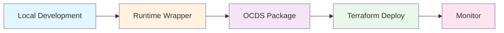
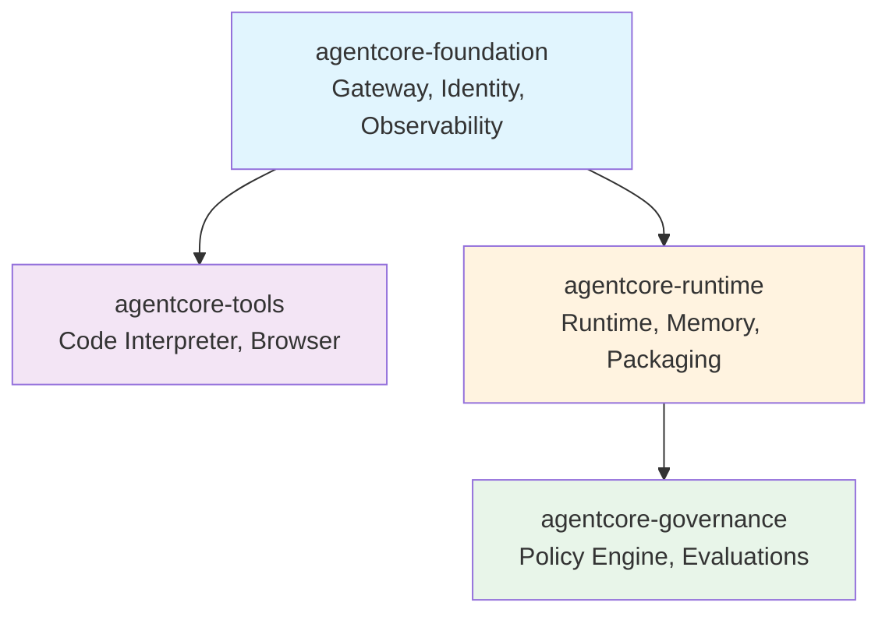

# AWS Bedrock AgentCore Terraform

> Build and deploy production AI agents with a local-first development workflow.

## What This Does

- **Local development first** - Build and test agents in Python before deploying any infrastructure
- **CLI-based infrastructure** - Robust provisioning using AWS CLI + Terraform state management (11/13 resources)
- **OCDS-compliant packaging** - Two-stage build separates dependencies (cached) from code (fresh)
- **Development progression** - Local → Runtime Wrapper → OCDS Package → Terraform Deploy → Monitor
- **CloudWatch monitoring** - Automatic logging and metrics with optional Weave integration

## Development Flow



**Phase 1: Local Development** - Write and test your agent logic in Python
**Phase 2: Runtime Wrapper** - Implement AgentCore contract (`BedrockAgentCoreApp` interface)
**Phase 3: OCDS Package** - Two-stage build (dependencies layer + code package)
**Phase 4: Terraform Deploy** - Infrastructure provisioning with state management
**Phase 5: Monitor** - CloudWatch logs/metrics, optional Weave tracing

## Architecture

### Infrastructure Modules



### Resource Architecture (CLI-Based)

**⚠️ Critical**: This implementation uses **CLI-based provisioning** for AWS Bedrock AgentCore resources that are not yet available in the Terraform AWS provider.

| Resource | Implementation | Status |
|----------|---------------|--------|
| Gateway | `null_resource` + AWS CLI | ⚠️ CLI-based |
| Workload Identity | `null_resource` + AWS CLI | ⚠️ CLI-based |
| Code Interpreter | `null_resource` + AWS CLI | ⚠️ CLI-based |
| Browser | `null_resource` + AWS CLI | ⚠️ CLI-based |
| Runtime | `null_resource` + AWS CLI | ⚠️ CLI-based |
| Memory | `null_resource` + AWS CLI | ⚠️ CLI-based |
| Policy Engine | `null_resource` + AWS CLI | ⚠️ CLI-based |
| Cedar Policies | `null_resource` + AWS CLI | ⚠️ CLI-based |
| Evaluators | `null_resource` + AWS CLI | ⚠️ CLI-based |
| OAuth2 Providers | `null_resource` + AWS CLI | ⚠️ CLI-based |
| Credential Providers | `null_resource` + AWS CLI | ⚠️ CLI-based |
| IAM Roles/Policies | `aws_iam_*` | ✅ Terraform-native |
| CloudWatch Logs | `aws_cloudwatch_log_group` | ✅ Terraform-native |
| S3 Buckets | `aws_s3_bucket` | ✅ Terraform-native |

**Total**: 11/13 CLI-based, 2/13 Terraform-native

**Pattern**:
```hcl
resource "null_resource" "gateway" {
  triggers = {
    config_hash = sha256(jsonencode(local.gateway_config))
  }

  provisioner "local-exec" {
    command = <<-EOT
      set -e
      aws bedrock-agentcore-control create-gateway \
        --name "${var.gateway_name}" \
        --role-arn "${aws_iam_role.gateway.arn}" \
        --output json > ${path.module}/.terraform/gateway_output.json
    EOT
  }
}

data "external" "gateway_output" {
  program = ["cat", "${path.module}/.terraform/gateway_output.json"]
  depends_on = [null_resource.gateway]
}
```

**Migration Path**: When AWS provider adds native resources, we'll migrate using `terraform import` + resource replacement. See `CLAUDE.md` Rule 3.2.

## Quick Start

### Phase 1: Local Development (No AWS Required)

Start building your agent locally without any infrastructure:

```bash
# 1. Create agent directory
mkdir my-agent && cd my-agent

# 2. Create runtime.py implementing AgentCore contract
cat > runtime.py <<'EOF'
from bedrock_agentcore import BedrockAgentCoreApp

class MyAgent(BedrockAgentCoreApp):
    def invoke(self, event):
        # Your agent logic here
        return {"status": "success", "message": "Hello from local dev!"}

app = MyAgent()

if __name__ == "__main__":
    # Test locally
    result = app.invoke({"query": "test"})
    print(result)
EOF

# 3. Test locally
python runtime.py
# Output: {'status': 'success', 'message': 'Hello from local dev!'}
```

**No AWS account needed yet!** You're developing pure Python.

### Phase 2: Add Runtime Wrapper

Implement the AgentCore contract for cloud deployment:

```python
# runtime.py
from bedrock_agentcore import BedrockAgentCoreApp, Session

class MyAgent(BedrockAgentCoreApp):
    def __init__(self):
        super().__init__()
        # Initialize your agent

    def invoke(self, event: dict) -> dict:
        """
        Contract required by AWS Bedrock AgentCore.

        Args:
            event: {
                "sessionId": str,
                "input": str,
                "context": dict
            }

        Returns: {
            "status": str,
            "output": str,
            "metadata": dict
        }
        """
        session_id = event.get("sessionId")
        user_input = event.get("input")

        # Your agent logic
        result = self.process(user_input)

        return {
            "status": "success",
            "output": result,
            "metadata": {
                "sessionId": session_id
            }
        }

    def process(self, input: str) -> str:
        # Your actual agent logic
        return f"Processed: {input}"

app = MyAgent()
```

### Phase 3: OCDS-Compliant Package

Create two-stage build configuration:

```toml
# pyproject.toml
[project]
name = "my-agent"
version = "1.0.0"
dependencies = [
    "bedrock-agentcore>=1.0.0",
    "requests>=2.28.0",
    # Dependencies installed in Layer (cached)
]

[tool.terraform]
source_path = "."
entry_file = "runtime.py"
```

**Two-Stage Build Process**:

1. **Stage 1 (Dependencies Layer)** - Cached unless pyproject.toml changes
   ```bash
   pip install -t deps/ -r <(grep -E "^[a-zA-Z]" pyproject.toml)
   zip -r deps-layer.zip deps/
   ```

2. **Stage 2 (Code Package)** - Always fresh on every code change
   ```bash
   zip -r code.zip runtime.py other_code.py
   ```

**Hash-based triggers** ensure rebuilds only when needed:
```hcl
triggers = {
  dependencies_hash = filesha256("pyproject.toml")
  code_hash = sha256(join("", [for f in fileset(".", "**/*.py") : filesha256(f)]))
}
```

See `examples/mcp-servers/terraform/packaging.tf` for full implementation.

### Phase 4: Terraform Deploy

Now provision infrastructure:

```bash
# 1. Clone repository
git clone <repo-url>
cd terraform

# 2. Initialize Terraform
terraform init

# 3. Configure variables
cp terraform.tfvars.example terraform.tfvars
# Edit terraform.tfvars:
#   agent_name          = "my-agent"
#   region              = "us-east-1"
#   runtime_source_path = "../my-agent"  # Path to your agent code

# 4. Validate locally (NO AWS deployment)
terraform validate
terraform plan -backend=false

# 5. Deploy to AWS
terraform apply
```

### Phase 5: Monitor

CloudWatch is configured automatically:

```bash
# View runtime logs
aws logs tail /aws/bedrock/agentcore/runtime/my-agent --follow

# View gateway logs
aws logs tail /aws/bedrock/agentcore/gateway/my-agent --follow

# Check metrics
aws cloudwatch get-metric-statistics \
  --namespace AWS/BedrockAgentCore \
  --metric-name Invocations \
  --dimensions Name=AgentName,Value=my-agent \
  --start-time $(date -u -d '1 hour ago' +%Y-%m-%dT%H:%M:%S) \
  --end-time $(date -u +%Y-%m-%dT%H:%M:%S) \
  --period 300 \
  --statistics Sum
```

**Optional: Weave Integration**

Add Weave for enhanced tracing and debugging:

```python
# runtime.py
import weave

class MyAgent(BedrockAgentCoreApp):
    @weave.op()
    def invoke(self, event: dict) -> dict:
        # Automatically traced by Weave
        return self.process(event["input"])
```

Configure in `terraform.tfvars`:
```hcl
enable_weave = true
weave_project_name = "my-agent-dev"
```

## OCDS Principles

This project follows **Open Container Development Standards (OCDS)** for reproducible builds:

### Two-Stage Build

```
Stage 1: Dependencies (Slow, Cached)
  ↓
  pyproject.toml changes? → Rebuild layer
  ↓
  No changes? → Use cached layer

Stage 2: Code (Fast, Always Fresh)
  ↓
  Python code changes? → Rebuild package
  ↓
  Combine: deps layer + code package → deployment.zip
```

**Benefits**:
- **Fast iteration**: Code changes don't reinstall dependencies
- **Reproducible builds**: Hash-based triggers ensure consistency
- **Layer caching**: Dependencies installed once, reused across deployments
- **Audit trail**: Git commit hash embedded in deployment metadata

### Hash-Based Change Detection

```hcl
locals {
  # Dependencies hash - triggers layer rebuild
  dependencies_hash = fileexists(local.dependencies_file) ?
    filesha256(local.dependencies_file) :
    "no-dependencies"

  # Code hash - triggers package rebuild
  code_files = fileset(local.source_path, "**/*.py")
  code_hash = sha256(join("", [
    for f in local.code_files :
    filesha256("${local.source_path}/${f}")
  ]))
}

resource "null_resource" "package" {
  triggers = {
    dependencies = local.dependencies_hash
    code         = local.code_hash
  }

  provisioner "local-exec" {
    command = "./scripts/package.sh"
  }
}
```

**No unnecessary rebuilds**: Terraform only re-packages when files actually change.

## Feature Configuration

### Foundation Module (CLI-Based)

Enable MCP gateway for tool integration, workload identity, and observability:

```hcl
enable_gateway        = true
gateway_search_type   = "HYBRID"

# RECOMMENDED: Use module composition for automatic ARN resolution
mcp_targets = module.mcp_servers.mcp_targets

# OR manual configuration (NOT recommended - see Rule 1.7 in CLAUDE.md):
mcp_targets = {
  tool_name = {
    name        = "my-tool"
    lambda_arn  = data.aws_lambda_function.my_tool.arn  # Use data source
    description = "Tool description"
  }
}

enable_identity       = true
oauth_return_urls     = ["https://myapp.com/callback"]

enable_observability  = true
enable_xray           = true
log_retention_days    = 30
```

**Status**: ⚠️ CLI-based via `null_resource` + AWS CLI
- Gateway creation: `bedrock-agentcore-control create-gateway`
- Identity creation: `bedrock-agentcore-control create-workload-identity`
- Observability: `aws_cloudwatch_log_group` (Terraform-native)

### Tools Module (CLI-Based)

Enable Code Interpreter and Browser tools:

```hcl
enable_code_interpreter       = true
code_interpreter_network_mode = "SANDBOX"  # PUBLIC, SANDBOX, VPC

enable_browser               = true
browser_network_mode         = "SANDBOX"
enable_browser_recording     = true
browser_recording_s3_bucket  = module.runtime.deployment_bucket_name
```

**Status**: ⚠️ CLI-based via `null_resource` + AWS CLI
- Code Interpreter: `bedrock-agentcore-control create-code-interpreter`
- Browser: `bedrock-agentcore-control create-browser`

### Runtime Module (CLI-Based + OCDS Packaging)

Configure agent execution and state:

```hcl
enable_runtime      = true
runtime_source_path = "./agent-code"
runtime_entry_file  = "runtime.py"
runtime_config = {
  max_iterations  = 10
  timeout_seconds = 300
}

enable_memory = true
memory_type   = "BOTH"  # SHORT_TERM, LONG_TERM, BOTH

enable_packaging = true
python_version   = "3.12"
```

**Status**: ⚠️ CLI-based with OCDS packaging
- Two-stage build process (dependencies → code)
- Runtime creation: `bedrock-agentcore-control create-agent-runtime`
- Memory creation: `bedrock-agentcore-control create-memory`
- Deployment bucket: `aws_s3_bucket` (Terraform-native)

### Governance Module (CLI-Based)

Enable policy enforcement and quality evaluation:

```hcl
enable_policy_engine = true
cedar_policy_files = {
  pii_protection = "./cedar_policies/pii-protection.cedar"
  rate_limiting  = "./cedar_policies/rate-limiting.cedar"
}

enable_evaluations = true
evaluation_type    = "TOOL_CALL"  # TOOL_CALL, REASONING, RESPONSE, ALL
evaluator_model_id = "anthropic.claude-sonnet-4-5"
evaluation_prompt  = "Evaluate response quality..."
evaluation_criteria = {
  accuracy  = "Factual correctness"
  relevance = "Relevance to query"
}
```

**Status**: ⚠️ CLI-based via `null_resource` + AWS CLI
- Policy engine: `bedrock-agentcore-control create-policy-engine`
- Cedar policies: `bedrock-agentcore-control create-policy`
- Evaluators: `bedrock-agentcore-control create-evaluator`

## Examples

### Example 1: Hello World (Local Development)

Pure Python agent without any AWS infrastructure:

```bash
cd examples/1-hello-world/agent-code
python runtime.py
# Output: Lists S3 buckets (if AWS credentials configured)
```

**Purpose**: Demonstrates local development workflow before deploying infrastructure.

### Example 2: Gateway Tool (Titanic Analysis)

MCP gateway integration with Lambda tool:

```bash
terraform apply -var-file=examples/2-gateway-tool/terraform.tfvars
```

**Features**:
- MCP gateway with Lambda target
- Code interpreter for pandas analysis
- Demonstrates OCDS packaging

### Example 3: Deep Research Agent (Full-Featured)

Production-ready research agent using Strands DeepAgents framework:

```bash
terraform apply -var-file=examples/3-deepresearch/terraform.tfvars
```

**Features**:
- Multi-agent framework (Strands DeepAgents)
- Internet search integration (Linkup SDK)
- Code interpreter and web browser
- Short-term and long-term memory
- S3 session storage
- Optional Weave telemetry

### Example 5: Integrated (Recommended Pattern)

Complete module composition with MCP servers + AgentCore:

```bash
cd examples/5-integrated
terraform init
terraform apply
```

**Features**:
- MCP servers deployed as submodule
- **No hardcoded ARNs** - automatic resolution via module outputs
- Lambda versioning with aliases for rollback
- Two-stage OCDS packaging
- Single `terraform apply` deploys everything

**Pattern**:
```hcl
# Deploy MCP servers first
module "mcp_servers" {
  source      = "../mcp-servers/terraform"
  environment = var.environment
}

# Then AgentCore with automatic ARN resolution
module "agentcore" {
  source      = "../../"
  mcp_targets = module.mcp_servers.mcp_targets  # No hardcoded ARNs!
  depends_on  = [module.mcp_servers]
}
```

See `examples/5-integrated/README.md` for full documentation.

## Local Development (No AWS)

Validate everything locally without AWS account:

```bash
# Format check
terraform fmt -check -recursive

# Syntax validation
terraform validate

# Generate plan (dry-run, no AWS resources)
terraform plan -backend=false -var-file=examples/1-hello-world/terraform.tfvars

# Security scan
checkov -d . --framework terraform --quiet

# Lint
tflint --recursive

# All tests (via Makefile)
make test-all
```

**Key Point**: Developers can validate 100% of Terraform code locally before deploying to AWS.

## Monitoring

### CloudWatch (Automatic)

CloudWatch logging and metrics are configured automatically for all components:

**Log Groups**:
- `/aws/bedrock/agentcore/runtime/<agent-name>` - Agent execution
- `/aws/bedrock/agentcore/gateway/<agent-name>` - Gateway activity
- `/aws/bedrock/agentcore/code-interpreter/<agent-name>` - Code execution
- `/aws/bedrock/agentcore/browser/<agent-name>` - Browser activity
- `/aws/bedrock/agentcore/policy-engine/<agent-name>` - Policy decisions
- `/aws/bedrock/agentcore/evaluator/<agent-name>` - Evaluation results

**Metrics**:
- Invocations, errors, latency per component
- Evaluation scores and pass/fail rates
- Policy enforcement decisions

**Alarms**:
- Gateway errors (threshold: 5+ in 5 minutes)
- Runtime failures (threshold: 3+ in 5 minutes)
- Evaluation quality drops (threshold: score < 0.7)

### Weave (Optional)

Add Weave for enhanced tracing and debugging:

```hcl
enable_weave = true
weave_project_name = "my-agent-${var.environment}"
weave_api_key_secret_arn = "arn:aws:secretsmanager:..."
```

**Benefits**:
- Visual trace graphs
- Step-by-step debugging
- Tool call inspection
- Performance profiling

**Note**: Weave is optional and adds ~$5-10/month cost.

## Security

### Encryption

By default, this project uses **AWS-managed encryption** (SSE-S3):

- **At Rest**: AWS-managed encryption for S3, default CloudWatch encryption
- **In Transit**: HTTPS/TLS for all API calls
- **No Key Management**: No customer KMS keys to manage or pay for

```hcl
# AWS-managed encryption is the default (no configuration needed)

# For customer-managed KMS (only if regulatory requirements mandate it):
# enable_kms = true
# kms_key_arn = "arn:aws:kms:..."
```

See `docs/adr/0008-aws-managed-encryption.md` for rationale.

### IAM Least Privilege

Function-specific roles with granular permissions:

```hcl
# Example: Code interpreter role
resource "aws_iam_role" "code_interpreter" {
  assume_role_policy = jsonencode({
    Statement = [{
      Action = "sts:AssumeRole"
      Principal = {
        Service = "bedrock.amazonaws.com"
      }
      Condition = {
        StringEquals = {
          "aws:SourceAccount" = data.aws_caller_identity.current.account_id
        }
      }
    }]
  })
}

resource "aws_iam_role_policy" "code_interpreter" {
  role = aws_iam_role.code_interpreter.name

  policy = jsonencode({
    Statement = [{
      Effect = "Allow"
      Action = [
        "logs:CreateLogStream",
        "logs:PutLogEvents"
      ]
      Resource = "arn:aws:logs:*:*:log-group:/aws/bedrock/agentcore/code-interpreter/*"
    }]
  })
}
```

**No wildcard permissions** except where required by AWS service.

### Policy Engine

Cedar policies for access control:

```cedar
// cedar_policies/pii-protection.cedar
forbid (
  principal,
  action == Action::"ProcessData",
  resource
)
when {
  resource.contains_pii == true
};
```

Enable in Terraform:
```hcl
enable_policy_engine = true
cedar_policy_files = {
  pii_protection = "./cedar_policies/pii-protection.cedar"
}
```

## State Management

### Terraform State (S3 Backend)

Recommended configuration for production (Terraform 1.10.0+):

```hcl
# backend.tf
terraform {
  backend "s3" {
    bucket       = "terraform-state-prod"
    key          = "bedrock-agentcore/terraform.tfstate"
    region       = "us-east-1"
    encrypt      = true
    use_lockfile = true  # Native S3 locking (no DynamoDB needed)
  }
}
```

**Note**: Native S3 locking via `use_lockfile = true` requires Terraform >= 1.10.0. DynamoDB-based locking is deprecated.

### CLI Resource Outputs

CLI-provisioned resources store outputs in `.terraform/`:

```
.terraform/
├── gateway_output.json      # Gateway creation output
├── runtime_output.json      # Runtime creation output
├── policy_engine.json       # Policy engine creation output
├── evaluator.json           # Evaluator creation output
└── memory_output.json       # Memory creation output
```

These are read via `data "external"` sources and exposed as Terraform outputs.

## Project Structure

```
terraform/
├── modules/
│   ├── agentcore-foundation/   # Gateway, Identity, Observability (CLI-based)
│   ├── agentcore-tools/        # Code Interpreter, Browser (CLI-based)
│   ├── agentcore-runtime/      # Runtime, Memory, Packaging (CLI-based + OCDS)
│   └── agentcore-governance/   # Policy Engine, Evaluations (CLI-based)
├── examples/
│   ├── 1-hello-world/          # Local development example
│   ├── 2-gateway-tool/         # MCP gateway with Lambda
│   ├── 3-deepresearch/         # Full-featured research agent
│   └── 5-integrated/           # Recommended module composition pattern
├── docs/
│   ├── adr/                    # Architecture Decision Records
│   ├── architecture.md         # System architecture
│   └── runbooks/               # Operational runbooks
├── scripts/
│   ├── validate_examples.sh    # Example validation
│   └── test-local.sh           # Local testing
├── main.tf                     # Root module composition
├── variables.tf                # Input variables
├── outputs.tf                  # Output values
├── CLAUDE.md                   # AI agent development rules (auto-loaded)
├── DEVELOPER_GUIDE.md          # Team onboarding
└── README.md                   # This file
```

## Deployment Patterns

### Pattern 1: Local Development Only

For pure Python development without AWS:

```hcl
# No Terraform needed yet!
# Just develop in Python and test locally
```

### Pattern 2: Gateway + Tools

For agents that need tool integration and code execution:

```hcl
enable_gateway          = true
enable_code_interpreter = true
enable_browser          = false
enable_runtime          = false
enable_memory           = false
```

### Pattern 3: Full Agentic Runtime

For autonomous agents with all features:

```hcl
enable_gateway          = true
enable_code_interpreter = true
enable_browser          = true
enable_runtime          = true
enable_memory           = true
enable_evaluations      = true
enable_policy_engine    = true
```

### Pattern 4: Secure Production

For production deployments with security hardening:

```hcl
enable_observability          = true
enable_xray                   = true
code_interpreter_network_mode = "VPC"  # With VPC endpoints
browser_network_mode          = "VPC"
enable_policy_engine          = true
enable_evaluations            = true
enable_browser_recording      = true
log_retention_days            = 90

# Use module composition (no hardcoded ARNs)
mcp_targets = module.mcp_servers.mcp_targets
```

## Troubleshooting

### CLI Command Not Available

If `bedrock-agentcore-control` commands fail:

1. Update AWS CLI: `aws --version` (requires >= 2.0)
2. Check IAM permissions for the role
3. Verify AWS region supports Bedrock AgentCore
4. Review CloudWatch logs for detailed errors

### Packaging Fails

If two-stage packaging fails:

1. Verify source path exists: `ls <runtime_source_path>`
2. Check `pyproject.toml` syntax is valid
3. Test pip install locally: `pip install -e .`
4. Review `.terraform/` directory for build artifacts
5. Check hash-based triggers: `terraform console` → `local.dependencies_hash`

### Gateway Creation Fails

If gateway creation times out or errors:

1. Verify IAM role exists and has correct trust policy
2. Check MCP target Lambda ARNs are valid (no placeholders!)
3. Ensure Lambda functions exist before creating gateway
4. Use module composition to avoid ARN hardcoding issues

### Memory Creation Fails

If memory creation errors:

1. Verify runtime exists first (memory depends on runtime)
2. Check memory type is valid: SHORT_TERM, LONG_TERM, or BOTH
3. Review CloudWatch logs: `/aws/bedrock/agentcore/runtime/<agent-name>`
4. Ensure sufficient IAM permissions for memory operations

## Cost Estimation

Typical monthly costs (per agent):

| Feature | Cost Model | Estimate |
|---------|------------|----------|
| Gateway | Per request | $0.00 (free tier) |
| Code Interpreter | Per execution | $1.00-$10.00 |
| Browser | Per session | $0.50-$5.00 |
| CloudWatch Logs | Per GB ingested | $0.50-$5.00 |
| X-Ray Tracing | Per trace | $0.50-$2.00 |
| S3 Storage | Per GB-month | $0.023 |
| Weave (optional) | Per month | $5.00-$10.00 |
| **Total** | | **~$3-$35** |

Costs vary based on usage, region, and features enabled.

## References

### Documentation
- [AWS Bedrock AgentCore Documentation](https://docs.aws.amazon.com/bedrock/latest/userguide/agents.html)
- [Terraform AWS Provider](https://registry.terraform.io/providers/hashicorp/aws/latest/docs)
- [Cedar Policy Language](https://www.cedarpolicy.com/)
- [OCDS (Open Container Development Standards)](https://opencontainers.org/)

### Development Resources
- [CLAUDE.md](./CLAUDE.md) - AI agent development rules and principles
- [DEVELOPER_GUIDE.md](./DEVELOPER_GUIDE.md) - Team onboarding guide
- [docs/architecture.md](./docs/architecture.md) - System architecture
- [docs/adr/](./docs/adr/) - Architecture Decision Records
- [pierreange.ai blog](https://www.pierreange.ai/blog/deploy-your-own-deep-research-agent) - Development workflow reference

## Contributing

To extend the architecture:

1. **Add CLI-based resources**: Follow the `null_resource` + `local-exec` pattern in `CLAUDE.md` Rule 3.1
2. **Add Cedar policies**: Place in `modules/agentcore-governance/cedar_policies/`
3. **Add examples**: Create new directory in `examples/` with `terraform.tfvars` + `README.md`
4. **Update documentation**: Follow `CLAUDE.md` Rule 7 (docs must match code in same commit)

## License

MIT - See LICENSE file for details.

## Support

For issues or questions:

1. Check the [Troubleshooting](#troubleshooting) section
2. Review CloudWatch logs in `/aws/bedrock/agentcore/`
3. Examine `.terraform/*.json` files for CLI command outputs
4. Consult [DEVELOPER_GUIDE.md](./DEVELOPER_GUIDE.md) for common tasks
5. Read [CLAUDE.md](./CLAUDE.md) for development rules and patterns
