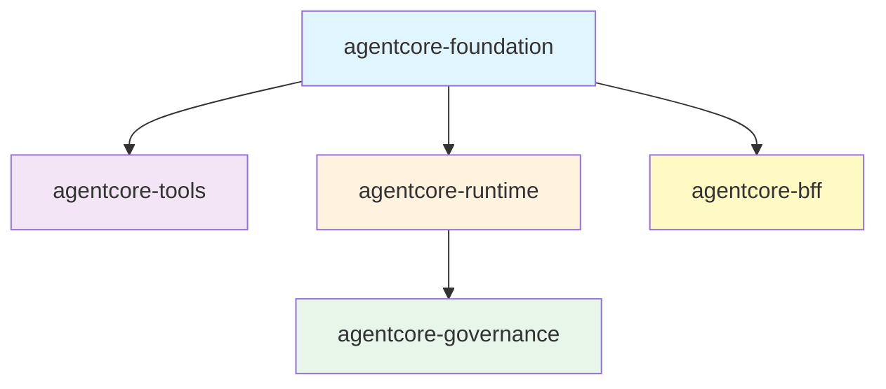
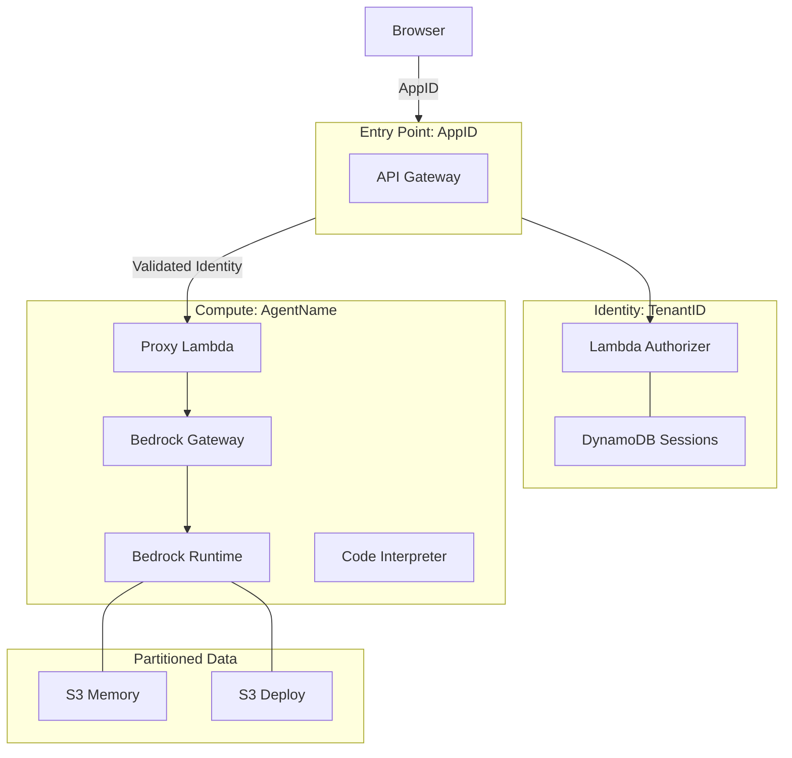

# Bedrock AgentCore Terraform // Production-Ready AI Infrastructure

Deploy, secure, and scale production AI agents on AWS Bedrock with a **local-first DX**, **Zero-Trust security**, and **Instant Hot-Reload**.

---

## 🛠️ Framework Features

*   ⚡ **Instant Hot-Reload**: Update agent logic without full dependency reinstalls using our **OCDS Layered Builds**.
*   🛡️ **Zero-Trust BFF**: A secure Backend-for-Frontend using the **Token Handler Pattern**—OIDC tokens never reach the browser.
*   🔐 **Hardened Multi-Tenancy**: Built-in **North-South Join Isolation** using dynamic ABAC policies to protect tenant data at the credential layer.
*   🔍 **OIDC Auto-Discovery**: Seamless integration with Entra ID, Okta, and Auth0 via automated build-time endpoint discovery.
*   🔄 **Seamless Session Rotation**: Integrated OIDC Refresh Token handler ensures long-running agents never lose connectivity.
*   🖥️ **Interactive Terminal**: Real-time observability and remote management with the `acore_debug` CLI.

---

## 🏗️ Architecture

### Logic & Modules


### Physical Infrastructure (North-South Join)


---

## 🎯 Core Engineering Principles

Bedrock AgentCore is a comprehensive framework designed for teams deploying AI Agents in production environments.

### 1. The SSM Persistence Pattern (CLI Bridge)
We utilize a stateful "Bridge" pattern to manage the lifecycle of Bedrock resources not yet natively supported by the Terraform provider. By wrapping the AWS CLI in `null_resource` provisioners and using **AWS Systems Manager (SSM) Parameter Store** to persist resource IDs, we solve the **Ephemeral State** problem. This ensures that resource IDs survive CI/CD runner destruction, preventing duplicate resource errors and enabling seamless "Ghost Resource" cleanup during destruction.

### 2. OCDS: Optimized Packaging
**Optimized Code/Dependency Separation (OCDS)** is our specialized build protocol.
*   **Architecture Aware**: Automatically detects and builds for **x86_64** or **ARM64 (Graviton)**, optimizing for price-performance.
*   **Layered Hashing**: By hashing `pyproject.toml` independently of code files, we ensure that heavy dependency layers are only rebuilt when necessary.
*   **Hardened Security**: The packaging engine strictly excludes local sensitive files (`.env`, `.tfvars`) and development artifacts from production archives.

### 3. Modular Regional Topology
The framework supports granular regional splitting out of the box. You can deploy the **Control Plane**, **BFF**, and **Models** in different regions (e.g., for data residency or availability constraints) while maintaining seamless integration through automated wiring.

### 4. Zero-Trust & Multi-Tenancy (North-South Join)
Our security model assumes the frontend may be compromised:
*   **Token Handler Pattern (ADR 0011):** The Serverless BFF ensures that OIDC tokens are exchanged server-side and never reach the browser, preventing XSS-based token theft.
*   **Build-time Discovery:** Automatically fetches OIDC endpoints during deployment, ensuring high performance and IdP flexibility without runtime latency.
*   **Identity Exchange:** The Gateway exchanges the verified User JWT for a scoped **Workload Token**, ensuring agents operate under minimum necessary permissions.
*   **North-South Join Isolation**: Every request is anchored by a composite identity of `AppID` (North) and `TenantID` (Middle) against the `AgentName` (South), enforced via dynamic IAM session policies.

---

## 🚀 The 3-Step Success Path

### 1. Bootstrap (Platform Readiness)
Prepare your AWS account for enterprise-grade automation. This one-time setup handles the plumbing of OIDC trust and state management.
```bash
# One-time setup for GitLab CI (WIF) and Secure S3 State
bash terraform/scripts/bootstrap_wif.sh
```

### 2. Scaffold (Development Velocity)
Developers start locally with a 100% compliant project structure.
```bash
# Scaffold a fresh project using the enterprise template
pip install copier
copier copy --trust templates/agent-project my-agent
```

### 3. Orchestrate (Global Scale)
Deploy your agent using the modular AgentCore topology.
```bash
# Initialize and deploy to the dev environment
cd terraform
terraform init -backend-config=backend-dev.tf
terraform apply
```

---

## 👤 Who is this for?

| Role | Focus | Outcome |
| :--- | :--- | :--- |
| **AI/ML Engineer** | Python logic & MCP tools | Builds intelligent, tool-using agents without managing AWS plumbing. |
| **DevOps / SRE** | Bootstrapping & CI/CD | Manages account readiness, regional splitting, and automated deployments. |
| **Security Architect** | Zero-Trust & Compliance | Enforces tenant isolation, OIDC discovery, and audit logging. |

---

## 📂 Project Structure

```
repo-root/
├── terraform/
│   ├── modules/
│   │   ├── agentcore-foundation/   # Gateway, Identity, Observability
│   │   ├── agentcore-tools/        # Code Interpreter, Browser
│   │   ├── agentcore-runtime/      # Runtime, Memory, Packaging
│   │   └── agentcore-governance/   # Policy Engine, Evaluations
│   ├── main.tf                     # Root module
│   ├── variables.tf                # Input variables
├── examples/
│   ├── 3-deepresearch/             # Full research agent
│   ├── 5-integrated/               # Recommended module composition
│   └── mcp-servers/                # Lambda-based MCP tools
├── docs/
│   ├── adr/                        # Architecture Decision Records
│   ├── architecture.md             # System design
├── AGENTS.md                       # Universal AI agent codex
└── DEVELOPER_GUIDE.md              # Team onboarding
```

---

## 📖 Documentation

- **[DEVELOPER_GUIDE.md](./DEVELOPER_GUIDE.md)** - Team onboarding and common development tasks.
- **[SETUP.md](./SETUP.md)** - Detailed, step-by-step account configuration.
- **[AGENTS.md](./AGENTS.md)** - The Universal Codex for AI Agents (Rules, Security, Patterns).
- **[docs/architecture.md](./docs/architecture.md)** - Deep dive into system design and data flows.
- **[docs/WIF_SETUP.md](./docs/WIF_SETUP.md)** - Advanced GitLab OIDC configuration.

---

## ⚖️ License

MIT - See LICENSE file for details.
