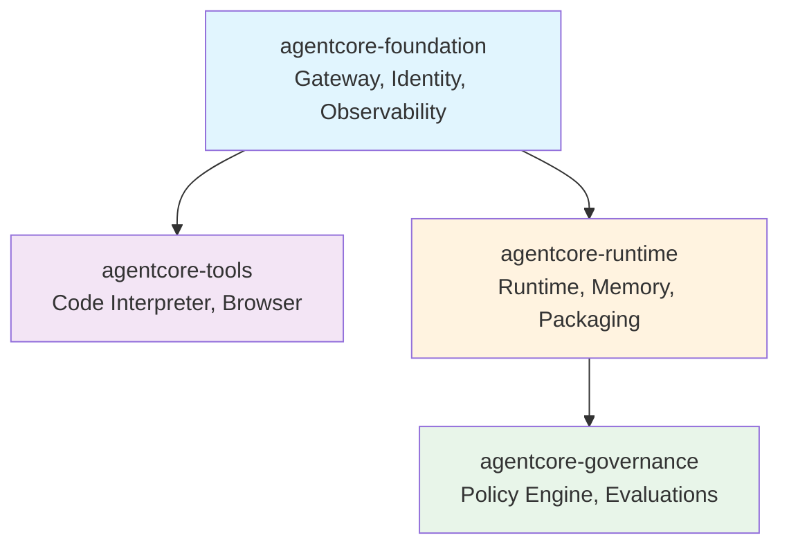
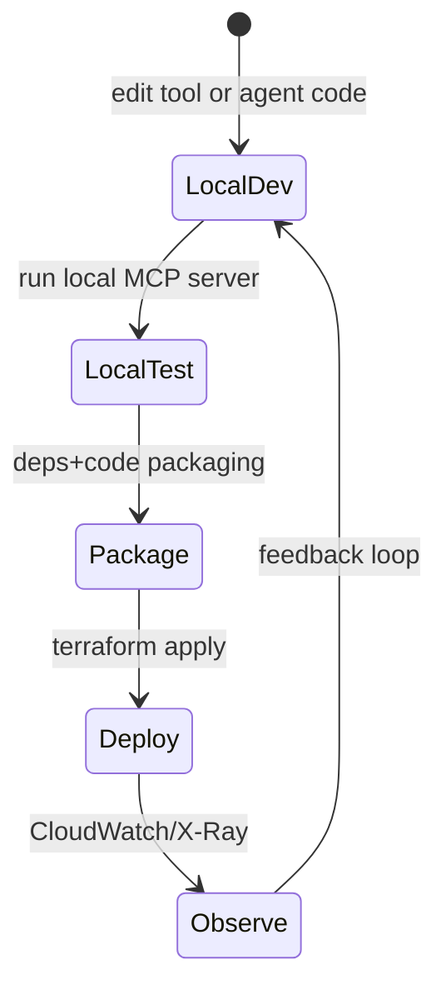
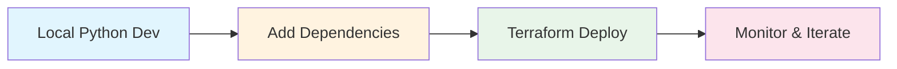

# Bedrock AgentCore Terraform // Industrial-Grade AI Infrastructure

Deploy, secure, and scale production AI agents on AWS Bedrock with a **local-first DX**, **Zero-Trust security**, and **Instant Hot-Reload**.

## The Engineering Philosophy

This is not a "Hello World" repository. This is an **Industrial-Grade Framework** designed for teams who need to deploy AI Agents that survive in production.

It solves the hard problems of AI engineering:

### 1. The "Bridge Pattern" (Interim State Management)
We don't wait for HashiCorp. When a Bedrock feature is released, we wrap the AWS CLI in `null_resource` provisioners but—crucially—we use **SSM Parameter Store** to persist resource IDs. This creates a "Bridge" that allows Terraform to manage the lifecycle (create, update, delete) of resources it doesn't officially support yet.
*   **Result:** You get Day 0 access to new models and features with full IaC safety.

### 2. OCDS: The Speed Engine
**Optimized Code/Dependency Separation (OCDS)** is our build protocol. We hash your `pyproject.toml` separately from your `*.py` files.
*   **Outcome:** If you only change your code, deployment takes **seconds**, not minutes. We only rebuild the heavy dependency layer when you actually add a library.

### 3. Global Mesh Topology
Real-world enterprise constraints are messy. You might need your **Control Plane** in `eu-central-1` (Data Residency), your **BFF** in `us-east-1` (Latency), and your **Models** in `us-west-2` (Availability).
*   **Solution:** AgentCore supports granular regional splitting out of the box. Set `bedrock_region` and `bff_region` independently of your primary `region`. The modules handle the cross-region wiring automatically.

### 4. Zero-Trust Security
We assume your frontend is compromised.
*   **Token Handler Pattern (ADR 0011):** Our Serverless BFF (Backend-for-Frontend) prevents all token exposure. OIDC tokens are exchanged server-side and never reach the browser, shielding you from XSS and token theft.
*   **Hardened Cookies:** Session IDs are transmitted via **HttpOnly**, **Secure**, and **SameSite=Strict** cookies, ensuring that client-side JS cannot access the session and preventing CSRF.
*   **Mandatory Server-Side Validation:** Every API request is intercepted by a Lambda Authorizer that validates sessions against DynamoDB before injecting identity context into the backend.
*   **Shadow JSON Audit:** Every interaction via the proxy is logged to a shadow audit trail (**Rule 15**), compliant with strict banking/healthcare standards.

## The AgentCore Advantage

*   ⚡ **Instant Hot-Reload**: Trigger OCDS builds directly from the TUI.
*   🖥️ **Matrix-Themed TUI**: A cyberpunk terminal interface for real-time observability.
*   🛡️ **ABAC Hardened**: Granular IAM permissions based on tags, not wildcards.
*   🚀 **Enterprise Templates**: Scaffold new agents instantly with `copier`, fully pre-configured for this architecture.

## Architecture



**Implementation Note**: Most AWS Bedrock AgentCore resources are provisioned via the mandatory **CLI Pattern** (AWS CLI + Terraform State) to bridge provider gaps while maintaining strict IaC principles. Native resources (IAM, S3, CloudWatch) use standard Terraform.

## Lifecycle (Local → Cloud → Local)



## Informal Flow (Local → Cloud)

```mermaid
flowchart LR
  subgraph Phase1[Phase 1: Local build]
    A[Write agent/tool code] --> B[Run locally]
    B --> C[Quick checks + tests]
  end

  subgraph Phase2[Phase 2: Observability (optional)]
    D[Enable telemetry] --> E[Weave or OTEL backend]
  end

  subgraph Phase3[Phase 3: Infra + deploy]
    F[Terraform plan/apply] --> G[AgentCore runtime + gateway]
    G --> H[MCP tools (Lambda)]
  end

  subgraph Phase4[Phase 4: Operate]
    I[User traffic] --> J[Runtime executes]
    J --> K[Logs + traces]
    K --> L[Fix + iterate]
  end

  C --> F
  B --> D
  G --> J
  E --> K
  L --> A
```

## Project Structure

```
repo-root/
├── terraform/
│   ├── modules/
│   │   ├── agentcore-foundation/   # Gateway, Identity, Observability
│   │   ├── agentcore-tools/        # Code Interpreter, Browser
│   │   ├── agentcore-runtime/      # Runtime, Memory, Packaging
│   │   └── agentcore-governance/   # Policy Engine, Evaluations
│   ├── scripts/                    # Validation helpers
│   ├── tests/                      # Terraform-focused tests
│   ├── main.tf                     # Root module
│   ├── variables.tf                # Input variables
│   └── terraform.tfvars.example    # Example config
├── examples/
│   ├── 1-hello-world/              # Basic S3 explorer
│   ├── 2-gateway-tool/             # MCP gateway with Lambda
│   ├── 3-deepresearch/             # Full research agent
│   ├── 5-integrated/               # Recommended module composition
│   └── mcp-servers/                # Lambda-based MCP tools
├── docs/
│   ├── adr/                        # Architecture Decision Records
│   ├── architecture.md             # System design
│   └── runbooks/                   # Operational procedures
├── AGENTS.md                       # Universal AI agent codex (hardlinked)
├── CLAUDE.md                       # → AGENTS.md (hardlink)
├── GEMINI.md                       # → AGENTS.md (hardlink)
└── DEVELOPER_GUIDE.md              # Team onboarding
```

**Note**: `AGENTS.md`, `CLAUDE.md`, and `GEMINI.md` are hardlinked to the same file. They contain universal development rules and principles that apply to all AI coding agents (Claude, Gemini, etc.). Editing any one file updates all three.

## Prerequisites

- Terraform 1.14.4 (see `terraform/.terraform-version`)
- AWS CLI >= 2.0
- Python 3.12+
- AWS account with Bedrock AgentCore permissions

## Quick Start

### 1. Scaffold with Template

Don't start from scratch. Use our enterprise `copier` template to generate a fully compliant agent project.

```bash
# Install copier
pip install copier

# Generate project
copier copy --trust templates/agent-project my-agent
cd my-agent
```

### 2. Local Development (No AWS Required)

Start by developing your agent in pure Python:

```bash
# Test locally
cd agent-code
python runtime.py
```

### 3. Add Dependencies

Edit `pyproject.toml` to add libraries. The OCDS build system will automatically cache them.

```toml
[project]
name = "my-agent"
version = "1.0.0"
dependencies = [
    "bedrock-agentcore>=1.0.0",
    "requests>=2.28.0"
]
```

### 4. Deploy Infrastructure

```bash
cd terraform

# Initialize
terraform init

# Configure
cp terraform.tfvars.example terraform.tfvars
# Edit terraform.tfvars with your settings

# Deploy
terraform plan
terraform apply
```

### 4. Invoke Agent

```bash
# Get runtime ARN from outputs
RUNTIME_ARN=$(terraform output -raw runtime_arn)

# Invoke
aws bedrock-agentcore-runtime invoke-runtime \
  --runtime-arn "$RUNTIME_ARN" \
  --input '{"input": "Your query here"}' \
  --region us-east-1
```

## Terraform Configuration

### Required Variables

| Variable | Description |
|----------|-------------|
| `agent_name` | Unique name for the agent |
| `region` | AWS region for deployment |
| `runtime_source_path` | Path to agent source code |

### Optional Variables

| Variable | Default | Description |
|----------|---------|-------------|
| `environment` | `dev` | Environment name |
| `agentcore_region` | `""` | Optional AgentCore control-plane region override (defaults to `region`) |
| `bedrock_region` | `""` | Optional Bedrock model/guardrail/inference profile region override (defaults to `agentcore_region`) |
| `bff_region` | `""` | Optional BFF/API Gateway region override (defaults to `agentcore_region`) |
| `enable_gateway` | `true` | Enable MCP gateway |
| `enable_code_interpreter` | `true` | Enable Python sandbox |
| `enable_browser` | `false` | Enable web browsing |
| `enable_runtime` | `true` | Enable agent runtime |
| `enable_memory` | `true` | Enable agent memory |
| `enable_evaluations` | `false` | Enable quality evaluation |
| `enable_policy_engine` | `false` | Enable Cedar policies |
| `code_interpreter_network_mode` | `SANDBOX` | Network mode (PUBLIC/SANDBOX/VPC) |
| `log_retention_days` | `30` | CloudWatch log retention |

Region splits are optional. If you need API Gateway/BFF in a different region than AgentCore, set `bff_region`. If you need Bedrock models in a different region, set `bedrock_region`.

### Example terraform.tfvars

```hcl
agent_name          = "my-research-agent"
region              = "us-east-1"
environment         = "dev"
runtime_source_path = "../my-agent"
agentcore_region    = ""
bedrock_region      = ""
bff_region          = ""

# Enable features
enable_gateway          = true
enable_code_interpreter = true
enable_browser          = true
enable_memory           = true

# MCP targets - Use module composition (recommended)
# See examples/5-integrated/ for pattern
mcp_targets = module.mcp_servers.mcp_targets

tags = {
  Project     = "research-agent"
  Environment = "dev"
}
```

## Examples

### Example 1: Hello World

Basic S3 explorer demonstrating local development:

```bash
# Test locally first
cd examples/1-hello-world/agent-code
python runtime.py

# Then deploy
terraform apply -var-file=examples/1-hello-world/terraform.tfvars
```

### Example 2: Gateway Tool

MCP gateway with Lambda tool for data analysis:

```bash
terraform apply -var-file=examples/2-gateway-tool/terraform.tfvars
```

### Example 3: Deep Research Agent

Full-featured agent using Strands DeepAgents framework:

```bash
terraform apply -var-file=examples/3-deepresearch/terraform.tfvars
```

**Features**: Multi-agent research, internet search, code interpreter, browser, memory, S3 storage

### Example 5: Integrated (Recommended)

Module composition pattern with automatic ARN resolution:

```bash
cd examples/5-integrated
terraform init
terraform apply
```

**Pattern**:
```hcl
module "mcp_servers" {
  source = "../mcp-servers/terraform"
}

module "agentcore" {
  source      = "../../"
  mcp_targets = module.mcp_servers.mcp_targets  # No hardcoded ARNs
}
```

See `examples/5-integrated/README.md` for details.

## The Command Center (Matrix TUI)

The AgentCore Matrix TUI is your mission control for deployed agents. It combines real-time observability with remote management in a single cyberpunk interface.

```bash
# Launch the Matrix (Auto-discovers region and ID)
python terraform/scripts/acore_debug.py
```

*   📡 **Live Logs**: Automated CloudWatch tailing with near-zero latency.
*   🚦 **System Traces**: Real-time monitoring of Authorizer decisions and Bedrock latency.
*   🔄 **Remote Reload**: Press `r` to trigger an OCDS Hot-Reload via Terraform directly from the TUI.

## Serverless BFF & SPA

AgentCore includes a high-security **Backend-for-Frontend** module to expose your agents to the web without compromising identity.

*   🖥️ **Web Terminal**: A Matrix-themed SPA (Single Page Application) matching the TUI aesthetic.
*   🛡️ **Token Handler**: Pure serverless OIDC implementation. No Access Tokens in the browser.
*   🕵️ **Shadow JSON**: Implements **Rule 15** audit logging, dumping all proxy payloads to a secure audit trail.

## Local Development

Test Terraform configurations without AWS:

```bash
# Format check
terraform fmt -check -recursive

# Validate syntax
terraform validate

# Generate plan (no AWS deployment)
terraform plan -backend=false -var-file=examples/1-hello-world/terraform.tfvars

# Security scan
checkov -d . --framework terraform

# Lint
tflint --recursive
```

For MCP servers:

```bash
cd examples/mcp-servers

# Local development server
make dev

# Test without AWS
make test-local

# Deploy to AWS
make deploy
```

## Monitoring

### CloudWatch Logs

```bash
# Runtime logs
aws logs tail /aws/bedrock/agentcore/runtime/<agent-name> --follow

# Gateway logs
aws logs tail /aws/bedrock/agentcore/gateway/<agent-name> --follow
```

### Metrics

- Invocations, errors, latency per component
- Evaluation scores and pass/fail rates
- Policy enforcement decisions

### Optional: Weave Integration

Enable enhanced tracing:

```hcl
enable_weave = true
weave_project_name = "my-agent-${var.environment}"
```

Add to Python code:

```python
import weave

class MyAgent(BedrockAgentCoreApp):
    @weave.op()
    def invoke(self, event):
        # Automatically traced
        return self.process(event)
```

## OCDS Two-Stage Build

Dependencies are cached in a layer, code is always fresh:

```
Stage 1: Dependencies (cached)
  pyproject.toml unchanged → Use cached layer

Stage 2: Code (fresh)
  Python files changed → Rebuild package

Result: Fast iteration on code changes
```

Hash-based triggers ensure rebuilds only when needed. See `examples/mcp-servers/terraform/packaging.tf` for implementation.

## Security

- **Encryption**: AWS-managed (SSE-S3) by default, optional customer-managed KMS
- **IAM**: Least privilege roles with granular permissions
- **Policy Engine**: Cedar policies for access control
- **Network**: VPC isolation support for Code Interpreter and Browser

See `docs/adr/0008-aws-managed-encryption.md` for encryption rationale.

## State Management

Recommended S3 backend configuration:

```hcl
terraform {
  backend "s3" {
    bucket       = "terraform-state-prod"
    key          = "bedrock-agentcore/terraform.tfstate"
    region       = "us-east-1"
    encrypt      = true
    use_lockfile = true  # Native S3 locking (Terraform 1.10+)
  }
}
```

## Cost Estimation

Typical monthly costs per agent:

| Component | Cost |
|-----------|------|
| Gateway | Free tier |
| Code Interpreter | $1-10 |
| Browser | $0.50-5 |
| CloudWatch Logs | $0.50-5 |
| S3 Storage | $0.02/GB |
| Weave (optional) | $5-10 |
| **Total** | **~$3-35** |

Varies by usage and region.

## Documentation

- **[docs/archive/IMPLEMENTATION_PLAN.md](./docs/archive/IMPLEMENTATION_PLAN.md)** - Historical test & validation plan (archived)
- **[DEVELOPER_GUIDE.md](./DEVELOPER_GUIDE.md)** - Team onboarding and common tasks
- **[AGENTS.md](./AGENTS.md)** / **[CLAUDE.md](./CLAUDE.md)** / **[GEMINI.md](./GEMINI.md)** - Universal AI agent development rules (hardlinked files - same content)
- **[docs/architecture.md](./docs/architecture.md)** - System design and data flows
- **[docs/adr/](./docs/adr/)** - Architecture Decision Records
- **[docs/runbooks/](./docs/runbooks/)** - Operational procedures
- **[docs/WIF_SETUP.md](./docs/WIF_SETUP.md)** - GitLab CI/CD with Web Identity Federation

**Note on Agent Files**: `AGENTS.md`, `CLAUDE.md`, and `GEMINI.md` are hardlinked (same file, different names). They serve as a Universal Codex containing development rules, security requirements, and architectural patterns that apply to all AI coding agents. Claude Code auto-loads `CLAUDE.md`, while other AI assistants may reference `AGENTS.md` or `GEMINI.md`.

## Troubleshooting

### CLI Command Fails

If `bedrock-agentcore-control` commands error:

1. Update AWS CLI: `aws --version` (requires >= 2.0)
2. Check IAM permissions
3. Verify region supports Bedrock AgentCore
4. Review CloudWatch logs

### Packaging Fails

1. Verify source path exists
2. Check `pyproject.toml` syntax
3. Test pip install locally
4. Review `.terraform/` directory

### No Hardcoded ARNs Error

If you see placeholder ARNs (123456789012):

- Use module composition pattern (see Example 5)
- Use data sources: `data.aws_lambda_function.existing.arn`
- Never hardcode account IDs or regions

See `CLAUDE.md` Rule 1.7 for details.

## Development Workflow



1. **Local**: Develop and test in Python (no AWS)
2. **Dependencies**: Add `pyproject.toml` for OCDS packaging
3. **Deploy**: Run `terraform apply` to provision infrastructure
4. **Monitor**: View logs in CloudWatch, iterate on code

## Contributing

See [DEVELOPER_GUIDE.md](./DEVELOPER_GUIDE.md) for:
- Common development tasks
- Module architecture rules
- Security requirements
- Testing procedures

## References

- [AWS Bedrock AgentCore Documentation](https://docs.aws.amazon.com/bedrock/latest/userguide/agents.html)
- [Terraform AWS Provider](https://registry.terraform.io/providers/hashicorp/aws/latest/docs)
- [Cedar Policy Language](https://www.cedarpolicy.com/)
- [Strands DeepAgents Framework](https://strandsagents.com/)

## License

MIT - See LICENSE file for details.
