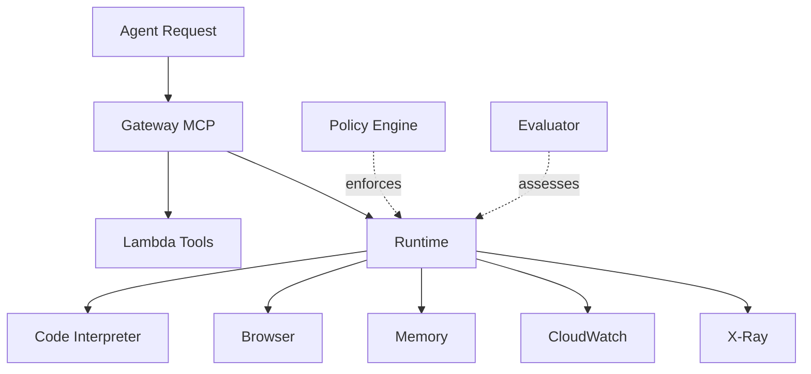
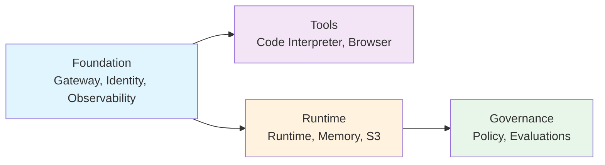
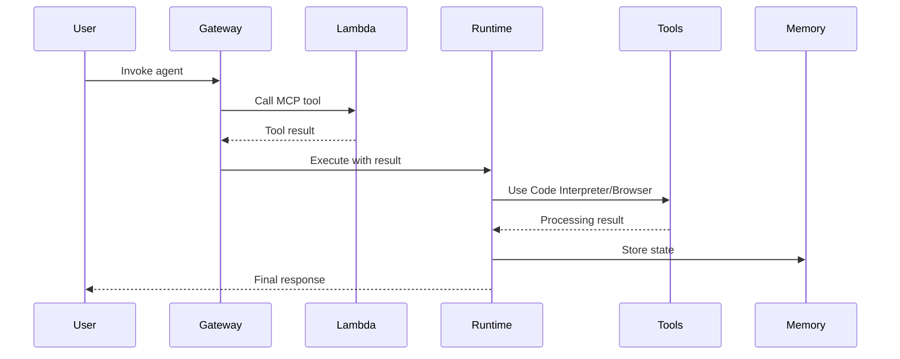
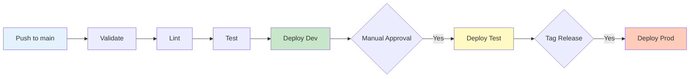
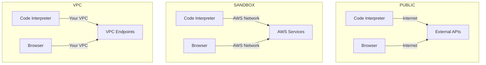

# README Improvement Plan

## Problems with Current README

1. **Too technical** - Reads like a feature list, not user-focused
2. **No visual architecture** - Missing Mermaid diagrams
3. **Overwhelmed with details** - Too many sections, too early
4. **Unclear value proposition** - What problem does this solve?
5. **Poor navigation** - Hard to find what you need
6. **Examples buried** - Should be prominent
7. **No screenshots/visuals** - Dry text only

## Reference Quality Bar (deepagents README)

**What makes it good:**
- ✅ Clear value proposition in first paragraph
- ✅ Visual architecture diagram (image)
- ✅ Concise project structure
- ✅ Step-by-step quick start (4 simple steps)
- ✅ Table formatting for variables
- ✅ Practical examples with actual commands
- ✅ Output samples showing what user gets
- ✅ Short, focused sections

## Proposed New README Structure

```markdown
# AWS Bedrock AgentCore Terraform

> Production-ready, modular Terraform infrastructure for deploying AI agents on AWS Bedrock AgentCore

## What This Does

[3-4 bullet points of capabilities, user-focused]

## Architecture

[Mermaid diagram showing 4 modules + data flow]

## Quick Start

### Prerequisites
[Minimal list with versions]

### 1. Clone and Setup
[3-4 commands max]

### 2. Configure
[Copy tfvars, edit 2-3 key values]

### 3. Deploy
[terraform init/plan/apply]

### 4. Verify
[How to check it worked]

## Examples

### Example 1: Simple S3 Agent
[2-3 line description]
```bash
terraform apply -var-file=examples/1-hello-world/terraform.tfvars
```

### Example 2: Research Agent with MCP
[2-3 line description]
[Link to example README]

## Configuration Reference

### Required Variables
[Table with 3-5 must-have variables]

### Optional Variables
[Table with common optional variables]

### Module Composition (Recommended)
[Show the module.mcp_servers pattern]

## Project Structure

[Clean tree showing key files only]

## Features

[Grid/table showing 9 features with enable/disable flags]

## Documentation

- [Architecture](docs/architecture.md) - System design
- [Developer Guide](DEVELOPER_GUIDE.md) - Team onboarding
- [WIF Setup](docs/WIF_SETUP.md) - GitLab CI/CD
- [ADRs](docs/adr/) - Design decisions

## Cost Estimate

[Simple table: component → cost model → typical cost]

## Next Steps

[3-5 links to deep-dive docs]
```

## Mermaid Diagrams to Add

### 1. Architecture Overview (README.md)


### 2. Module Dependencies (docs/architecture.md)


### 3. Data Flow (docs/architecture.md)


### 4. CI/CD Pipeline (docs/architecture.md)


### 5. Network Modes (docs/architecture.md)


## Implementation Plan

### Phase 1: Core README Rewrite (2 hours)
- [ ] Rewrite opening section (value proposition)
- [ ] Add architecture Mermaid diagram
- [ ] Simplify Quick Start to 4 steps
- [ ] Create concise examples section
- [ ] Add configuration reference tables
- [ ] Move technical details to linked docs

### Phase 2: Mermaid Diagrams (1 hour)
- [ ] Add architecture diagram to README.md
- [ ] Add 5 diagrams to docs/architecture.md
- [ ] Add CI/CD diagram to .gitlab-ci.yml comments
- [ ] Add network modes diagram to architecture.md

### Phase 3: Documentation Reorganization (1 hour)
- [ ] Move "Feature Configuration" details to separate doc
- [ ] Create CONFIGURATION.md for deep-dive
- [ ] Update DEVELOPER_GUIDE.md with diagram references
- [ ] Add visual elements to runbooks

### Phase 4: CLAUDE.md Update (30 min)
- [ ] Add Rule 1.8: README must be user-focused
- [ ] Add Rule 1.9: Use Mermaid for all architecture diagrams
- [ ] Update documentation sync requirements
- [ ] Add quality bar reference (deepagents README)

## Acceptance Criteria

✅ **User can understand value in <30 seconds** (opening paragraph)
✅ **Visual architecture** (Mermaid diagram visible without scrolling)
✅ **Deploy in <5 minutes** (following Quick Start)
✅ **Find examples immediately** (prominent Examples section)
✅ **See costs** (simple cost table)
✅ **Navigate to deep docs** (clear links at bottom)

## Files to Create/Update

1. **README.md** - Complete rewrite (keep current as README.old.md backup)
2. **docs/CONFIGURATION.md** - Deep-dive configuration guide
3. **docs/architecture.md** - Add 5 Mermaid diagrams
4. **CLAUDE.md** - Add documentation rules
5. **examples/*/README.md** - Ensure each example has clear README

## Quality Checklist

Before considering done:
- [ ] README is <300 lines (currently >500)
- [ ] Architecture diagram visible in first screen
- [ ] Quick Start has exactly 4 numbered steps
- [ ] No technical jargon in first 3 sections
- [ ] All variables shown in tables
- [ ] Examples have copy-paste commands
- [ ] Links to all deep-dive docs at end
- [ ] Matches deepagents README quality bar
