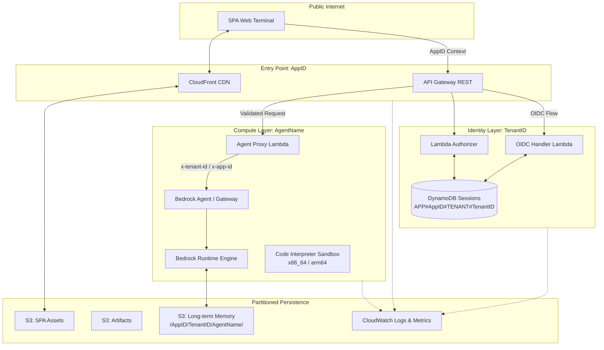
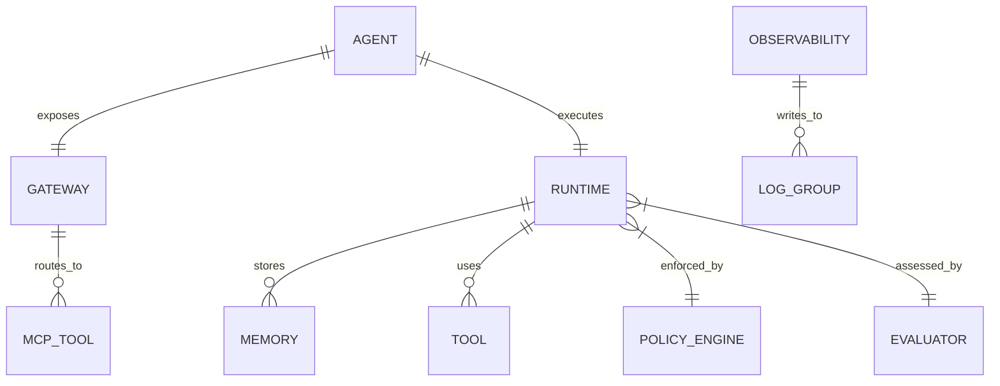
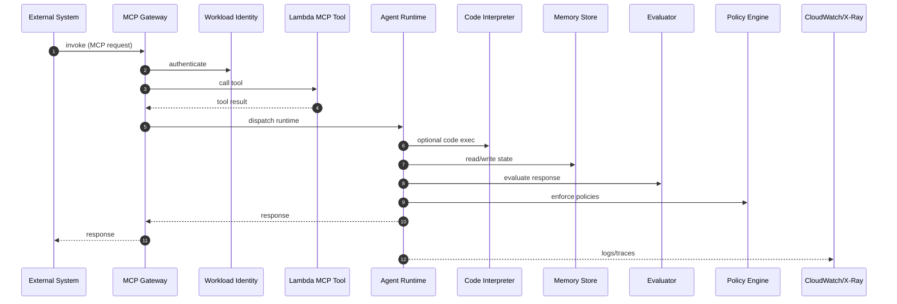

# Bedrock AgentCore Terraform Architecture

## Document Status

| Aspect | Status |
|--------|--------|
| **Last Updated** | 2026-02-13 |
| **Code Version** | v1.1.0 (North-South Join) |
| **Sync Status** | Fully Refactored for Multi-Tenancy |

---

## Physical Infrastructure Architecture

The following diagram illustrates the deployment of AgentCore components and the end-to-end data flow from the browser to the AI runtime.



## System Overview

This Terraform implementation provisions AWS Bedrock AgentCore infrastructure for deploying AI agents with MCP protocol support, code interpretation, web browsing, memory, and governance capabilities.

## Project Structure

```
repo-root/
├── terraform/
│   ├── modules/
│   │   ├── agentcore-foundation/   # Gateway, Identity, Observability
│   │   ├── agentcore-tools/        # Code Interpreter, Browser
│   │   ├── agentcore-runtime/      # Runtime, Memory, Packaging
│   │   └── agentcore-governance/   # Policies, Evaluations
│   ├── tests/
│   │   ├── validation/             # Terraform validation scripts
│   │   └── security/               # Security scanning scripts
│   ├── scripts/                    # Helper utilities
│   ├── main.tf                     # Module composition
│   ├── variables.tf                # Root variables
│   ├── outputs.tf                  # Root outputs
│   └── versions.tf                 # Provider configuration
├── examples/
│   ├── 1-hello-world/              # Basic S3 explorer agent
│   ├── 2-gateway-tool/             # MCP gateway with Titanic analysis
│   ├── 3-deepresearch/             # Full Strands DeepAgents implementation
│   ├── 4-research/                 # Simplified research agent
│   ├── 5-integrated/               # Module composition (RECOMMENDED)
│   └── mcp-servers/                # Lambda MCP servers + local dev
├── docs/
│   ├── adr/                        # Architecture Decision Records
│   ├── runbooks/                   # Operational runbooks
│   └── architecture.md             # This file
├── CLAUDE.md                       # AI development rules
├── DEVELOPER_GUIDE.md              # Team onboarding
└── README.md                       # User documentation
```

## High-Level Architecture

```
+-------------------------------------------------------------+
|                     AgentCore Agent                          |
|                                                              |
|  +------------+  +----------+  +--------------+             |
|  |  Gateway   |->| Runtime  |->| Code         |             |
|  |  (MCP)     |  |          |  | Interpreter  |             |
|  +------------+  +----------+  +--------------+             |
|        |              |                                      |
|        v              v                                      |
|  +------------+  +----------+  +--------------+             |
|  |  Lambda    |  |  Memory  |  |   Browser    |             |
|  | (MCP Tool) |  |          |  |              |             |
|  +------------+  +----------+  +--------------+             |
|                                                              |
|         Monitored by CloudWatch + X-Ray                      |
|         Governed by Cedar Policies + Evaluators              |
+-------------------------------------------------------------+
```

## Resource Model (Entity)



## Module Architecture

### Dependency Graph

```
agentcore-foundation (NO dependencies)
        |
        +---> agentcore-tools (depends: foundation)
        +---> agentcore-runtime (depends: foundation)
                    |
                agentcore-governance (depends: foundation + runtime)
```

### 1. agentcore-foundation

**Purpose**: Core infrastructure (Gateway, Identity, Observability)

**Resources**:
- `aws_bedrockagentcore_gateway` - MCP protocol gateway (native provider)
- `aws_bedrockagentcore_gateway_target` - MCP Lambda targets (native provider)
- `null_resource` + CLI for Workload Identity (OAuth2 identity)
- `aws_cloudwatch_log_group` - Centralized logging
- `aws_xray_sampling_rule` - Distributed tracing
- IAM roles and policies

**Encryption**: AWS-managed (SSE-S3, default CloudWatch encryption)

**Dependencies**: None (foundation layer)

### 2. agentcore-tools

**Purpose**: Agent capabilities (Code Interpreter, Browser)

**Resources**:
- `null_resource` + CLI for Code Interpreter (Python sandbox)
- `null_resource` + CLI for Browser (Web browser)
- CloudWatch log groups
- IAM roles

**Network Modes**: PUBLIC, SANDBOX, VPC

**Dependencies**: Foundation (for observability integration)

### 3. agentcore-runtime

**Purpose**: Execution + state (Runtime, Memory, Packaging)

**Resources**:
- `null_resource` + CLI for Runtime
- `null_resource` + CLI for Memory
- `null_resource` + CLI for Application Inference Profile
- `aws_s3_bucket` - Deployment artifacts
- Two-stage build (dependencies -> code)

**Encryption**: AWS-managed (SSE-S3/AES256)

**Dependencies**: Foundation (IAM roles)

### 4. agentcore-governance

**Purpose**: Security + quality (Policies, Evaluations)

**Resources**:
- `null_resource` + CLI for Policy Engine
- `null_resource` + CLI for Cedar Policies
- `null_resource` + CLI for Evaluators
- CloudWatch alarms

**Dependencies**: Foundation + Runtime

## Data Flow

### Agent Invocation Flow



```
1. External System -> Gateway (MCP endpoint)
2. Gateway -> Authenticates via Workload Identity
3. Gateway -> Routes to Lambda (MCP target)
4. Lambda -> Returns tool result
5. Gateway -> Passes to Runtime
6. Runtime -> Executes agent code
7. Agent Code -> Uses Code Interpreter/Browser
8. Runtime -> Stores state in Memory
9. Evaluator -> Assesses response quality
10. Policy Engine -> Enforces access controls
11. CloudWatch/X-Ray -> Records metrics
12. Gateway -> Returns response
```

### Deployment Flow

```
1. Developer -> Commits code to Git
2. GitHub Actions (current) / GitLab CI (target) -> Runs validate/lint/test (no AWS)
3. GitLab CI (target) -> Auto-deploys to dev on merge to main
4. GitLab CI (target) -> Manual deploy to test from release branch
5. GitLab CI (target) -> Manual deploy to prod from tag
```

GitHub Actions currently runs validation only and does not deploy to AWS.

## Security Architecture

### Authentication & Authorization

```
GitLab (deploy) -> WIF -> AWS STS -> Temporary Credentials
    |
    v
Terraform -> Creates Resources
    |
    v
Agent Runtime -> IAM Role (least privilege)
    |
    v
Gateway -> Workload Identity (OAuth2)
    |
    v
MCP Tools -> Lambda IAM execution role
```

#### Identity Persistence and Interceptor Boundaries (ADR 0015)

Identity is preserved through the app-facing stack by carrying a normalized identity envelope (for example `app_id`,
`tenant_id`, principal, `session_id`, scopes, correlation IDs) across boundaries, rather than repeatedly trusting raw
request-body fields at each hop.

The architecture distinguishes:
- **Inbound identity**: who is calling into API Gateway / BFF / AgentCore and what routes/tools they may invoke
- **Outbound identity**: what credential mode (IAM/OAuth/API key) is used when calling downstream targets

These are separate decisions and MUST be modeled independently. A valid inbound JWT does **not** imply unrestricted
outbound access.

See `docs/adr/0015-bff-identity-persistence-interceptors-and-multitenancy-viability.md` for the normative interceptor
chains and East-West partition model.

#### Agent-to-Agent (A2A) Auth
For multi-agent collaboration (Strands), we use **Workload Identity Propagation**:
1.  **Source Agent** receives User JWT.
2.  Calls `GetWorkloadAccessTokenForJWT` to exchange User JWT for **Workload Token**.
3.  Invokes **Target Agent** with `Authorization: Bearer <WorkloadToken>`.
4.  **Target Agent** validates token via its Inbound Authorizer.

#### Dynamic Session Policies (Physical Isolation)
To prevent cross-tenant data leakage even in the event of agent compromise:
1.  **Proxy** assumes the **Agent Runtime Role** for every request.
2.  Passes a **Session Policy** scoped to the specific `AppID` and `TenantID` S3 prefixes.
3.  **Runtime** operates using these restricted temporary credentials.

#### East-West Partitions (Operational Boundaries)
To preserve release autonomy without corrupting runtime tenant authorization, the platform separates:
- **CI/Release Plane** (GitLab pipeline, release approvers) -> `Environment` promotion and evidence only
- **Identity/Control Plane** (Entra OIDC, AgentCore Identity/token exchange) -> authentication and token handling
- **Application Control Plane** (API Gateway + BFF) -> route authz, session binding, identity normalization
- **Runtime/Tool Control Plane** (AgentCore Gateway/Runtime + policy/evaluator) -> runtime/tool authz and policy checks
- **Runtime Data Plane** (DynamoDB/S3) -> tenant-partitioned persistence
- **Observability/Audit Plane** -> logs/traces/audit evidence with identity correlation (no secrets)

CI/release metadata MUST NOT be used as a runtime tenant authorization signal.

### Encryption Strategy (ADR 0008)

**At Rest**:
- S3: AWS-managed SSE-S3 (AES256)
- CloudWatch: AWS-managed encryption
- Secrets Manager: AWS-managed KMS (default)

**In Transit**:
- All APIs use HTTPS/TLS
- Internal: AWS PrivateLink (when VPC mode enabled)

**Rationale**: AWS-managed encryption provides equivalent security with less operational overhead. See `docs/adr/0008-aws-managed-encryption.md`.

### Policy Enforcement

```
Request -> Policy Engine (Cedar) -> Allow/Deny
    |
    v
If Allowed -> Runtime Executes
    |
    v
Response -> Evaluator -> Quality Score
    |
    v
Metrics -> CloudWatch
```

## State Management

### Terraform State (ADR 0004)

Using S3 backend with **native S3 locking** (Terraform 1.10.0+):

```
S3 Bucket (per environment)
├── agentcore/
│   ├── terraform.tfstate        (current state)
│   ├── terraform.tfstate.tflock (lock file during operations)
│   └── [versioned snapshots]    (via S3 versioning)
```

**Note**: DynamoDB-based locking is deprecated. Native S3 locking via `use_lockfile = true` is the recommended approach.

#### Scaling Risk: State Monolith (Current vs Target)

The environment-level state object shown above is simple, but it becomes a scaling bottleneck when many agents or app
stacks share the same backend key. Risks include:
- lock contention for unrelated work,
- larger blast radius for plans/applies,
- slower reviews and harder rollbacks,
- reduced team autonomy due to shared state coupling.

**Target direction (ADR 0013)**: segmented state keys by deployable boundary:

```text
agentcore/<env>/<app_id>/<agent_name>/terraform.tfstate
```

Treat the env-only monolith as a migration baseline, not the long-term target for scaled multi-agent operations.

If a single `app_id + agent_name` deployment is later split into independently planned/applied stacks, extend the key
with a stack segment per ADR 0016:

```text
agentcore/<env>/<app_id>/<agent_name>/<stack>/terraform.tfstate
```

See `docs/adr/0016-terraform-scaling-stack-topology-and-terragrunt-adoption-thresholds.md` and
`docs/runbooks/terraform-scaling-stack-segmentation-and-terragrunt-pilot.md` for the Terraform-first scaling path,
Terragrunt adoption thresholds, and pilot evidence requirements.

### Agent State

**Short-term Memory**:
- In-memory storage
- TTL: configurable (default 60 min)
- Use: conversation context

**Long-term Memory**:
- Persistent storage (S3-backed)
- Infinite retention
- Use: learned knowledge

#### Multi-Tenancy Viability (Realistic Operating Model)

Full pooled multi-tenancy is viable only when tenant isolation is enforced across **identity**, **session binding**,
**authorization**, and **storage partitioning** (not just shared infrastructure tags).

Practical tiers:
- **Tier A (default / viable)**: shared app-agent stack with tenant-partitioned data (`AppID + TenantID`) and strict authz/session checks
- **Tier B (selective)**: shared control plane, tenant-dedicated data stores/prefixes for specific tenants
- **Tier C (exception)**: tenant-dedicated runtime stack for compliance or high-isolation needs

Do not claim "full multi-tenancy" if tenant isolation is not proven in logs/traces/audit paths and negative tests.

## Observability

### Metrics (CloudWatch)

- **Gateway**: Invocations, errors, latency
- **Runtime**: Executions, memory usage
- **Tools**: Code interpreter runs, browser sessions
- **Evaluations**: Quality scores, pass/fail rates

### Logs (CloudWatch Logs)

```
/aws/bedrock/agentcore/
+-- gateway/{agent-name}
+-- runtime/{agent-name}
+-- code-interpreter/{agent-name}
+-- browser/{agent-name}
+-- policy-engine/{agent-name}
+-- evaluator/{agent-name}
```

### Tracing (X-Ray)

- End-to-end request tracing
- Service map visualization
- Latency analysis
- Error tracking

#### Tracing Metadata Contract (Tenant-Aware)
Tracing SHOULD include queryable annotations for:
- `app_id`
- `tenant_id`
- `agent_name`
- `environment`
- `session_id`
- `route`

Do not write raw tokens, secrets, or unredacted PII into annotations or trace metadata.

### Shared-Account Observability Limits

When deploying multiple agents to the same AWS account, two account-level limits apply:

- **CloudWatch resource policies**: AWS hard limit of 10 per account/region. The module creates one policy per environment (`bedrock-agentcore-log-policy-{env}`) scoped to cover all agents. Set `manage_log_resource_policy = false` on all agent deployments after the first in the same account/environment.
- **X-Ray sampling rule priority**: All agents default to priority `100`. Set unique `xray_sampling_priority` values (1–9999) per agent in shared accounts to ensure deterministic sampling order.

### Tenant-Partitioned Dashboards

Use two dashboard classes:
1. **Operational dashboards** (CloudWatch/X-Ray): per-agent/per-environment health, alarms, and trace triage.
2. **Tenant analytics/audit dashboards** (Athena/BI over BFF audit logs): tenant volume, error rate, latency, and
   usage/cost attribution joins.

Avoid relying on high-cardinality per-tenant CloudWatch metric dimensions at scale. The BFF audit schema already emits
`app_id`, `tenant_id`, session IDs, outcomes, and durations for query-driven dashboards.

## Network Architecture

### Service Discovery (ADR 0010)
Strands agents use a dual-tier discovery model:

1.  **East-West (Agent-to-Agent):** Uses **AWS Cloud Map**.
    *   Namespace: `agents.internal`
    *   Resolution: Logical Name -> Runtime Endpoint
    *   Protocol: A2A (Agent Cards)

2.  **Northbound (User-to-Agent):** Uses **API Gateway Catalog**.
    *   Endpoint: `GET /agents`
    *   Resolution: User Group -> Available Agents
    *   Protocol: REST

### Network Modes

**PUBLIC** (internet-facing):
- Code Interpreter/Browser connect to internet
- No VPC required
- Simple, lowest cost

**SANDBOX** (isolated):
- Code Interpreter/Browser in AWS managed network
- No internet access
- Balanced security/cost

**VPC** (customer VPC):
- Code Interpreter/Browser in your VPC
- Full network control
- VPC endpoints recommended

## Cost Architecture

### Cost Drivers

| Component | Cost Model | Estimate |
|-----------|------------|----------|
| Gateway | Per request | $0.001/request |
| Runtime | Per execution | $0.01/execution |
| Code Interpreter | Per second | $0.001/second |
| Browser | Per session | $0.01/session |
| Memory | Per GB-month | $0.023/GB-month |
| S3 Storage | Per GB-month | $0.023/GB-month |
| CloudWatch Logs | Per GB ingested | $0.50/GB |

**Typical Agent Cost**: $10-50/month (low volume)

### Cost Allocation and Authorization Boundary (Inference Profiles)

Application Inference Profiles should be used as the Bedrock invocation boundary when per-agent cost allocation and
IAM scoping are required:
- IAM policies can scope to a customer-owned inference profile ARN instead of broad model permissions.
- Cost and usage can be tracked at the application/agent boundary using profile tags.
- Quota/throughput management can be controlled at the profile boundary.

Tenant-level cost attribution should be derived from:
- BFF audit logs (`app_id`, `tenant_id`, request/response metadata, outcomes, durations),
- model usage/cost telemetry associated with the application inference profile,
- and runtime/tool usage telemetry as needed.

This avoids overloading AWS resource tags as a tenant cost ledger for shared resources.

## Deployment Environments

| Environment | Purpose | Promotion | Auto-Deploy |
|-------------|---------|-----------|-------------|
| Dev | Development | main branch | Yes |
| Test | Integration testing | release/* | Manual |
| Prod | Production | v* tags | Manual |

### GitLab Group Model for Release Autonomy (Recommended)

To provide autonomy to application/agent teams while preserving platform controls:
- **Platform group** owns shared CI templates, WIF/OIDC deployment trust, protected tags/environments, and promotion policies.
- **Team subgroups/projects** own day-to-day development and lower-environment delivery cadence.
- **Production promotions** require protected environment/tag approvals and evidence (CI/release-plane action only).

Release metadata (pipeline IDs, approvers, promoted SHA lineage) should be recorded as release evidence and MAY be
mirrored into resource tags where applicable (for example `GitLabGroup`, `GitLabProject`, `ReleaseChannel`), but must
remain separate from runtime tenant authorization decisions.

## Regional Topology

Default deployment is **single-region**. Region splits are supported when required by service availability:

- **AgentCore control plane**: `agentcore_region` (defaults to `region`)
- **Bedrock models/guardrails/inference profiles**: `bedrock_region` (defaults to `agentcore_region`)
- **BFF/API Gateway**: `bff_region` (defaults to `agentcore_region`)

When regions are split, expect higher latency and cross-region data transfer between BFF and AgentCore, and separate log/metric locations per region.

## Integration Points

### External Systems

- **MCP Tools**: Lambda functions (your code)
- **Secrets Manager**: Runtime secrets
- **GitHub/GitLab**: Source code + CI/CD
- **AWS Accounts**: Separate per environment

### APIs

- **Bedrock AgentCore**: AWS service APIs
- **AgentCore Runtime Invoke**: `InvokeAgentRuntime` over HTTPS (supports streaming responses)
- **S3**: Storage APIs
- **CloudWatch**: Monitoring APIs
- **Secrets Manager**: Secret retrieval

### Scaling Parameters and Service Quotas (Planning Inputs)

Architectural viability depends on AWS service quotas and throttling behavior in the target account/region.
As of AWS docs checked **2026-02-23** (see ADR 0015 references):
- **API Gateway** has account/region and API-level quotas affecting throttling, routes/resources, integrations,
  authorizers, payload/header sizes, and timeouts.
- **Cloud Map** has quotas and throttling for service instances and `DiscoverInstances`; aggressive mesh discovery must
  use caching/backoff.
- **DynamoDB** multi-tenant designs require explicit access-pattern validation and may need write-sharding as tenant
  hotspots emerge.

Main quotas to track (defaults; account/Region unless noted):

| Service | Key quota | Default | Why it matters here |
|---|---:|---:|---|
| CloudWatch Logs | **Resource policies** | `10` | Shared-account log delivery policy strategy; reuse one policy per env/account/region. |
| CloudWatch Logs | Log groups | `1,000,000` | Not the bottleneck for this design; resource policy count is the tighter constraint. |
| API Gateway (all API types) | Account throttle | `10,000 RPS` (+ burst, region-dependent) | Shared account ingress throughput and noisy-neighbor risk across APIs. |
| API Gateway REST API | Authorizers per API | `10` | BFF route/auth design must reuse authorizers rather than per-route sprawl. |
| API Gateway REST API | Resources per API | `300` | Route surface growth (tenant/admin/diagnostic APIs) must stay compact. |
| AWS Cloud Map | `DiscoverInstances` steady rate | `1,000/s` | East-west mesh discovery must cache and back off. |
| AWS Cloud Map | `DiscoverInstances` burst rate | `2,000` | Burst traffic can throttle without cache discipline. |
| AWS Cloud Map | Instances per service | `1,000` | Limits service-registry fanout per logical service. |
| AWS Cloud Map | Instances per namespace | `2,000` | Namespace planning for larger agent meshes. |
| AWS X-Ray | Segments per second | `2,600` | Trace sampling and cardinality control for tenant-correlated tracing. |
| AWS X-Ray | Indexed annotations per trace | `50` | Limits how much tenant/app/session metadata should be query-indexed. |
| DynamoDB | Tables per account/Region (initial) | `2,500` | Matters if tenant-dedicated table strategy is overused. |
| DynamoDB | Per-table throughput (read / write) | `40,000 / 40,000` | Session/audit partition hot-spot planning and scale headroom. |
| DynamoDB | GSIs per table | `20` | Tenant query-pattern design and audit/reporting index budget. |
| Bedrock (application inference profiles) | Model invocation quotas | Varies by model/region/account | Cost/auth boundary is covered by inference profiles, but throughput/token limits must be checked per target model and region at rollout time. |
| AgentCore (runtime/gateway/tools) | Service-specific quotas | Varies by component | AgentCore limits (gateway targets/tools, runtime sessions, browser/code-interpreter concurrency) can become the practical ceiling before infrastructure limits. |

Important correction: the `10` limit commonly encountered in this repo is **CloudWatch Logs resource policies**, not
CloudWatch log groups.

Treat these as first-class architecture inputs, not post-launch tuning details. Re-check Service Quotas before large
tenant onboarding or major mesh growth.

## Local Development and Inner Loop

The architecture must support a fast local inner loop for identity, tenancy, and observability behavior:
- local MCP server development and replay (`examples/mcp-servers/local-dev/`)
- local Terraform validate/plan (`-backend=false`) for infrastructure changes
- unit tests for BFF/session/authorizer logic with mocked OIDC claims
- structured log fixtures that preserve production field names (`app_id`, `tenant_id`, `session_id`, `outcome`)
- replayable audit samples for tenant dashboard/query development

A developer should be able to validate identity propagation, tenant isolation checks, and metadata integrity before a
GitLab deployment cycle.

## CLI-Based Resources

Due to AWS provider gaps, the core Bedrock AgentCore suite uses AWS CLI:

| Resource | CLI Command |
|----------|------------|
| Identity | `bedrock-agentcore-control create-workload-identity` |
| Browser | `bedrock-agentcore-control create-browser` |
| Code Interpreter | `bedrock-agentcore-control create-code-interpreter` |
| Runtime | `bedrock-agentcore-control create-agent-runtime` |
| Memory | `bedrock-agentcore-control create-memory` |
| Policy Engine | `bedrock-agentcore-control create-policy-engine` |
| Cedar Policies | `bedrock-agentcore-control create-policy` |
| Evaluators | `bedrock-agentcore-control create-evaluator` |
| OAuth2 Providers | `bedrock-agentcore-control create-oauth2-credential-provider` |

See `docs/adr/0002-cli-based-resources.md` for migration path when native resources become available.

## Canonical Tag Taxonomy

All managed resources carry a deterministic set of required tags. These are enforced via:
1. **Provider `default_tags`** in `terraform/versions.tf` — applied automatically to every AWS resource.
2. **`local.canonical_tags`** in `terraform/locals.tf` — merged into every module's `tags` input for explicit control and for non-AWS resources.
3. **CI validation** — `terraform/tests/validation/tags_test.sh` confirms the taxonomy is intact on every run.

This taxonomy governs the **Infrastructure Plane (AWS resource tags)** only. Tenant/session/request identity and
release/promotion metadata are also mandatory, but they live in different planes:
- **Runtime Request Plane**: structured logs and audit records (`app_id`, `tenant_id`, `session_id`, outcomes)
- **Tracing Plane**: X-Ray annotations/metadata for correlation
- **Release Plane**: GitLab pipeline/environment/promotion evidence metadata

See `docs/adr/0014-metadata-tagging-telemetry-and-release-metadata-boundaries.md` for the normative cross-plane
metadata model, tenant dashboard guidance, and inference-profile cost/authorization guidance.

| Tag Key | Source | Description |
|---------|--------|-------------|
| `AppID` | `var.app_id` (or `var.agent_name`) | Logical application/environment boundary (North Anchor). |
| `AgentAlias` | `var.app_id` (or `var.agent_name`) | Human-facing alias mirrored into tags for console visibility and policy/reporting joins. |
| `Environment` | `var.environment` | Deployment stage: `dev`, `test`, or `prod`. |
| `AgentName` | `var.agent_name` | Physical compute resource name (South Anchor). |
| `ManagedBy` | Static: `"terraform"` | Always set; indicates this resource is Terraform-managed. |
| `Owner` | `var.owner` (or `var.app_id`) | Team or individual owner. Defaults to `app_id` if not set. |

**Override policy**: Canonical keys always win. User-supplied `var.tags` can add supplementary keys but cannot override canonical values. Set `var.owner` to assign an explicit owner identifier.
`AgentName` is the internal immutable identity; `AgentAlias` mirrors `app_id` for the human-facing label.

**Check date**: 2026-02-23. See ADR 0014 for AWS-backed cost/authorization metadata guidance (inference profiles and
AgentCore JWT auth surfaces).

---

## Architecture Decision Records

| ADR | Decision |
|-----|----------|
| 0001 | Four-module architecture |
| 0002 | CLI-based resources via null_resource |
| 0003 | GitLab CI with WIF authentication |
| 0004 | S3 backend with native S3 locking |
| 0005 | Hybrid secrets management |
| 0006 | Separate backends (not workspaces) |
| 0007 | Single region deployment |
| 0008 | AWS-managed encryption |
| 0009 | Strands publishing, Entra identity, and release architecture |
| 0010 | Agent mesh & service discovery |
| 0011 | Serverless SPA/BFF token handler pattern |
| 0012 | Agent identity vs alias naming |
| 0013 | Segmented Terraform state key strategy |
| 0014 | Metadata boundaries (tags, telemetry, traces, release metadata) |
| 0015 | BFF identity persistence, interceptors, and multitenancy viability |
| 0016 | Terraform scaling, stack topology, and Terragrunt adoption thresholds |

See `docs/adr/` for full decision records.
