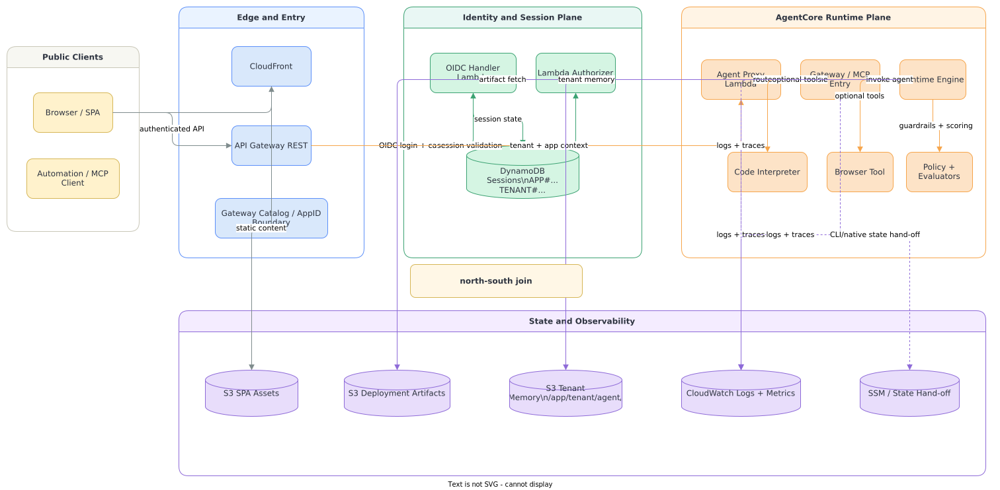
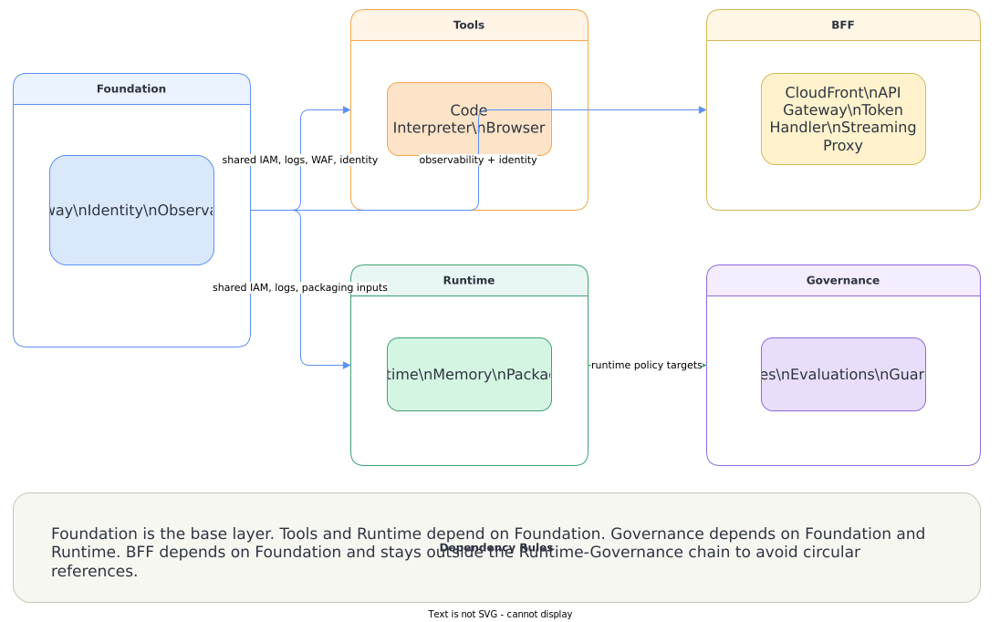
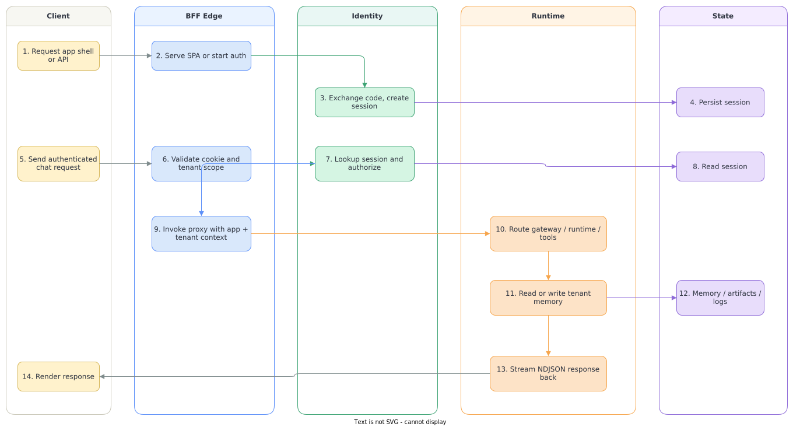

# Bedrock AgentCore Terraform Architecture

## Document Status

| Aspect | Status |
|--------|--------|
| **Last Updated** | 2026-03-10 |
| **Code Version** | v0.1.1 (North-South Join) |
| **Sync Status** | Fully Refactored for Multi-Tenancy |

---

## System Summary

This repository provisions an opinionated Bedrock AgentCore platform for multi-tenant agents on AWS. The architecture is built around a small set of hard boundaries:

- `foundation` owns shared ingress, identity, and observability primitives
- `tools` owns optional execution tools such as browser and code interpreter
- `runtime` owns packaging, execution, and memory
- `governance` owns policy, guardrails, and evaluation
- `bff` owns browser-facing auth, SPA delivery, and streaming proxy behavior

The system model is designed around a North-South Join:

- **North**: `app_id` and the public entrypoint
- **Middle**: validated tenant and session context
- **South**: runtime resources, tools, and policy enforcement

## Physical Infrastructure Architecture

The platform overview below shows how public traffic, browser auth, runtime execution, and tenant-partitioned state fit together.



_The same `app_id` and tenant boundary drives routing, session lookup, runtime invocation, and persistent state layout._

## System Overview

This Terraform implementation provisions Bedrock AgentCore infrastructure for agents that need MCP routing, runtime execution, optional browser/code-interpreter tools, persistent memory, and governance controls. The repo intentionally mixes native Terraform resources with a CLI bridge where provider coverage is still incomplete.

## Project Structure

```
repo-root/
├── terraform/
│   ├── modules/
│   │   ├── agentcore-foundation/   # Gateway, Identity, Observability
│   │   ├── agentcore-tools/        # Code Interpreter, Browser
│   │   ├── agentcore-runtime/      # Runtime, Memory, Packaging
│   │   └── agentcore-governance/   # Policies, Evaluations
│   ├── tests/
│   │   ├── validation/             # Terraform validation scripts
│   │   └── security/               # Security scanning scripts
│   ├── scripts/                    # Helper utilities
│   ├── main.tf                     # Module composition
│   ├── variables.tf                # Root variables
│   ├── outputs.tf                  # Root outputs
│   └── versions.tf                 # Provider configuration
├── examples/
│   ├── 1-hello-world/              # Minimal Strands baseline demo agent
│   ├── 2-gateway-tool/             # MCP gateway with Titanic analysis
│   ├── 3-deepresearch/             # Full Strands DeepAgents implementation
│   ├── 4-research/                 # Simplified research agent
│   ├── 5-integrated/               # Module composition (RECOMMENDED)
│   └── mcp-servers/                # Lambda MCP servers + local dev
├── docs/
│   ├── adr/                        # Architecture Decision Records
│   ├── diagrams/                   # Editable draw.io sources + SVG exports
│   ├── runbooks/                   # Operational runbooks
│   └── architecture.md             # This file
├── AGENTS.md                       # Canonical AI development rules
├── CLAUDE.md                       # Mirror of AGENTS.md
├── GEMINI.md                       # Mirror of AGENTS.md
├── DEVELOPER_GUIDE.md              # Team onboarding
└── README.md                       # User documentation
```

## High-Level Architecture

The dependency graph is fixed. `foundation` is the base layer, `tools` and `runtime` consume it, `governance` depends on `runtime`, and `bff` stays adjacent to the runtime chain rather than inside it.



_The dependency order is there to prevent circular references and keep shared primitives stable before higher-level modules consume them._

## Resource Model

At runtime, the core relationships are straightforward:

- one agent exposes one runtime
- a gateway can route to many MCP tools
- a runtime can read and write memory
- policy and evaluator systems sit beside runtime execution, not inside the request origin
- observability spans every layer rather than belonging to one module

## Module Architecture

### Dependency Graph

Use the module topology above as the source of truth for dependency direction. The detailed module summaries below explain what each layer owns.

### 1. agentcore-foundation

**Purpose**: Core infrastructure (Gateway, Identity, Observability)

**Resources**:
- `aws_bedrockagentcore_gateway` - MCP protocol gateway (native provider)
- `aws_bedrockagentcore_gateway_target` - MCP Lambda targets (native provider)
- `null_resource` + CLI for Workload Identity (OAuth2 identity)
- `aws_cloudwatch_log_group` - Centralized logging
- `aws_xray_sampling_rule` - Distributed tracing
- IAM roles and policies

**Encryption**: AWS-managed (SSE-S3, default CloudWatch encryption)

**Dependencies**: None (foundation layer)

### 2. agentcore-tools

**Purpose**: Agent capabilities (Code Interpreter, Browser)

**Resources**:
- `null_resource` + CLI for Code Interpreter (Python sandbox)
- `null_resource` + CLI for Browser (Web browser)
- CloudWatch log groups
- IAM roles

**Network Modes**: PUBLIC, SANDBOX, VPC

**Dependencies**: Foundation (for observability integration)

### 3. agentcore-runtime

**Purpose**: Execution + state (Runtime, Memory, Packaging)

**Resources**:
- `null_resource` + CLI for Runtime
- `null_resource` + CLI for Memory
- `null_resource` + CLI for Application Inference Profile
- `aws_s3_bucket` - Deployment artifacts
- Two-stage build (dependencies -> code)

**Encryption**: AWS-managed (SSE-S3/AES256)

**Dependencies**: Foundation (IAM roles)

### 4. agentcore-governance

**Purpose**: Security + quality (Policies, Evaluations)

**Resources**:
- `null_resource` + CLI for Policy Engine
- `null_resource` + CLI for Cedar Policies
- `null_resource` + CLI for Evaluators
- CloudWatch alarms

**Dependencies**: Foundation + Runtime

## Data Flow

### Agent Invocation Flow



_The browser-facing path keeps identity, session lookup, runtime execution, and tenant memory as explicit hops instead of implicit application logic._

```
1. External System -> Gateway (MCP endpoint)
2. Gateway -> Authenticates via Workload Identity
3. Gateway -> Routes to Lambda (MCP target)
4. Lambda -> Returns tool result
5. Gateway -> Passes to Runtime
6. Runtime -> Executes agent code
7. Agent Code -> Uses Code Interpreter/Browser
8. Runtime -> Stores state in Memory
9. Evaluator -> Assesses response quality
10. Policy Engine -> Enforces access controls
11. CloudWatch/X-Ray -> Records metrics
12. Gateway -> Returns response
```

### Deployment Flow

1. Developers work on scoped issue branches and open PRs to `main`.
2. GitHub Actions runs validation-only CI and does not deploy to AWS.
3. GitLab CI handles promotion and deployment gates.
4. Dev promotion happens from `main`; test and production promotions remain explicit.

GitHub Actions currently runs validation only and does not deploy to AWS.

## Security Architecture

### Authentication & Authorization

The deployment and runtime auth chain is:

1. GitLab uses WIF to obtain AWS STS credentials for deployment.
2. Terraform provisions resources under those temporary credentials.
3. The agent runtime executes under a least-privilege IAM role.
4. Gateway access is mediated by workload identity.
5. MCP tools run under their own Lambda execution roles.

#### Agent-to-Agent (A2A) Auth
For multi-agent collaboration (Strands), we use **Workload Identity Propagation**:
1.  **Source Agent** receives User JWT.
2.  Calls `GetWorkloadAccessTokenForJWT` to exchange User JWT for **Workload Token**.
3.  Invokes **Target Agent** with `Authorization: Bearer <WorkloadToken>`.
4.  **Target Agent** validates token via its Inbound Authorizer.

#### Dynamic Session Policies (Physical Isolation)
To prevent cross-tenant data leakage even in the event of agent compromise:
1.  **Proxy** assumes the **Agent Runtime Role** for every request.
2.  Passes a **Session Policy** scoped to the specific `AppID` and `TenantID` S3 prefixes.
3.  **Runtime** operates using these restricted temporary credentials.

### Encryption Strategy (ADR 0008)

**At Rest**:
- S3: AWS-managed SSE-S3 (AES256)
- CloudWatch: AWS-managed encryption
- Secrets Manager: AWS-managed KMS (default)

**In Transit**:
- All APIs use HTTPS/TLS
- Internal: AWS PrivateLink (when VPC mode enabled)

**Rationale**: AWS-managed encryption provides equivalent security with less operational overhead. See `docs/adr/0008-aws-managed-encryption.md`.

### Policy Enforcement

Policy and evaluation stay adjacent to runtime execution:

1. The request hits the policy engine and is allowed or denied.
2. Allowed requests continue to runtime execution.
3. Responses can then be scored by evaluator logic.
4. Metrics and quality signals land in CloudWatch.

## State Management

### Terraform State (ADR 0004)

Using S3 backend with **native S3 locking** (Terraform 1.10.0+):

- `agentcore/terraform.tfstate`: current state
- `agentcore/terraform.tfstate.tflock`: active lock file during operations
- versioned snapshots: historical state through S3 versioning

**Note**: DynamoDB-based locking is deprecated. Native S3 locking via `use_lockfile = true` is the recommended approach.

### Agent State

**Short-term Memory**:
- In-memory storage
- TTL: configurable (default 60 min)
- Use: conversation context

**Long-term Memory**:
- Persistent storage (S3-backed)
- Infinite retention
- Use: learned knowledge

## Observability

### Metrics (CloudWatch)

- **Gateway**: Invocations, errors, latency
- **Runtime**: Executions, memory usage
- **Tools**: Code interpreter runs, browser sessions
- **Evaluations**: Quality scores, pass/fail rates

### Logs (CloudWatch Logs)

Log groups are organized under `/aws/bedrock/agentcore/` by component, for example:

- `gateway/{agent-name}`
- `runtime/{agent-name}`
- `code-interpreter/{agent-name}`
- `browser/{agent-name}`
- `policy-engine/{agent-name}`
- `evaluator/{agent-name}`

### Tracing (X-Ray)

- End-to-end request tracing
- Service map visualization
- Latency analysis
- Error tracking

### Shared-Account Observability Limits

When deploying multiple agents to the same AWS account, two account-level limits apply:

- **CloudWatch resource policies**: AWS hard limit of 10 per account/region. The module creates one policy per environment (`bedrock-agentcore-log-policy-{env}`) scoped to cover all agents. Set `manage_log_resource_policy = false` on all agent deployments after the first in the same account/environment.
- **X-Ray sampling rule priority**: All agents default to priority `100`. Set unique `xray_sampling_priority` values (1–9999) per agent in shared accounts to ensure deterministic sampling order.

## Network Architecture

### Service Discovery (ADR 0010)
Strands agents use a dual-tier discovery model:

1.  **East-West (Agent-to-Agent):** Uses **AWS Cloud Map**.
    *   Namespace: `agents.internal`
    *   Resolution: Logical Name -> Runtime Endpoint
    *   Protocol: A2A (Agent Cards)

2.  **Northbound (User-to-Agent):** Uses **API Gateway Catalog**.
    *   Endpoint: `GET /agents`
    *   Resolution: User Group -> Available Agents
    *   Protocol: REST

### Network Modes

**PUBLIC** (internet-facing):
- Code Interpreter/Browser connect to internet
- No VPC required
- Simple, lowest cost

**SANDBOX** (isolated):
- Code Interpreter/Browser in AWS managed network
- No internet access
- Balanced security/cost

**VPC** (customer VPC):
- Code Interpreter/Browser in your VPC
- Full network control
- VPC endpoints recommended

## Cost Architecture

### Cost Drivers

| Component | Cost Model | Estimate |
|-----------|------------|----------|
| Gateway | Per request | $0.001/request |
| Runtime | Per execution | $0.01/execution |
| Code Interpreter | Per second | $0.001/second |
| Browser | Per session | $0.01/session |
| Memory | Per GB-month | $0.023/GB-month |
| S3 Storage | Per GB-month | $0.023/GB-month |
| CloudWatch Logs | Per GB ingested | $0.50/GB |

**Typical Agent Cost**: $10-50/month (low volume)

## Deployment Environments

| Environment | Purpose | Promotion | Auto-Deploy |
|-------------|---------|-----------|-------------|
| Dev | Development | main branch | Yes |
| Test | Integration testing | release/* | Manual |
| Prod | Production | v* tags | Manual |

## Regional Topology

Default deployment is **single-region**. Region splits are supported when required by service availability:

- **AgentCore control plane**: `agentcore_region` (defaults to `region`)
- **Bedrock models/guardrails/inference profiles**: `bedrock_region` (defaults to `agentcore_region`)
- **BFF/API Gateway**: `bff_region` (defaults to `agentcore_region`)

When regions are split, expect higher latency and cross-region data transfer between BFF and AgentCore, and separate log/metric locations per region.

## Integration Points

### External Systems

- **MCP Tools**: Lambda functions (your code)
- **Secrets Manager**: Runtime secrets
- **GitHub/GitLab**: Source code + CI/CD
- **AWS Accounts**: Separate per environment

### APIs

- **Bedrock AgentCore**: AWS service APIs
- **AgentCore Runtime Invoke**: `InvokeAgentRuntime` over HTTPS (supports streaming responses)
- **S3**: Storage APIs
- **CloudWatch**: Monitoring APIs
- **Secrets Manager**: Secret retrieval

## CLI-Based Resources

Due to AWS provider gaps, the core Bedrock AgentCore suite uses AWS CLI:

| Resource | CLI Command |
|----------|------------|
| Identity | `bedrock-agentcore-control create-workload-identity` |
| Browser | `bedrock-agentcore-control create-browser` |
| Code Interpreter | `bedrock-agentcore-control create-code-interpreter` |
| Runtime | `bedrock-agentcore-control create-agent-runtime` |
| Memory | `bedrock-agentcore-control create-memory` |
| Policy Engine | `bedrock-agentcore-control create-policy-engine` |
| Cedar Policies | `bedrock-agentcore-control create-policy` |
| Evaluators | `bedrock-agentcore-control create-evaluator` |
| OAuth2 Providers | `bedrock-agentcore-control create-oauth2-credential-provider` |

See `docs/adr/0002-cli-based-resources.md` for migration path when native resources become available.

## Canonical Tag Taxonomy

All managed resources carry a deterministic set of required tags. These are enforced via:
1. **Provider `default_tags`** in `terraform/versions.tf` — applied automatically to every AWS resource.
2. **`local.canonical_tags`** in `terraform/locals.tf` — merged into every module's `tags` input for explicit control and for non-AWS resources.
3. **CI validation** — `terraform/tests/validation/tags_test.sh` confirms the taxonomy is intact on every run.

| Tag Key | Source | Description |
|---------|--------|-------------|
| `AppID` | `var.app_id` (or `var.agent_name`) | Logical application/environment boundary (North Anchor). |
| `AgentAlias` | `var.app_id` (or `var.agent_name`) | Human-facing alias mirrored into tags for console visibility and policy/reporting joins. |
| `Environment` | `var.environment` | Deployment stage: `dev`, `staging`, or `prod`. |
| `AgentName` | `var.agent_name` | Physical compute resource name (South Anchor). |
| `ManagedBy` | Static: `"terraform"` | Always set; indicates this resource is Terraform-managed. |
| `Owner` | `var.owner` (or `var.app_id`) | Team or individual owner. Defaults to `app_id` if not set. |

**Override policy**: Canonical keys always win. User-supplied `var.tags` can add supplementary keys but cannot override canonical values. Set `var.owner` to assign an explicit owner identifier.
`AgentName` is the internal immutable identity; `AgentAlias` mirrors `app_id` for the human-facing label.

**Check date**: 2026-02-22. No AWS API dependency; this is a Terraform-level convention.

---

## Architecture Decision Records

| ADR | Decision |
|-----|----------|
| 0001 | Four-module architecture |
| 0002 | CLI-based resources via null_resource |
| 0003 | GitLab CI with WIF authentication |
| 0004 | S3 backend with native S3 locking |
| 0005 | Hybrid secrets management |
| 0006 | Separate backends (not workspaces) |
| 0007 | Single region deployment |
| 0008 | AWS-managed encryption |

See `docs/adr/` for full decision records.
