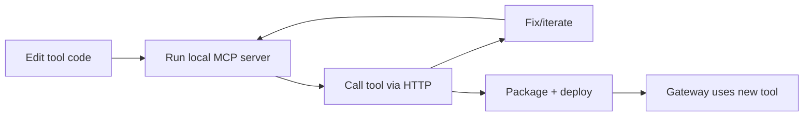

# MCP Servers for Bedrock AgentCore

This directory contains Model Context Protocol (MCP) server implementations for use with AWS Bedrock AgentCore Gateway.

## Overview

MCP servers provide tools that agents can invoke through the AgentCore Gateway. Each server implements the MCP protocol and can be deployed as:

- **Lambda functions** (production) - Deployed to AWS, invoked via Gateway
- **Local server** (development) - Run locally for testing without AWS

## Available Servers

### 1. S3 Tools (`s3-tools/`)

Provides S3 bucket and object operations.

**Tools:**
- `list_buckets` - List accessible S3 buckets
- `list_objects` - List objects in a bucket
- `get_object` - Download object content
- `put_object` - Upload content to S3
- `get_object_metadata` - Get object metadata

**Use Case:** File storage, data retrieval, content management

**Security:** You must set `s3_tools_allowed_buckets` with both bucket and object ARNs.
The Lambda enforces an allowlist via the `ALLOWED_BUCKETS` environment variable (set by Terraform).

### 2. Titanic Data (`titanic-data/`)

Serves the Titanic passenger dataset for analysis demonstrations.

**Tools:**
- `fetch_dataset` - Get full or partial dataset
- `get_schema` - Get column information
- `query` - Run filtered queries
- `get_statistics` - Get summary statistics

**Use Case:** Data analysis demos, testing code interpreter

### 3. Local Development (`local-dev/`)

Flask-based local server for development and testing.

**Tools:**
- `echo` - Echo messages (connectivity test)
- `store_value` / `get_value` - Key-value storage
- `add_memory` / `get_memory` - Conversation memory
- `calculate` - Simple math calculations
- `get_env` - Environment information

**Use Case:** Local testing without AWS, development

## Quick Start

### Local Setup (One-Time)

**What you need**
- `Python 3.12`
- `uv` (recommended) or `pip`
- `AWS CLI v2` (for deploy/plan and S3 tool tests)
- `Terraform 1.14.4` (deploy/plan)
- `zip` (packaging)

**Why this setup speeds you up**
- Local server uses the same MCP protocol as Gateway, so you can test tools without AWS.
- Two‑stage packaging is deterministic, so changes only rebuild when inputs change.
- Module composition wires ARNs automatically, so you avoid manual wiring errors.

**Setup with `uv` (recommended)**
```bash
cd examples/mcp-servers
uv venv
uv pip install -r local-dev/requirements.txt
uv pip install -r s3-tools/requirements-dev.txt
```

**AWS credentials (only needed for S3 tool tests or deploy)**
```bash
aws configure
```
Optional: set `ALLOWED_BUCKETS` (comma‑separated) to limit bucket access during local runs.

**Note:** The `Makefile` uses Windows venv paths (`.venv/Scripts/...`). On macOS/Linux/WSL, run the commands above manually or update the Makefile to use `.venv/bin/...`.

### Option 1: Integrated Deployment (Recommended)

The recommended approach uses MCP servers as a Terraform submodule with automatic ARN resolution:

```bash
# See the integrated example
cd ../5-integrated
terraform init
terraform apply
```

This pattern:
- Deploys MCP servers + AgentCore in one command
- Automatically resolves ARNs (no hardcoding)
- Handles dependencies correctly

See `examples/5-integrated/` for the full example.

### Option 2: Local Development

```bash
# Install dependencies
cd local-dev
pip install -r requirements.txt

# Run server
python server.py

# Test
curl http://localhost:8080/health
curl http://localhost:8080/tools/list

# Call a tool
curl -X POST http://localhost:8080/tools/call \
  -H "Content-Type: application/json" \
  -d '{"params": {"name": "echo", "arguments": {"message": "Hello!"}}}'
```

### Local Development Loop (Full Workflow)

Complete workflow for developing and testing MCP servers locally before deployment:

```bash
# 1. Setup (one-time)
make setup

# 2. Start local MCP server (Terminal 1)
make dev
# Server runs at http://localhost:8080

# 3. Develop and test (Terminal 2)
# Edit your handler code, then test:
make test-s3       # Test S3 tools handler
make test-titanic  # Test Titanic data handler
make test          # Run all tests

# 4. Validate Terraform (no AWS needed)
make validate

# 5. Deploy when ready
make plan          # Preview changes
make deploy        # Apply to AWS
```

**Process Overview (How the Loop Accelerates Dev)**
1. Implement or update a tool in `s3-tools/` or `titanic-data/`.
2. Run the local MCP server (`make dev`) and call tools directly via HTTP.
3. Validate tool behavior fast without AWS, then run targeted tests.
4. When ready, deploy with Terraform; ARNs flow automatically to the Gateway.

This mirrors the full Gateway → MCP tool path described in `docs/architecture.md` but keeps the feedback loop local and fast.

**Lifecycle (Cloud ↔ Local)**
This flow is intentionally bidirectional so production issues get pulled back into a fast local loop.

1. **Local build event**: change tool code → run local MCP server → validate tool behavior via HTTP.
2. **Promote event**: local behavior is correct → `terraform plan/apply` deploys Lambda MCP servers → Gateway targets updated via module outputs.
3. **Cloud run event**: real traffic hits Gateway → Lambda tool → results observed in CloudWatch/X‑Ray.
4. **Cloud issue event**: anomaly, regression, or missing capability → reproduce locally using the same MCP protocol.
5. **Local fix event**: update tool logic → re‑test locally → redeploy to cloud.

This maps to the architecture in `docs/architecture.md`: the same Gateway→Lambda tool contract is exercised locally first, then promoted to cloud for scale and observability.

**Local Dev Flow (Mermaid)**


**Development Cycle:**

```
┌─────────────────────────────────────────────────────────────┐
│                    LOCAL DEVELOPMENT                        │
├─────────────────────────────────────────────────────────────┤
│                                                             │
│  1. Edit Code                    2. Test Locally            │
│     s3-tools/handler.py             make test-s3            │
│     titanic-data/handler.py         make test-titanic       │
│                                                             │
│  3. Test with Local Server       4. Validate Terraform      │
│     make dev                        make validate           │
│     curl localhost:8080/...                                 │
│                                                             │
├─────────────────────────────────────────────────────────────┤
│                    AWS DEPLOYMENT                           │
├─────────────────────────────────────────────────────────────┤
│                                                             │
│  5. Plan                         6. Deploy                  │
│     make plan                       make deploy             │
│                                                             │
│  7. Test Lambda                  8. Rollback (if needed)    │
│     aws lambda invoke ...           Alias → previous ver    │
│                                                             │
└─────────────────────────────────────────────────────────────┘
```

**Key Files:**

| File | Purpose |
|------|---------|
| `Makefile` | All dev commands |
| `scripts/test-local.sh` | Comprehensive test script |
| `local-dev/server.py` | Local Flask MCP server |
| `s3-tools/requirements.txt` | S3 tools dependencies for packaging |
| `titanic-data/requirements.txt` | Titanic data dependencies for packaging |
| `terraform/packaging.tf` | Two-stage Lambda build |

### Option 3: Standalone MCP Server Deployment

Deploy MCP servers separately, then reference outputs:

```bash
# Deploy MCP servers
cd terraform
terraform init
terraform apply

# Get ARNs for use in agent config
terraform output mcp_targets
```

### Using MCP Servers in AgentCore

**Recommended: Module Composition (Automatic ARNs)**

```hcl
# Deploy MCP servers as submodule
module "mcp_servers" {
  source = "./examples/mcp-servers/terraform"
  environment = var.environment
}

# Use outputs directly - no hardcoded ARNs!
module "agentcore" {
  source = "./"

  mcp_targets = module.mcp_servers.mcp_targets

  depends_on = [module.mcp_servers]
}
```

**Alternative: Manual ARN Reference**

If you deploy MCP servers separately:

```hcl
# After: cd examples/mcp-servers/terraform && terraform apply
# Run: terraform output mcp_targets
# Then use the output ARNs:

mcp_targets = {
  s3_tools = {
    name        = "s3-tools"
    lambda_arn  = "arn:aws:lambda:us-east-1:YOUR_ACCOUNT:function:agentcore-mcp-s3-tools-dev"
    description = "S3 bucket and object operations"
  }
}

### Optional: Explicit Lambda Invoke Permission

If your Gateway needs a resource-based policy on the Lambda (e.g., cross-account setup),
enable the explicit permission in `terraform.tfvars`:

```hcl
enable_bedrock_agentcore_invoke_permission = true
bedrock_agentcore_invoke_principal = "bedrock-agentcore.amazonaws.com"
bedrock_agentcore_source_account = "ACCOUNT_ID"
bedrock_agentcore_source_arn = "arn:aws:bedrock-agentcore:REGION:ACCOUNT_ID:gateway/GATEWAY_ID"
```
For same-account setups using the Gateway role, you can keep this disabled.

## MCP Protocol

All servers implement the MCP JSON-RPC protocol:

### List Tools

```json
// Request
{
  "jsonrpc": "2.0",
  "method": "tools/list",
  "id": "1"
}

// Response
{
  "jsonrpc": "2.0",
  "result": {
    "tools": [
      {
        "name": "tool_name",
        "description": "Tool description",
        "inputSchema": {
          "type": "object",
          "properties": {...}
        }
      }
    ]
  },
  "id": "1"
}
```

## Packaging Notes

Packaging follows a two-stage build (deps + code) required by `AGENTS.md`.
Each MCP server has a `requirements.txt` file and the Terraform packaging step creates a zip
containing `deps/` and `code/`. See `terraform/packaging.tf` for the exact build steps.

### Call Tool

```json
// Request
{
  "jsonrpc": "2.0",
  "method": "tools/call",
  "params": {
    "name": "tool_name",
    "arguments": {
      "param1": "value1"
    }
  },
  "id": "2"
}

// Response
{
  "jsonrpc": "2.0",
  "result": {
    "content": [
      {
        "type": "text",
        "text": "{\"success\": true, ...}"
      }
    ]
  },
  "id": "2"
}
```

### Simple Format (Lambda Direct)

Servers also accept a simplified format for direct Lambda invocation:

```json
// Request
{
  "tool": "tool_name",
  "parameters": {
    "param1": "value1"
  }
}

// Response
{
  "statusCode": 200,
  "body": "{\"success\": true, ...}"
}
```

## Directory Structure

```
mcp-servers/
├── README.md              # This file
├── local-dev/             # Local development server
│   ├── server.py          # Flask MCP server
│   └── requirements.txt   # Python dependencies
├── s3-tools/              # S3 operations server
│   └── handler.py         # Lambda handler
├── titanic-data/          # Titanic dataset server
│   └── handler.py         # Lambda handler
└── terraform/             # Deployment module
    └── main.tf            # Lambda deployment
```

## Creating Custom MCP Servers

### Lambda Template

```python
"""
Custom MCP Server Template
"""

import json
import logging
from typing import Any

logger = logging.getLogger()
logger.setLevel(logging.INFO)


def tool_my_tool(params: dict) -> dict:
    """
    Your tool implementation.

    Parameters:
        param1: Description (required)
        param2: Description (optional)
    """
    param1 = params.get("param1")
    if not param1:
        return {"success": False, "error": "param1 required"}

    # Your logic here
    result = do_something(param1)

    return {
        "success": True,
        "result": result
    }


TOOLS = {
    "my_tool": {
        "handler": tool_my_tool,
        "description": "My tool description",
        "parameters": {
            "param1": "Description (required)",
            "param2": "Description"
        }
    }
}


def lambda_handler(event: dict, context: Any) -> dict:
    """Lambda handler for MCP tool invocation."""
    logger.info(f"Received event: {json.dumps(event)}")

    try:
        # Handle MCP protocol format
        if "jsonrpc" in event:
            method = event.get("method", "")
            request_id = event.get("id")

            if method == "tools/list":
                tools_list = [
                    {
                        "name": name,
                        "description": info["description"],
                        "inputSchema": {
                            "type": "object",
                            "properties": {
                                k: {"type": "string", "description": v}
                                for k, v in info["parameters"].items()
                            },
                            "required": [
                                k for k, v in info["parameters"].items()
                                if "required" in v.lower()
                            ]
                        }
                    }
                    for name, info in TOOLS.items()
                ]
                return {
                    "jsonrpc": "2.0",
                    "result": {"tools": tools_list},
                    "id": request_id
                }

            elif method == "tools/call":
                params = event.get("params", {})
                tool_name = params.get("name")
                tool_args = params.get("arguments", {})

                if tool_name not in TOOLS:
                    return {
                        "jsonrpc": "2.0",
                        "error": {"code": -32601, "message": f"Unknown tool: {tool_name}"},
                        "id": request_id
                    }

                result = TOOLS[tool_name]["handler"](tool_args)
                return {
                    "jsonrpc": "2.0",
                    "result": {"content": [{"type": "text", "text": json.dumps(result)}]},
                    "id": request_id
                }

        # Handle simple format
        tool_name = event.get("tool", event.get("action"))
        tool_params = event.get("parameters", event.get("params", {}))

        if not tool_name:
            return {
                "statusCode": 400,
                "body": json.dumps({"error": "tool parameter required"})
            }

        if tool_name not in TOOLS:
            return {
                "statusCode": 400,
                "body": json.dumps({"error": f"Unknown tool: {tool_name}"})
            }

        result = TOOLS[tool_name]["handler"](tool_params)
        return {
            "statusCode": 200,
            "body": json.dumps(result)
        }

    except Exception as e:
        logger.error(f"Error: {str(e)}")
        return {
            "statusCode": 500,
            "body": json.dumps({"error": str(e)})
        }
```

## Testing

### Test Local Server

```bash
# Start server
cd local-dev
python server.py &

# Run tests
curl http://localhost:8080/tools/list | jq .
curl -X POST http://localhost:8080/tools/call \
  -H "Content-Type: application/json" \
  -d '{"params": {"name": "echo", "arguments": {"message": "test"}}}' | jq .
```

### Test Lambda Locally

```bash
# Test with sample event
cd s3-tools
python -c "
import handler
result = handler.lambda_handler({
    'tool': 'list_buckets',
    'parameters': {}
}, None)
print(result)
"
```

### Test Deployed Lambda

```bash
# Invoke via AWS CLI
aws lambda invoke \
  --function-name agentcore-mcp-s3-tools-dev \
  --payload '{"tool": "list_buckets", "parameters": {}}' \
  response.json

cat response.json | jq .
```

## Security Considerations

1. **IAM Permissions**: Lambda roles have minimal permissions. S3 tools require an explicit bucket allowlist in `terraform.tfvars`.

2. **Input Validation**: All tool inputs are validated before use.

3. **Error Handling**: Errors return sanitized messages, no stack traces.

4. **Logging**: CloudWatch logs for auditing, configurable retention.

5. **No Credentials in Code**: Use IAM roles, not embedded credentials.

## Troubleshooting

### Lambda Not Invoking

```bash
# Check Lambda exists
aws lambda get-function --function-name agentcore-mcp-s3-tools-dev

# Check CloudWatch logs
aws logs tail /aws/lambda/agentcore-mcp-s3-tools-dev --follow
```

### Permission Denied

```bash
# Check IAM role policies
aws iam get-role-policy --role-name agentcore-mcp-lambda-role-dev --policy-name agentcore-mcp-s3-access-policy
```

### Local Server Connection Refused

```bash
# Check if server is running
lsof -i :8080

# Restart server
python server.py
```
